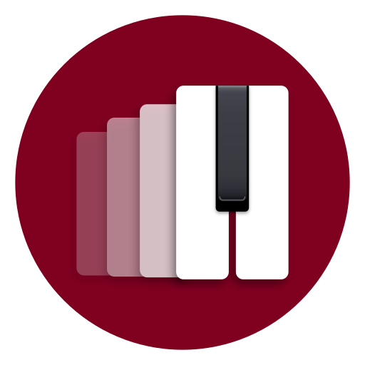

  

<h1 align="center">KeyRecall</h1>

KeyRecall is an adaptive practice partner for piano technique. Connect a MIDI
keyboard, play the scale it gives you, and it decides what you play next: which
key, which form, how many octaves, hands separately or together, at what tempo,
and how much of the notation to show you. It watches what you actually played
and keeps a long-running picture of what you can do and what you are starting to
forget.

The interaction is meant to be almost nothing:

> **Open it. Play what it gives you. Stop whenever you want.**

Everything else is underneath.

---

## Features

- **It chooses, so you don't**\
  No lesson list to pick from and no streak to maintain. Each exercise is chosen
  from what you have played, how long ago, and how it went, aiming at the edge
  of what you can currently do rather than at whatever comes next in a book.

- **It watches you play**\
  Every note you play is matched against the scale that was asked for. Playing
  the wrong notes, stopping and starting, playing unevenly, and hands that come
  apart are four different problems, and KeyRecall keeps them apart instead of
  collapsing them into one score.

- **Support that fades**\
  A scale you do not know yet is shown on the staff while you play it. Once you
  can, the notes are previewed and then hidden. Once that is comfortable, you
  are asked for it from memory. Moving down a rung is a normal response to a bad
  attempt, not a penalty.

- **Remembering is the point**\
  Playing a scale with the notes in front of you is practice, not recall, and
  KeyRecall records it as such. What moves your memory of a key is producing it
  without being shown, and the schedule is built around bringing each key back
  as its recall starts to weaken.

- **A count-in, and a metronome only if you want one**\
  Every exercise counts you in, at every level of support. The metronome is a
  separate choice you make, not a reward you unlock.

- **One install, several people**\
  Each profile keeps its own history, and switching between them takes a tap. A
  household piano is usually not one person's.

- **Your practice history is yours**\
  Everything is stored on your device as an append-only record of what you
  played. Nothing is uploaded, there are no accounts, and there is no
  advertising or tracking. Your skill picture is recomputed from that record
  rather than stored as a score somebody could quietly rewrite.

## What it covers

All twelve keys in four forms: major, natural minor, harmonic minor, and melodic
minor. Each can be asked for with either hand alone or hands together, over one
octave or two, ascending or ascending and descending, in parallel or contrary
motion, at four tempos, and at any of the three levels of support.

That comes to 9,216 distinct exercises, which is the real argument for letting
something else choose. A practice plan you write yourself fixes one path through
that space in advance, and what you most need to play today is rarely the next
line on it.

So the scope is narrow but not small. Scales alone hold years of progression,
and doing one thing well is worth more than doing everything shallowly.
Arpeggios are not here yet. They are the most likely thing to be added next.

## Who is this for?

- Pianists who know they should practice technique and would rather not also
  plan it
- Returning players with uneven ground behind them, who need the gaps found
  rather than guessed at
- Students working through scales systematically, who want the review timed
  rather than arbitrary
- Teachers curious about what an evidence-driven practice schedule looks like

It is a practice partner for technique, not a piano course. It has no
repertoire, sight reading, ear training, or theory lessons, and it is not trying
to acquire them.

## Status

**KeyRecall is not released yet.** It is under active development and there is
nothing to install. The learner model and scheduler are built and documented and
the practice loop runs. The structure underneath is settled; the constants in it
are versioned starting points, calibrated against recorded playing where they
could be and not yet against a real learner population.

This is a human-led project built with assistance from AI coding tools. AI tools
may be used as part of the development workflow for exploration, implementation
support, refactoring, testing ideas, and review, while real people remain
responsible for design decisions, validation, maintenance, and project
direction. The project is developed with deliberate attention to pedagogical
honesty, musical correctness, accessibility, cross-platform behavior, and
long-term maintainability.

## Documentation

The [documentation map](docs/README.md) covers the product, the domain model,
and the research record. For the learner model and scheduler as they currently
stand, start with
[The KeyRecall V1 Adaptive System](docs/learner-model/v1-current-system.md).

To build or work on KeyRecall, see [CONTRIBUTING.md](CONTRIBUTING.md).

## License

KeyRecall is released under the [Zero Clause BSD License](LICENSE) (SPDX: 0BSD).

Copyright &copy; 2026 [Aaron Bull Schaefer][EMAIL] and contributors

[EMAIL]: mailto:aaron@elasticdog.com
