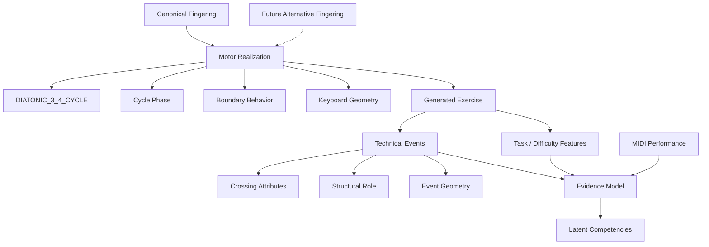

# Scale Motor Taxonomy

**Status:** Mechanically verified V1 analysis\
**Date:** August 18, 2026\
**Scope:** Derived motor structure for canonical V1 piano scale fingerings\
**Input:** `fingering-taxonomy.md`\
**Machine-readable mapping:**
`../../analysis/scale-motor/motor-realizations.yaml`

---

## 1. Purpose

This document derives reusable motor structure from KeyRecall's canonical
scale-fingering corpus.

The canonical fingering taxonomy remains the source of truth for the actual
fingers expected for each scale and hand. This document does not generate or
replace canonical fingering. It derives a structural layer that can support
transfer, diagnosis, and learner-state inference.

The verified V1 corpus contains:

- 48 scale definitions;
- 96 hand-specific canonical fingering records;
- major, natural minor, harmonic minor, and fixed-form melodic minor;
- multi-octave-normalized continuation behavior; and
- one canonical fingering per scale/hand.

Future alternative fingerings may map into the same structural model or expand
it.

## 2. Mechanical Verification Result

The first formal hypothesis proposed two sibling motor families:

```text
THREE_THEN_FOUR
FOUR_THEN_THREE
```

Mechanical cycle canonicalization disproves that distinction.

The proposed canonical cycles:

```text
THREE_THEN_FOUR:
1 2 3 1 2 3 4

FOUR_THEN_THREE:
1 2 3 4 1 2 3
```

are themselves **cyclic rotations of the same seven-position sequence**.

Therefore rotation-invariant analysis cannot legitimately treat them as
different `MotorFamily` values.

After correcting the final stale continuation summaries in the fingering
dataset, **all 96 canonical V1 hand-specific records map to one motor family**.

The verified taxonomy is:

```text
DIATONIC_SCALE_MOTOR
    |
    `-- DIATONIC_3_4_CYCLE
```

with hand orientation, cycle phase, boundary behavior, scale topology, and
keyboard geometry supplying the important contextual distinctions.

`DIATONIC_SCALE_MOTOR` here names a motor-*domain* category, a grouping
over `MotorFamily` values, parallel to how `DIATONIC_3_4_CYCLE` is the
one verified `MotorFamily` beneath it. It predates, and is not the same
thing as, the identically-named candidate learner *Competency* rejected
during the competency/Q-matrix reconciliation
(`../learner-model/02-v1-design.md` §9.1.4); worth noting so the two
aren't conflated.

This is the central result of the analysis pass.

## 3. Canonical Cycle

For RH ascending, define the canonical phase-0 cycle as:

```text
index:   0 1 2 3 4 5 6
finger:  1 2 3 1 2 3 4
```

```yaml
DIATONIC_3_4_CYCLE:
  right_ascending: [1, 2, 3, 1, 2, 3, 4]
```

The LH ascending orientation is the reverse:

```text
index:   0 1 2 3 4 5 6
finger:  4 3 2 1 3 2 1
```

```yaml
DIATONIC_3_4_CYCLE:
  left_ascending: [4, 3, 2, 1, 3, 2, 1]
```

These are two hand-specific orientations of one higher-order scale motor family,
not two unrelated skills.

## 4. Rotation Equivalence

Every tonic-relative continuation cycle in the verified V1 corpus is a rotation
of the appropriate hand orientation.

RH rotations:

```text
phase 0: 1 2 3 1 2 3 4
phase 1: 2 3 1 2 3 4 1
phase 2: 3 1 2 3 4 1 2
phase 3: 1 2 3 4 1 2 3
phase 4: 2 3 4 1 2 3 1
phase 5: 3 4 1 2 3 1 2
phase 6: 4 1 2 3 1 2 3
```

LH rotations:

```text
phase 0: 4 3 2 1 3 2 1
phase 1: 3 2 1 3 2 1 4
phase 2: 2 1 3 2 1 4 3
phase 3: 1 3 2 1 4 3 2
phase 4: 3 2 1 4 3 2 1
phase 5: 2 1 4 3 2 1 3
phase 6: 1 4 3 2 1 3 2
```

The C-sharp/F-sharp fixed-form melodic-minor RH pattern that initially appeared
to require a second family:

```text
23123412
```

normalizes to continuation:

```text
3 1 2 3 4 1 2
```

which is RH **phase 2** of the same `DIATONIC_3_4_CYCLE`.

Thus the documented melodic-minor exception is a canonical fingering exception
at the scale level, but **not a separate motor family** under rotation-invariant
analysis.

## 5. Verified Phase Distribution

All 96 records were mapped mechanically rather than assigned by hand.

Hand Phase Records

---

RH 0 4 RH 1 24 RH 2 3 RH 3 4 RH 4 4 RH 5 1 RH 6 8 LH 0 24 LH 1 4 LH 2 0 LH 3 3
LH 4 4 LH 5 10 LH 6 3

Two useful observations follow:

1.  RH uses all seven phases somewhere in the canonical corpus.
2.  The current LH corpus uses six of seven possible phases; absence of LH phase
    2 is a property of the selected canonical V1 fingerings, not a statement
    that the phase is mechanically invalid.

A future alternative fingering could introduce an unused phase without requiring
a new motor family.

## 6. MotorRealization

The verified structural decomposition is:

```text
canonical fingering
    =
DIATONIC_3_4_CYCLE
    + hand/orientation
    + cycle phase
    + entry boundary
    + terminal boundary
    + scale topology
    + keyboard geometry
```

A useful derived representation is:

```yaml
MotorRealization:
  family: DIATONIC_3_4_CYCLE
  orientation: RH_ASCENDING
  phase: 6

  entry:
    finger: 3
    override: false

  terminal:
    override_finger: null

  geometry:
    derived_from_scale: true
```

`MotorRealization` is derived from canonical fingering. It must never become the
authoritative source from which fingering is silently reconstructed.

`MotorFamily` and `MotorRealization` describe the structure of the task; they are
not synonymous with latent learner components. The adaptive learner model may
maintain evidence about a pianist's competence with these structures, but a
structural distinction does not by itself justify a persistent mastery variable.

## 7. Boundary Behavior

The machine-readable corpus distinguishes entry and terminal adaptations from
the recurring cycle.

Across 96 records:

```text
34  entry override only
34  no entry or terminal override
28  terminal override only
 0  both entry and terminal override
```

Examples:

### C major RH

```text
entry finger:       1
internal tonic:     1
terminal tonic:     5
```

This is a terminal override.

### B-flat major RH

```text
entry finger:       2
internal tonic:     4
terminal tonic:     4
```

This is an entry override.

### D-flat major RH

```text
entry finger:       2
internal tonic:     2
terminal tonic:     2
```

No boundary override is required.

Boundary adaptations therefore remain valuable technical context without
splitting the parent motor family.

## 8. Implication for the Earlier "3+4 vs 4+3" Language

The three/four grouping terminology remains pedagogically useful, but it should
not be encoded as mutually exclusive motor-family IDs.

Because:

```text
1 2 3 | 1 2 3 4
```

and:

```text
1 2 3 4 | 1 2 3
```

are rotations of one cyclic structure, the difference is one of **phase and
grouping perception**, not rotation-invariant motor-family identity.

The UI or pedagogy may still describe a passage as "group four, then three."
Internally, KeyRecall should represent the exact phase and technical crossings
rather than create a second latent family.

## 9. Alternative Fingerings

Future alternative fingerings fit naturally into this result.

```text
Scale + Hand
     |
     +-- CanonicalFingering -----+
     |                           |
     `-- AlternativeFingering ---+--> MotorRealization
                                        |
                                        v
                               DIATONIC_3_4_CYCLE
```

An alternative fingering may:

- map to the same phase;
- map to another phase;
- alter entry or terminal behavior;
- change keyboard-geometric events; or
- potentially fail to fit `DIATONIC_3_4_CYCLE`, in which case the taxonomy can
  add a new family based on evidence.

The V1 result therefore does not constrain future fingering support.

## 10. Technical-Event Verification

A two-octave ascending and descending exercise was generated for every
hand-specific record, yielding 192 directional exercise streams.

For each adjacent transition the analysis recorded:

```text
hand
direction
from_finger
to_finger
from_key_class
to_key_class
interval_semitones
octave_boundary
crossing_type
```

Across the corpus this produced:

- **170 distinct detailed transition signatures**; and
- **47 distinct crossing signatures** when restricted to thumb/finger crossings
  and their geometry.

Those counts are evidence that the event representation should be
**attribute-based**, not implemented as 170 or 47 independent enum values or
learner skills.

## 11. Crossing Vocabulary

The generated corpus requires only four basic crossing motion types:

```text
THUMB_UNDER_3
THUMB_UNDER_4
FINGER_OVER_3
FINGER_OVER_4
```

In the generated two-octave corpus their opportunity counts were:

```text
THUMB_UNDER_3   182
FINGER_OVER_3   182
THUMB_UNDER_4   140
FINGER_OVER_4   140
```

These counts are descriptive of the generated audit corpus, not pedagogical
weights.

A better implementation may normalize these further:

```yaml
CrossingEvent:
  motion: THUMB_UNDER | FINGER_OVER
  crossing_finger: 3 | 4
```

with hand, direction, geometry, and structural role carried as separate
attributes.

## 12. Crossing Geometry

The generated crossing opportunities span all four physical key-class
relationships:

```text
BLACK -> WHITE   231
WHITE -> BLACK   231
WHITE -> WHITE   178
BLACK -> BLACK     4
```

Crossing intervals in the V1 corpus include:

```text
2 semitones   362
1 semitone    278
3 semitones     4
```

The four 3-semitone cases arise from harmonic-minor augmented-second topology.

This supports the earlier conclusion that a single `BLACK_KEY_NAVIGATION`
learner variable would be too coarse.

The same nominal `3 -> 1` or `4 -> 1` finger transition can occur under
meaningfully different physical geometry.

## 13. Structural Role

Crossing type alone is also insufficient.

Generated crossings occur both:

```text
within an octave
at an internal octave boundary
```

For example, the same crossing finger can function as the scale's ordinary
within-octave thumb passage in one phase and as an octave-continuation crossing
in another.

A technical event should therefore include:

```yaml
role:
  octave_boundary: true | false
```

and may later grow into a higher-level role enum if useful:

```text
INTERNAL_CROSSING
OCTAVE_CONTINUATION
ENTRY_ADAPTATION
TERMINAL_ADAPTATION
TURNAROUND
```

The enum should be driven by actual diagnostic needs rather than by every
structural distinction available in the generator.

## 14. Proposed TechnicalEvent Schema

```yaml
TechnicalEvent:
  hand: RIGHT
  direction: ASCENDING

  motor:
    family: DIATONIC_3_4_CYCLE
    phase: 6

  transition:
    from_finger: 4
    to_finger: 1
    crossing:
      motion: THUMB_UNDER
      crossing_finger: 4

  geometry:
    from_key_class: BLACK
    to_key_class: WHITE
    interval_semitones: 1

  structure:
    octave_boundary: false
```

Boundary and turnaround events can use the same general event model with
different `structure` fields rather than being shoehorned into crossing events.

## 15. Boundary with the Learner Model

The mechanical analysis argues strongly **against** treating every structural
feature or technical-event signature as a latent learner component.

The motor taxonomy describes **what the task requires**. `TechnicalEvent`
instances describe concrete opportunities and observations within that task.
The learner model separately decides which persistent competencies should be
estimated from those observations.

For example:

```text
DIATONIC_3_4_CYCLE   motor-domain structure
phase 5              task context
BLACK -> WHITE       event geometry
THUMB_UNDER / 4      technical event
```

None of these automatically implies an independent mastery variable.

The four mechanically observed crossing forms should remain fine-grained event
attributes even if the learner model initially aggregates their evidence into a
coarser crossing competency. Preserving fine-grained observations allows later
empirical analysis to justify splitting a latent component without changing the
motor-domain model or losing historical information.

Likewise, keyboard geometry and cycle phase should initially remain contextual
features rather than independent latent competencies. They may be promoted into
learner-specific parameters later if longitudinal evidence demonstrates stable,
diagnostically useful geometry- or phase-specific effects.

```text
Motor domain model
------------------

CanonicalFingering
        |
        v
MotorRealization
        +-- MotorFamily
        +-- phase
        +-- boundaries
        `-- geometry
        |
        v
TechnicalEvents


Adaptive learner model
----------------------

Task features + TechnicalEvents + MIDI performance
                        |
                        v
                 Evidence model
                        |
                        v
                Latent competencies
```

The motor taxonomy describes the structure of the task. The learner model
describes what KeyRecall currently believes about the pianist. The evidence
model connects the two.

## 16. Phase in the Learner Model

The mechanical result confirms that phase is structurally important but does not
justify seven separate phase skills.

Recommended V1 behavior:

- store phase in `MotorRealization`;
- treat phase as a task/context feature, not a latent competency;
- include phase in diagnostic observations;
- allow phase to influence predicted difficulty;
- aggregate primary learning evidence at the shared motor/crossing components;
  and
- only add phase-specific latent parameters if empirical performance
  demonstrates persistent phase effects.

This preserves transfer without assuming perfect equivalence.

## 17. Evidence-Model Implications

The verified taxonomy constrains what information the motor layer can supply to
a future Q-matrix or other evidence model, but it does not determine the final
latent-component vocabulary.

A generated exercise can expose structural evidence such as:

```text
motor family
hand/orientation
cycle phase
entry/terminal boundaries
crossing opportunities
keyboard geometry
octave-continuation opportunities
turnaround opportunities
```

while MIDI performance supplies observations such as correctness, timing,
continuity, and localized errors.

The evidence model can then decide how strongly those observations update a
smaller set of persistent learner competencies.

This separation prevents domain concepts such as `F_RH_FINGERING`,
`THUMB_UNDER_4`, or `PHASE_5` from becoming latent skills merely because they
can be represented structurally.

Tempo, octave count, direction, and hands-together status should likewise be
treated here as **performance conditions or task-difficulty features**, not as
properties that fragment `MotorFamily`. The learner model may estimate how
performance changes as those conditions become more demanding without creating
a separate motor family for each condition.

The exact latent-component set and weighting/evidence rules belong in the
learner-model analysis rather than this motor-taxonomy document.

## 18. Transfer Consequences

This materially strengthens cross-scale transfer.

A pianist demonstrating fluent execution of one scale supplies evidence for:

```text
general diatonic scalar motor organization
hand-specific execution
specific crossing motions
continuation behavior
timing/evenness
```

That evidence should inform priors for another scale even when:

- tonic changes;
- scale form changes;
- phase changes; or
- keyboard geometry changes.

But transfer is not perfect because the new exercise still has distinct:

```text
pitch topology
phase
geometry
boundary conditions
tempo/challenge
```

This gives KeyRecall a principled middle ground between treating scales as
isolated skills and treating them as interchangeable.

## 19. Machine-Readable Artifacts

The formal pass produced three analysis artifacts.

### Motor realization YAML

`motor-realizations.yaml`

Contains:

- canonical hand record;
- compact display summary;
- derived entry;
- derived seven-note continuation cycle;
- phase;
- entry override;
- terminal override;
- orientation; and
- verified motor-family assignment.

### Motor realization CSV

`generated/motor-realizations.csv`

Tabular version of the same 96-record mapping.

### Technical-event CSV

`generated/technical-events.csv`

Contains every adjacent transition generated for two-octave ascending and
descending audit exercises across all 96 records.

These are analysis artifacts, not yet the proposed production data format.

## 20. Mermaid Taxonomy



The diagram deliberately places an evidence-model boundary between motor-domain
structure and latent learner state.

## 21. Verified Taxonomy Status

### Verified

- all 96 canonical V1 records fit one `DIATONIC_3_4_CYCLE` family;
- RH and LH use reverse hand orientations;
- all RH phase values 0--6 occur;
- six LH phases occur in the canonical V1 corpus;
- boundary behavior is independent from family identity;
- C#/F# fixed melodic-minor RH do **not** require a second family;
- one-octave display strings are insufficient as authoritative continuation
  data;
- detailed technical events are best represented compositionally through
  attributes; and
- alternative fingering support can extend the model without changing the V1
  canonical dataset.

### Still provisional

- ~~which event contexts deserve independent latent learner components~~:
  **resolved**, none do in V1. They aggregate into `SCALAR_CROSSING`,
  `MULTI_OCTAVE_CONTINUATION`, and `DIRECTION_REVERSAL` as event-level
  context feeding one competency each (`../learner-model/02-v1-design.md`
  §9.1).
- whether phase should eventually receive learner-specific parameters;
- whether keyboard-geometry effects can be summarized with a small set of useful
  contextual features;
- how strongly evidence transfers across hand, direction, phase, and geometry:
  **partially resolved** for hand, via correlated priors rather than a
  shared parent competency (`../learner-model/02-v1-design.md` §9.1.5).
  Direction, phase, and geometry remain open; and
- whether future modes, alternative fingerings, or non-diatonic scales introduce
  additional `MotorFamily` values.

## 22. Next Step

> **Status: done.** The competency/Q-matrix reconciliation this section
> called for is complete. The reconciled ten-Competency ontology lives in
> `../learner-model/02-v1-design.md` §9.1; the Q-matrix (structural `Q`,
> derived `q`, evidence-attribution `w`) lives in
> `../learner-model/03-v1-math.md` §9. The admission rule the
> reconciliation settled on:
>
> ```text
> A latent Competency should correspond to a persistent transferable
> capability for which KeyRecall has observations that can discriminate
> it, at least probabilistically, from neighboring competencies.
> ```
>
> resolves this document's own caution against treating every mechanically
> identifiable structure as a latent skill (§15, §17): shared task
> structure (one `DIATONIC_3_4_CYCLE` motor family across all 96 records)
> is not the same thing as a shared observation channel, so it did not
> produce a corresponding shared competency.

## 23. Document Status

This revision converts the initial proposed motor taxonomy into a **mechanically
verified V1 taxonomy**.

The two-family hypothesis from the first draft has been rejected because the
supposed `THREE_THEN_FOUR` and `FOUR_THEN_THREE` cycles are rotations of the
same cyclic structure.

For the current canonical 48-scale / 96-hand V1 corpus, one `DIATONIC_3_4_CYCLE`
motor family is sufficient. Future data may expand the taxonomy, but no
additional canonical V1 family is justified by the current corpus.

This document intentionally stops at the boundary of the motor domain. It does
not freeze a latent learner-component taxonomy. `MotorFamily`, phase, geometry,
technical events, and performance conditions provide structured evidence to
that later model rather than automatically becoming mastery variables
themselves.
