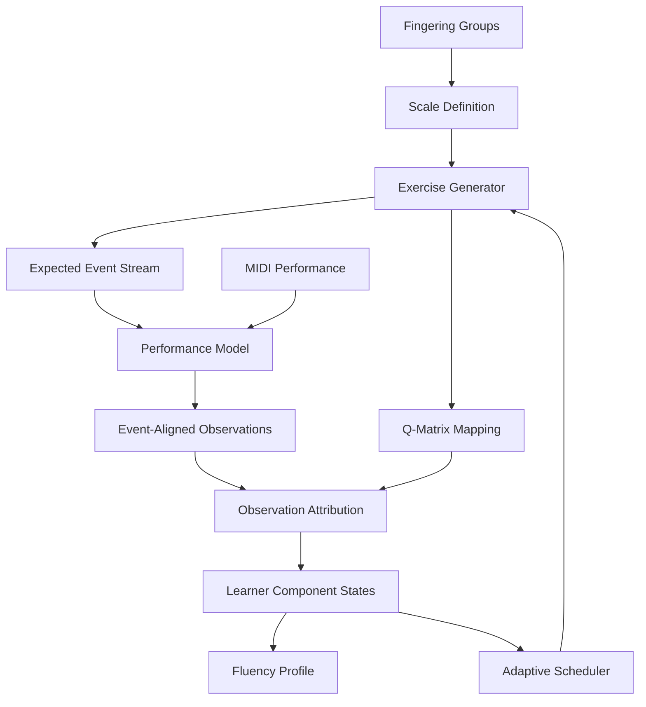
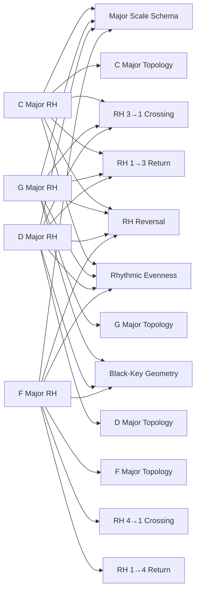
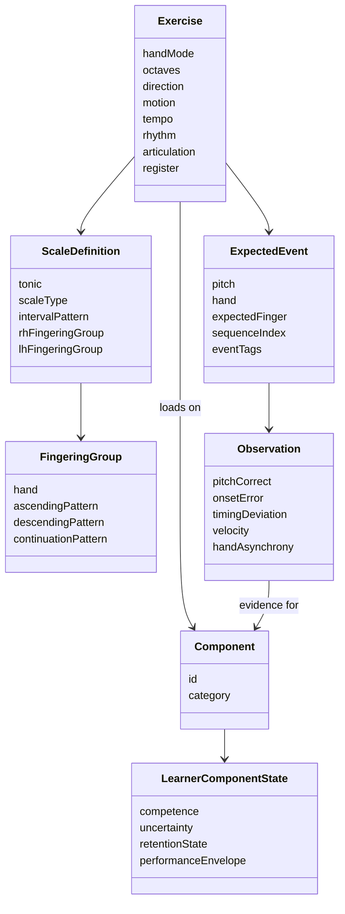

# V1 Domain Model and Q-Matrix

**Status:** Initial domain-model specification\
**Date:** August 18, 2026\
**Scope:** Piano scale practice, initial five-scale laboratory\
**Scales:** C major, G major, D major, F major, A natural minor\
**Purpose:** Capture the current V1 data-model direction, qualitative Q-matrix,
fingering-model decisions, transfer assumptions, diagnostic event model, and
unresolved questions before implementation.

> **Superseded.** The competency ontology and Q-matrix in this document (§6.2,
> §6.5-§11, and the worked examples in §14-§16) predate the reconciliation in
> `../learner-model/02-v1-design.md` §9.1 and `../learner-model/03-v1-math.md`
> §9. Current names and semantics live there.

---

## 1. Executive Summary

KeyRecall should model piano technique as a relationship among:

1.  **Parametric exercises** that the pianist is asked to perform.
2.  **Expected technical events** within those exercises.
3.  **Latent knowledge and motor components** that exercises and events provide
    evidence about.
4.  **Performance observations** derived from MIDI.
5.  **Learner-component states** that summarize competence, uncertainty,
    retention, and performance capability over time.
6.  **A scheduler** that selects exercises for learning value, retention value,
    diagnostic value, user goals, and appropriate challenge.

The initial five-scale analysis supports the overall architecture but refines an
earlier "skill graph" idea. Transfer between exercises should usually emerge
from **shared latent components** rather than manually authored scale-to-scale
transfer edges.

The analysis also reinforces that fingering should be modeled explicitly and
systematically. A temporary catch-all such as `LH_STANDARD_SCALE_CROSSING` is
not an appropriate long-term domain representation merely because the initial
five scales happen to share substantial left-hand fingering structure. KeyRecall
is intended eventually to cover all major and minor keys and advanced technical
patterns, so the model should represent the **actual fingering groups and
transition types** from the beginning.

The diagnostic unit is also finer than an entire exercise. Because KeyRecall
knows the prescribed notes and fingering, the generated exercise can contain an
**expected event stream** identifying crossings, octave continuations,
reversals, and other technically meaningful locations. MIDI observations can
then be aligned to those events.

Thus:

```text
Scale / Pattern Definition
        ↓
Exercise Generator
        ↓
Expected Notes + Fingering + Technical Events
        ↓
MIDI Performance
        ↓
Event-Aligned Observations
        ↓
Evidence for Latent Components
        ↓
Learner / Fluency Model
        ↓
Scheduler
        ↓
Next Exercise
```

This gives KeyRecall a path from simple scale grading toward genuine diagnosis
and adaptive practice.

---

## 2. Modeling Principles

### 2.1 Exercises are not skills

An exercise is an observable task such as:

```text
C major
right hand
2 octaves
ascending + descending
96 BPM
straight eighth notes
legato
```

It is not itself a single latent "C-major skill."

Instead, its performance provides evidence about several capabilities.

### 2.2 Exercise variants should be parametric

Do not create separate latent skills for:

```text
C major @ 60 BPM
C major @ 80 BPM
C major @ 100 BPM
C major 1 octave
C major 2 octaves
C major 4 octaves
```

Tempo, octave count, rhythm, articulation, direction, and similar properties are
exercise parameters that alter difficulty and determine which latent components
become observable.

### 2.3 Transfer should emerge from shared components

Avoid manually encoding a progression such as:

```text
C major → G major → D major
```

Successful C-major performance should improve the prior prediction for G or D
because those exercises share:

- major-scale schema;
- related fingering patterns;
- crossing-transition capabilities;
- direction reversal;
- timing/evenness;
- tempo capability;
- other motor components.

G then adds evidence about mixed white/black-key geometry, further changing the
prior for D.

### 2.4 Fingering groups belong in the model

KeyRecall will eventually cover the complete scale domain. Therefore, the domain
representation should not collapse fingering into temporary labels that happen
to fit the first five scales.

The model should preserve both:

- **canonical fingering-group membership**, where multiple scales share a
  conventional fingering pattern; and
- **specific transition components**, such as RH 3→1 or RH 4→1 crossings.

This lets KeyRecall reason at multiple useful levels:

```text
scale belongs to fingering group
        ↓
group defines expected finger sequence
        ↓
sequence generates technical transition events
        ↓
performance provides evidence about reusable motor components
```

This is preferable to either extreme:

- one unique fingering skill per scale, which destroys transfer; or
- one generic "standard crossing" skill, which discards known structural
  differences.

### 2.5 Hands are distinct motor systems

Right-hand success provides strong evidence about shared scale/pitch topology
but only weak evidence about left-hand motor execution.

Hands-together competence cannot be inferred solely from strong RH and LH
performance. It introduces distinct coordination components.

### 2.6 Localized observations are more useful than aggregate scores

A 94% exercise score says relatively little about _why_ an attempt was
imperfect.

A repeated hesitation at the prescribed RH 3→1 transition across C, G, and D
provides strong evidence of a specific technical weakness.

The model should therefore retain event-localized evidence.

---

## 3. Conceptual Domain Diagrams

These diagrams are conceptual views of the V1 model. They are intended to
clarify relationships and data flow, not to prescribe a final database schema or
implementation structure.

### 3.1 Overall Domain and Evidence Flow

The Q-matrix describes what an exercise is capable of measuring. The Performance
Model and observation-attribution layer determine what a particular performance
actually tells KeyRecall about the learner.



The feedback loop is intentional: learner-state estimates affect exercise
selection, new performances create additional observations, and those
observations update the learner model.

### 3.2 Shared Latent Components and Emergent Transfer

The following simplified RH example illustrates why KeyRecall should not model
each scale as a single isolated skill. Transfer between C, G, D, and F major
emerges from the latent components they share, while F major remains
diagnostically valuable because it loads on a different RH fingering-transition
family.



A natural minor adds another useful kind of overlap: it shares C major's pitch
collection and several motor-transition characteristics while retaining a
different scale-family schema and key-specific topology.

### 3.3 Conceptual Domain Object Relationships

This diagram summarizes the current domain objects and their conceptual
relationships. Cardinalities and persistence choices remain implementation
decisions.



Detailed Q-matrix relationships remain in tabular form below because a complete
scale-by-component graph would quickly become visually unmanageable. After the
full fingering taxonomy is enumerated, a separate **fingering-group → scale**
diagram should be added to visualize expected motor-transfer families across the
complete scale domain.

---

## 4. Scale-Pattern Conventions and Future Extensibility

### 6.1 Fixed-Form Melodic Minor

KeyRecall uses **fixed-form melodic minor** as its canonical melodic-minor
definition:

```text
1 2 ♭3 4 5 6 7
```

The sixth and seventh degrees remain raised relative to natural minor in **both
ascending and descending directions**.

For example:

```text
A melodic minor ascending:
A B C D E F# G# A

A melodic minor descending:
A G# F# E D C B A
```

This is sometimes called **jazz melodic minor**. Traditional classical pedagogy
often uses raised sixth and seventh degrees ascending and natural minor
descending. KeyRecall deliberately does **not** use that direction-dependent
convention.

This choice makes each V1 scale form a stable pitch collection:

```text
major:          1 2 3 4 5 6 7
natural minor:  1 2 ♭3 4 5 ♭6 ♭7
harmonic minor: 1 2 ♭3 4 5 ♭6 7
melodic minor:  1 2 ♭3 4 5 6 7
```

Direction therefore changes traversal, fingering, reversal behavior, and
expected technical events without changing the underlying melodic-minor pitch
collection.

### 6.2 Scale Forms Are an Initial Catalog, Not a Closed Enum

The initial fingering taxonomy will cover:

- major;
- natural minor;
- harmonic minor; and
- fixed-form melodic minor.

The domain model should **not** treat those four forms as the complete universe
of scale patterns.

KeyRecall is expected eventually to model modal and other technical patterns,
including at least:

```text
Ionian
Dorian
Phrygian
Lydian
Mixolydian
Aeolian
Locrian
```

Ionian and Aeolian should be related to major and natural minor rather than
needlessly represented as unrelated musical structures.

A more extensible conceptual abstraction is therefore:

```text
ScalePattern
    id
    interval_pattern
    degree_spellings
    canonical_fingerings
```

with `major`, `natural_minor`, `harmonic_minor`, and `melodic_minor` forming the
initial catalog.

### 6.3 Pattern Definition and Exercise Traversal Should Remain Separate

V1 scale exercises will normally traverse the same scale pattern ascending and
descending. The data model should nevertheless avoid making that equivalence an
architectural requirement.

Later technical exercises may intentionally combine patterns or modes by
direction, for example:

```text
ascending_pattern: ionian
descending_pattern: dorian
```

or use a longer sequence of modal patterns as part of an advanced regimen.

Therefore:

```text
musical pattern definition
```

and:

```text
exercise traversal / pattern sequence
```

should remain conceptually separate, even if the initial implementation uses a
simple one-pattern exercise in almost every case.

---

## 5. Initial Five-Scale Laboratory

The first domain-model experiment uses:

- C major
- G major
- D major
- F major
- A natural minor

This set is deliberately small but structurally useful.

### C major

Provides a white-key baseline and conventional fingering-family evidence.

### G major

Introduces one black key while retaining substantial fingering similarity with C
major.

### D major

Adds a second black key and strengthens the test of transfer from a generalized
major-scale schema.

### F major

Provides a useful right-hand fingering counterexample. Its conventional RH
fingering uses a different crossing family from C/G/D.

### A natural minor

Shares C major's pitch collection while changing tonic, sequence organization,
crossing locations, and motor pattern. It helps separate pitch-set familiarity
from proceduralized scale execution.

---

## 6. V1 Domain Entities

### 6.1 `ScaleDefinition`

Represents the canonical musical and fingering definition of a scale.

Conceptually:

```text
ScaleDefinition
    id
    tonic
    scale_pattern
    pitch_classes / spelled degrees
    ascending_definition
    descending_definition
    rh_fingering_pattern
    lh_fingering_pattern
```

The exact storage representation remains open.

The important point is that fingering is first-class domain data rather than UI
annotation.

### 6.2 `FingeringPattern` and `FingeringGroup`

KeyRecall should distinguish the **authoritative canonical fingering pattern**
from the **derived fingering family** used to recognize structural sharing
across scales.

A canonical fingering pattern should model three distinct concepts:

```text
FingeringPattern
    id
    hand
    direction
    entry
    cycle
    exit
```

Where:

- `entry` describes how the traversal begins from its starting tonic/register;
- `cycle` describes the repeating fingering used through internal octave
  boundaries during multi-octave traversal;
- `exit` describes how the traversal terminates or turns around.

This distinction matters because terminal fingering is not necessarily the same
motor event as fingering at an internal octave boundary. For example, a
repeating RH scale cycle may conceptually contain:

```text
... 1 2 3 1 2 3 4 | 1 2 3 1 2 3 4 | 1 ...
```

while a terminal one-octave traversal may end with finger 5 rather than
continuing through the octave with finger 1.

The domain model should therefore avoid treating:

```text
4 → 5 at a terminal turnaround
```

as equivalent to:

```text
4 → 1 at an internal octave continuation
```

because they are different technical events and should provide different
evidence to the learner model.

> **Superseded.** `FingeringGroup`, sketched below as a derived multi-family
> classification, is retired: mechanical analysis (`motor-taxonomy.md`) found
> all 96 canonical hand-specific records collapse into one `MotorFamily`
> (`DIATONIC_3_4_CYCLE`), differentiated by phase and boundary rather than group
> membership. The **pattern** remains authoritative domain data;
> `FingeringPattern` → `MotorRealization` → `MotorFamily` is the current triad
> (`GLOSSARY.md`, “FingeringPattern”).

### 6.3 `Exercise`

Represents one requested performance.

```text
Exercise
    scale_definition
    hand_mode
    octaves
    direction
    motion
    tempo
    rhythm
    articulation
    start_octave / register
    pattern_variant
```

Not all parameters are required in the earliest prototype, but the model should
leave room for them.

> **Superseded** by the compositional `Exercise` in
> `../learner-model/02-v1-design.md`, which makes `GuidanceContext` part of the
> evidence model rather than UI state.

### 6.4 `ExpectedEvent`

Generated from the scale definition and exercise parameters.

```text
ExpectedEvent
    sequence_index
    pitch
    hand
    expected_finger
    metrical_position
    event_tags[]
```

Possible tags include:

```text
START
NORMAL_STEP
CROSSING_ENTRY
CROSSING_EXIT
RH_3_TO_1
RH_1_TO_3
RH_4_TO_1
RH_1_TO_4
LH_<transition>
OCTAVE_CONTINUATION
DIRECTION_REVERSAL
END
BLACK_KEY_ENTRY
BLACK_KEY_EXIT
```

The exact event vocabulary should emerge from the complete fingering taxonomy.

`expected_finger` is pedagogical/domain information. Standard MIDI does not
verify which finger the pianist actually used.

### 6.5 `Component` (superseded by `Competency`)

**Superseded** by `Competency`: ten Competencies under non-latent
`CompetencyCategory` nodes, `../learner-model/02-v1-design.md` §9.1.

### 6.6 `ExerciseComponentMapping` (superseded)

**Superseded** by the `Q`/`q`/`w` split in `../learner-model/03-v1-math.md` §9:
a binary structural Q-matrix, a derived predictor loading, and a per-attempt
evidence-attribution weight, replacing the qualitative
`PRIMARY`/`SECONDARY`/`NONE` used here.

### 6.7 `Observation`

Derived from performed MIDI.

Potential fields:

```text
Observation
    expected_event
    actual_note
    pitch_correct
    onset_error
    inter_onset_interval
    local_timing_deviation
    velocity
    hand_asynchrony
    restart / interruption markers
```

### 6.8 `LearnerComponentState` (superseded by `LatentCompetencyState`)

**Superseded** by `LatentCompetencyState`, `../learner-model/02-v1-design.md`
§9.1.

---

## 7. Initial Latent-Component Ontology (superseded)

**Superseded** by the reconciled ten-Competency ontology,
`../learner-model/02-v1-design.md` §9.1, including why a general diatonic-motor
competency and a general evenness competency were deliberately left out.

---

## 8-11. Original Qualitative Q-Matrix Tables (superseded)

**Superseded** by the generated binary Q-matrix and evidence-attribution weight
in `../learner-model/03-v1-math.md` §9. `Q` is generated from exercise
composition rather than authored per scale; the qualitative
`PRIMARY`/`SECONDARY`/`NONE` used in these tables is replaced by the per-attempt
weight `w_{a,k}`.

One idea worth keeping from here: an RH hesitation during a hands-together
attempt is ambiguous (RH weakness, coordination weakness, or interference from
the LH pattern), so HT observations should update RH/LH competencies more
cautiously than clean hands-separate observations. That reasoning is now
expressed as attempt-specific `w`, not a qualitative table label.

---

## 12. Observation-to-Component Mapping

> The pairing of ideas below (what an exercise can test vs. what a particular
> observation means) is still the right shape; it's now formalized as `Q_{e,k}`
> (exercise-level) vs. `w_{a,k}` (attempt-level) in
> `../learner-model/03-v1-math.md` §9, with "component" read as "competency"
> throughout.

The Q-matrix identifies what an exercise _can_ test. The Performance Model
determines what a particular observation actually means.

Initial examples:

---

Observation Strongest candidate evidence

---

Wrong note away from transition key topology / sequence knowledge

Same wrong note across repetitions topology strongly

Delay localized at prescribed 3→1 corresponding RH/LH transition event component

Delay localized at prescribed 4→1 corresponding transition component event

Clean first octave, disruption at multi-octave continuation continuation

Large delay only at upper/lower direction reversal turnaround

Globally irregular IOIs rhythmic evenness

Accurate at low tempo, unstable at tempo/performance envelope higher tempo

RH and LH individually strong, HT coordination poor

Correct pitches but consistent parallel synchronization inter-hand onset offset

Errors cluster around mixed provisional keyboard-geometry black/white geometry
component

Performance degrades across session-state/fatigue hypothesis, unrelated
exercises not immediate skill decay
-----------------------------------------------------------------------

This mapping is a central boundary between the Domain Model and Performance
Model.

---

## 13. Expected Technical Events

KeyRecall knows the prescribed fingering even though MIDI cannot observe fingers
directly.

For a generated scale, the event stream can identify locations such as:

```text
START
NORMAL_STEP
RH_3_TO_1_ASCENDING
NORMAL_STEP
OCTAVE_CONTINUATION
...
DIRECTION_REVERSAL
...
END
```

Example conceptually:

```text
C  D  E  F  G  A  B  C
1  2  3  1  2  3  4  5
       ^
       expected RH 3→1 transition
```

If timing repeatedly degrades at this event across multiple scales that share
the transition, KeyRecall can increase its belief that the reusable motor
transition is weak.

The app must describe this carefully:

> performance is consistent with difficulty at the prescribed crossing

rather than:

> you used the wrong finger

because ordinary MIDI does not reveal actual fingering.

---

## 14. C Major vs. A Natural Minor

This pair is particularly informative.

They share the same pitch classes but differ in tonic, scale-family
interpretation, sequence organization, crossing locations, and procedural motor
pattern.

If:

```text
C major RH          excellent
A natural minor RH  poor
```

and the A-minor failures are wrong-note/sequence failures rather than
transition-timing failures, the model should preserve strong estimates for:

```text
RH crossing capability
RHYTHMIC_EVENNESS
```

while updating:

```text
A_NATURAL_MINOR_TOPOLOGY
NATURAL_MINOR_SCHEMA
```

negatively or with increased uncertainty.

This prevents KeyRecall from conflating pitch-set familiarity with
motor-sequence fluency.

---

## 15. C → G → D Transfer Example

After excellent C-major RH performance, KeyRecall has evidence for:

```text
MAJOR_SCALE_SCHEMA
common RH transition components
RHYTHMIC_EVENNESS
TEMPO_CONTROL
RH_DIRECTION_REVERSAL
```

G-major then adds:

```text
G_MAJOR_TOPOLOGY
mixed white/black-key evidence
```

Before D major has ever been observed, the learner model can therefore assign a
favorable prior to D-major performance while retaining uncertainty about:

```text
D_MAJOR_TOPOLOGY
additional black-key geometry
```

Transfer emerges from component overlap rather than a hard-coded C→G→D edge.

---

## 16. F Major as a Diagnostic Counterexample

Excellent C/G/D RH performance should produce favorable expectations for F major
because of shared:

```text
MAJOR_SCALE_SCHEMA
RHYTHMIC_EVENNESS
TEMPO_CONTROL
REVERSAL
general keyboard experience
```

but should **not** establish mastery of F's different RH fingering-transition
family.

F major is therefore a high-information exercise:

> Does apparent major-scale fluency generalize to a different prescribed RH
> fingering pattern?

This is exactly the sort of exercise the scheduler may select for diagnostic
information rather than immediate remediation.

---

## 17. Relationship Types

The current model appears to need only a small number of explicit relationships.

### `REQUIRES`

Pedagogical or task eligibility.

Example:

```text
adequate RH state
+
adequate LH state
    ↓
HT exercise becomes appropriate
```

This should usually affect scheduling eligibility rather than act as an absolute
lock.

> This relationship now has a concrete home: candidate-generation eligibility,
> before challenge filtering and priority ranking
> (`../learner-model/03-v1-math.md` §20).

### `LOADS_ON`

The Q-matrix relationship between exercise/event families and latent components.

### `TRANSFORM`

Exercise parameters that alter difficulty or activate additional components:

```text
octaves
tempo
rhythm
articulation
motion
direction
pattern variant
```

### No explicit `TRANSFERS_TO` initially

Transfer should normally emerge from shared latent components.

Explicit transfer relationships should be added only if later evidence shows
systematic transfer that cannot be represented cleanly through component
overlap.

---

## 18. V1 Conceptual Data Model

> Historical. `FingeringGroup`, `Component`, `ExerciseComponentMapping`, and
> this `Exercise` shape are retired/superseded (§6.2-§6.6). Current object
> relationships: `../learner-model/02-v1-design.md` §17.

```text
ScaleDefinition
    id
    tonic
    scale_type
    interval / pitch definition
    rh_fingering_pattern
    lh_fingering_pattern

FingeringPattern
    id
    hand
    direction
    entry
    cycle
    exit

Exercise
    scale_definition
    hand_mode
    octaves
    direction
    motion
    tempo
    rhythm
    articulation
    register
    pattern_variant

ExpectedEvent
    pitch
    hand
    expected_finger
    sequence position
    event tags

Observation
    expected event
    observed pitch/timing/velocity
    localized errors
    hand synchronization
```

---

## 19. Learner Model Implications

The eventual learner model should not reduce a scale to:

```text
C major mastery = 87%
```

A more useful state is multidimensional.

Conceptually:

```text
C-major topology
    competence
    uncertainty

RH 3→1 transition
    competence
    uncertainty

parallel synchronization
    competence
    uncertainty

C major HT performance envelope
    reliable tempo
    frontier tempo
    variability
    delayed first-attempt reliability
```

These can feed a user-facing **Fluency Profile** without exposing every internal
component.

---

## 20. Placement Implications

The component model supports rapid calibration for experienced pianists.

An initial sequence might deliberately sample:

```text
C major RH
G major LH
D major HT
F major RH
A natural minor HT
```

Excellent performance across these exercises supplies evidence about:

- major and natural-minor schemas;
- multiple fingering families;
- both hands;
- mixed white/black-key geometry;
- multi-octave continuation;
- direction reversal;
- HT coordination;
- timing/evenness;
- tempo capability.

KeyRecall can then assign favorable priors to many untested scales without
marking them as demonstrated mastery.

Future exercises should be selected to reduce the most consequential
uncertainty.

---

## 21. Scheduler Implications

The domain model enables at least four reasons to choose an exercise.

### Learning

A known weak component needs targeted practice.

### Retention

A previously strong component has not been observed for long enough that
confidence in current performance has decayed.

### Diagnosis / information gain

The learner model has an important uncertainty that a carefully selected
exercise can resolve.

Example:

```text
C/G/D RH strong
F RH untested
```

F may be selected specifically to test whether RH fluency generalizes to the
alternate fingering family.

### Goal progression

The exercise advances an explicit learner objective.

The scheduler should combine these motives rather than maintain a fixed daily
list.

---

## 22. Important Lessons from the Five-Scale Exercise

### 22.1 The architecture remains viable

A relatively small component ontology can explain meaningful transfer among
several distinct scale exercises.

### 22.2 Fingering is domain structure, not presentation metadata

Canonical fingering must be represented explicitly because it determines
expected technical events and transfer relationships.

### 22.3 Fingering groups should be modeled comprehensively

Do not preserve a temporary `LH_STANDARD_SCALE_CROSSING` abstraction. The
complete intended scale set is known enough conceptually that canonical RH/LH
fingering groups and their transition vocabulary should be established before
implementation solidifies the ontology.

### 22.4 Entry, cycle, and exit are distinct fingering concepts

Canonical fingering should not be stored as one flat sequence when multi-octave
traversal is possible. KeyRecall must distinguish exercise entry, repeating
octave-cycle behavior, and terminal/turnaround exit behavior so that internal
continuation events are not conflated with end-of-exercise fingering.

### 22.5 Scale identity is not enough

The model needs scale-family schema, key-specific topology, fingering/motor
components, and general execution capabilities.

### 22.6 Octave count and tempo are exercise parameters

They modify difficulty and observability rather than creating independent
skills.

### 22.7 HT is a distinct coordination problem

Strong RH + strong LH predicts but does not establish strong HT performance.

### 22.8 Diagnostic evidence is event-localized

A technical event within an exercise may be more informative than the aggregate
exercise score.

### 22.9 Transfer should usually be emergent

Shared components provide a cleaner explanation of transfer than manually
maintained scale-to-scale edges.

### 22.10 The Q-matrix is only half the mapping

The system also needs an observation-to-component model that interprets _where
and how_ performance differed from expectation.

### 22.11 Some abstractions should remain explicitly provisional

`BLACK_KEY_NAVIGATION` is useful as a placeholder hypothesis but may prove too
coarse. The assumption registry should record that uncertainty.

---

## 23. Open Questions

### Fingering taxonomy

- What are the complete canonical RH and LH fingering groups for every supported
  major and minor form?
- Can `entry`, `cycle`, and `exit` be derived mechanically from one canonical
  fingering specification, or should all three remain explicit authoritative
  domain data?
- Should transition components encode only finger numbers, or finger numbers
  plus geometric context?
- How should alternate accepted fingerings be represented later?
- Should beginners initially be required to use one canonical fingering even
  though MIDI cannot verify it?

### Topology

- Is a separate key-specific topology component necessary for every scale?
- Can topology eventually be decomposed into more transferable spatial/pattern
  features?
- How should relative major/minor relationships influence priors?

### Keyboard geometry

- Does a general `BLACK_KEY_NAVIGATION` construct predict performance?
- Are more localized geometric transition features required?

### Performance envelopes

- Should reliable tempo be stored at the component level, exercise-family level,
  or both?
- How should timing accuracy and pitch accuracy interact when estimating
  fluency?

### Observation attribution

- How strongly should HT errors update individual-hand components?
- How many repeated localized errors are required before diagnosing a transition
  weakness?
- How should uncertainty prevent the system from overreacting to one bad
  attempt?

### Scale-pattern expansion

- How should modal patterns share topology, fingering, and transfer evidence
  with their parent major/natural-minor collections?
- How should multi-pattern exercises represent sequences such as ascending one
  mode and descending another?
- Which modes and advanced pattern families belong in the first post-V1
  expansion?

### Alternate fingerings

- How should KeyRecall handle legitimate advanced or pedagogically alternative
  fingerings?
- Can a user select a fingering system?
- Is alternate fingering support a later extension rather than a V1 requirement?

---

## 24. Immediate Next Steps

> **Status: complete.** Steps 1-3 are done (`fingering-taxonomy.md`,
> `motor-taxonomy.md`, and the Q-matrix reconciliation in
> `../learner-model/02-v1-design.md` §9.1 / `../learner-model/03-v1-math.md`
> §9). Step 7 is also done (`../learner-model/03-v1-math.md`). Steps 4-6 were
> subsumed into that same work rather than done as separate machine-readable
> artifacts.

Before implementing the learner mathematics:

1.  **Enumerate the complete canonical scale fingering taxonomy** intended for
    the initial product:

    - all major scales;
    - natural minor;
    - harmonic minor;
    - fixed-form melodic minor (raised 6th and 7th in both directions);
    - RH and LH;
    - one-octave terminal fingering;
    - multi-octave continuation behavior.

2.  Derive a reusable **transition-event vocabulary** from those fingerings.

3.  Update the Q-matrix component ontology using that complete vocabulary.

4.  Formalize the five-scale definitions as machine-readable examples.

5.  Generate expected event streams for RH, LH, and HT exercises.

6.  Define the first observation-to-component attribution rules.

7.  Only then choose the mathematical learner-state update model.

This sequence prevents the statistical model from hardening around an
unnecessarily crude representation of piano technique.

---

## 25. Current Architectural Summary

The V1 design can now be summarized as:

```text
MUSICAL DOMAIN
  scales + canonical fingering groups
          ↓
PARAMETRIC EXERCISES
          ↓
EXPECTED TECHNICAL EVENTS
          ↓
MIDI PERFORMANCE
          ↓
LOCALIZED OBSERVATIONS
          ↓
Q-MATRIX + ATTRIBUTION RULES
          ↓
LATENT COMPONENT STATES
          ↓
FLUENCY PROFILE
          ↓
ADAPTIVE SCHEDULER
          ↓
NEXT EXERCISE
```

The five-scale analysis gives enough confidence to proceed, while also
identifying the most important modeling work that should happen before
implementation: **build the complete scale-fingering taxonomy and derive the
technical-event vocabulary from it.**
