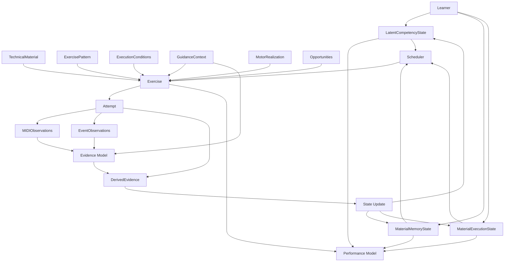
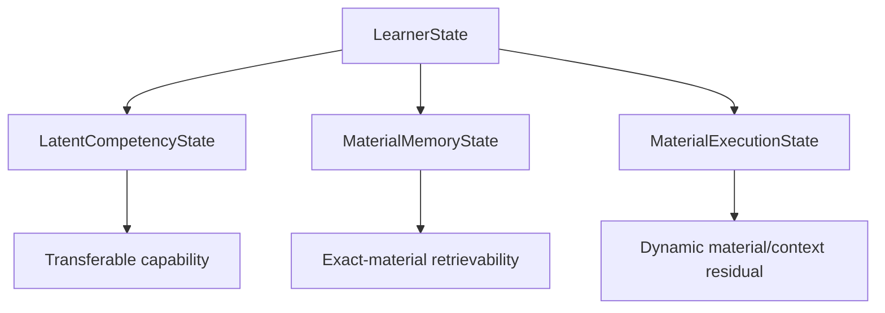
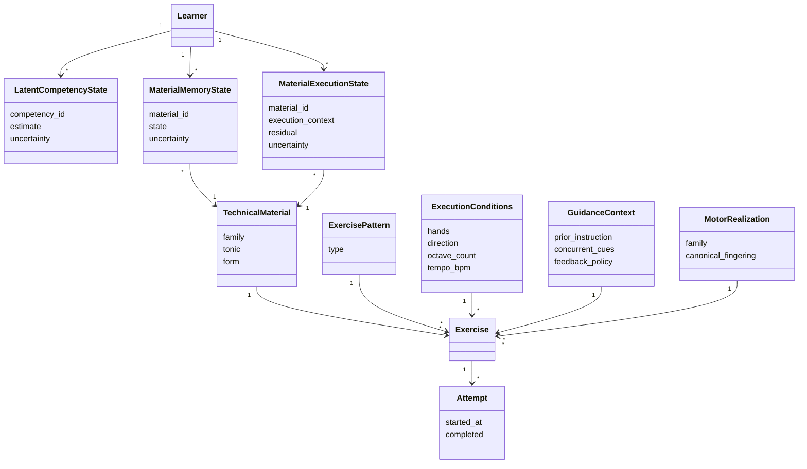
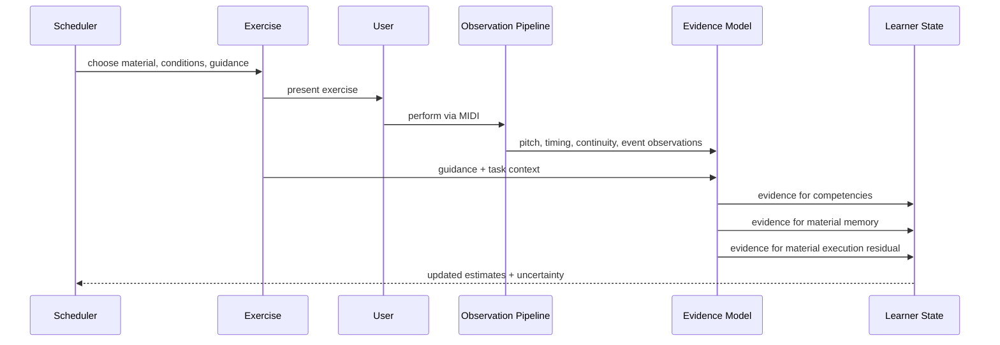

# KeyRecall V1 Learner-Model Design

## 1. Purpose

This document specifies the V1 learner-model architecture for KeyRecall.

It translates the conclusions preserved in `01-research.md` into a domain and
state design suitable for implementation. The research document remains the
evidentiary basis; this document records the design decisions made from that
evidence.

V1 is deliberately scale-focused in implementation, but the model is not
scale-specific. It must admit later technical-material families such as
arpeggios and later exercise patterns without redefining the learner-state
architecture.

This document does **not** yet freeze numerical update equations, decay
constants, scheduler weights, or success thresholds. Those remain modeling and
calibration work.

## 2. Design principles

The V1 model follows these principles:

1.  Separate transferable capability from exact-material knowledge and
    material-specific execution.
2.  Do not represent every observable performance dimension as an independent
    mastery variable.
3.  Preserve rich MIDI and event-level observations even when the initial latent
    model is parsimonious.
4.  Treat task difficulty, guidance, and execution conditions as predictors, not
    as separate remembered items.
5.  Use partial pooling so sparse material-specific evidence falls back toward
    shared learner state.
6.  Allow learner state to evolve with practice and nonuse.
7.  Preserve uncertainty alongside estimates.
8.  Distinguish supported execution from independent retrieval.
9.  Keep the domain vocabulary extensible beyond scales.
10. Prefer interpretable models in V1; population-trained higher-dimensional
    models can be introduced later if evidence warrants them.

## 3. Conceptual architecture



The central separation is:

```text
LatentCompetencyState
    transferable learner capability

MaterialMemoryState
    exact-material retrievability

MaterialExecutionState
    material/context-specific procedural residual

Exercise
    the requested task and its difficulty/support conditions

Attempt
    what actually happened
```

## 4. Technical material

### 4.1 General abstraction

`TechnicalMaterial` identifies the underlying musical object being practiced.

```text
TechnicalMaterial
|
+-- Scale
`-- Arpeggio          future
```

An arpeggio is not modeled as a scale exercise pattern. It is a distinct
technical-material family with its own pitch topology, canonical fingering, and
motor structure.

### 4.2 V1 scale material

For V1:

```yaml
TechnicalMaterial:
  family: SCALE
  tonic: F_SHARP
  form: HARMONIC_MINOR
```

Supported forms:

```text
MAJOR
NATURAL_MINOR
HARMONIC_MINOR
MELODIC_MINOR
```

Modes and arpeggios are outside the initial implementation scope but should fit
under the same abstraction.

### 4.3 Material identity

Material identity does **not** include:

```text
hand configuration
tempo
octave count
direction
guidance
exercise pattern
```

Thus `F# harmonic minor scale` is one technical material regardless of whether
it is played RH, LH, hands together, slowly, quickly, or over different octave
ranges.

## 5. Exercise pattern

`ExercisePattern` specifies a transformation or ordering applied to technical
material.

V1 supports:

```text
LINEAR
```

Future examples may include:

```text
THIRDS
RUSSIAN_FORMULA
modal or sequential patterns
```

A pattern normally does not change the identity of the underlying
`TechnicalMaterial`.

```yaml
ExercisePattern:
  type: LINEAR
```

Pattern-specific transferable competencies or residual effects may be added
later if longitudinal evidence demonstrates that they are necessary.

## 6. Execution conditions

`ExecutionConditions` describe the requested physical/performance context.

```yaml
ExecutionConditions:
  hands: RIGHT
  direction: UP_DOWN
  octaves: 2
  tempo_bpm: 96
```

Candidate V1 fields include:

```text
hands
direction
octave_count
tempo
rhythmic subdivision when relevant
```

These conditions affect task difficulty and evidence interpretation but do not
create separate technical materials.

### 6.1 Hand configuration

V1 distinguishes:

```text
RIGHT
LEFT
TOGETHER
```

RH, LH, and HT can have distinct material-execution state because motor-learning
research supports meaningful effector-specific effects and incomplete
intermanual transfer.

HT is not assumed to be mathematically equivalent to a third independent hand.
Its prediction can depend on RH/LH capability plus hands-together coordination
and HT-specific residual evidence.

## 7. Guidance context

`GuidanceContext` records what information and feedback the learner receives.

Guidance is part of the task/evidence context, not merely UI state.

```yaml
GuidanceContext:
  instruction:
    notes_previewed: false
    fingering_previewed: false

  concurrent_cues:
    note_names: false
    target_keys: false
    finger_numbers: false
    next_note_preview: false

  feedback:
    immediate_wrong_note: true
    post_attempt_summary: true
```

Three categories remain distinct:

```text
Instruction
    information supplied before the attempt

Concurrent cueing
    information supplied while executing

Feedback
    information supplied after or in response to performance
```

The raw configuration should be preserved. Derived concepts such as
`retrieval_demand` or `FULL/PARTIAL/MINIMAL/NONE` guidance may be computed later
but should not replace the source data.

Relevant prior exposure should also be retained when practical:

```yaml
RetrievalContext:
  material_shown_before_attempt: true
  seconds_since_material_view: 8
```

## 8. Motor realization and opportunities

`MotorRealization` describes how a technical material is canonically realized
under the requested execution context.

For the current scale corpus this connects the learner model to the established
scale motor taxonomy and generated realization data.

An exercise exposes `Opportunities` for competencies or diagnostically useful
events.

```text
Exercise
    |
    +-- expected scalar crossings
    +-- octave continuation
    +-- direction reversal
    +-- hands-together coordination
    `-- topology retrieval
```

An opportunity is not itself evidence. Evidence is produced by learner
performance at that opportunity.

```text
Task -> Opportunities -> Observations -> Evidence -> State update
```

Standard MIDI does not directly identify which finger was used. Expected
canonical fingering and expected crossing events may therefore be known while
actual fingering remains unobserved unless a defensible inference or additional
sensor is introduced.

## 9. Learner state

V1 has three conceptually distinct state layers.



### 9.1 LatentCompetencyState

`LatentCompetencyState` represents transferable capabilities supported by
evidence from many materials and tasks.

Each state should conceptually contain at least:

```yaml
LatentCompetencyState:
  competency_id: RH_SCALE_EXECUTION
  estimate: ...
  uncertainty: ...
```

The exact statistical representation of `estimate` and `uncertainty` is not yet
frozen.

#### 9.1.1 Competency vs. `CompetencyCategory`

The competency vocabulary distinguishes two kinds of node:

```text
Competency
    an actually estimated latent learner variable

CompetencyCategory
    an organizational/taxonomy node with no estimated state of its own
```

This distinction exists so a grouping that's convenient for documentation or UI
presentation doesn't silently become an additional statistical parameter. Every
`Competency` below is independently estimated; every `CompetencyCategory` is a
label over a set of Competencies and carries no `estimate`/`uncertainty` of its
own.

#### 9.1.2 Reconciled V1 scale competency ontology

The scale-focused V1 competency graph, reconciled against the mechanically
verified motor taxonomy (`../domain-model/motor-taxonomy.md`) and the domain
model's original Q-matrix (`../domain-model/v1-domain-model.md` §6.5-§7, now
superseded), is:

```text
CompetencyCategory: SCALE_TOPOLOGY
├── MAJOR_SCALE_TOPOLOGY          Competency
├── NATURAL_MINOR_TOPOLOGY        Competency
├── HARMONIC_MINOR_TOPOLOGY       Competency
└── MELODIC_MINOR_TOPOLOGY        Competency

CompetencyCategory: SCALE_EXECUTION
├── RH_SCALE_EXECUTION            Competency
└── LH_SCALE_EXECUTION            Competency

SCALAR_CROSSING                   Competency
MULTI_OCTAVE_CONTINUATION         Competency
DIRECTION_REVERSAL                Competency
HANDS_TOGETHER_COORDINATION       Competency
```

Ten estimated Competencies. `SCALE_TOPOLOGY` and `SCALE_EXECUTION` are
`CompetencyCategory` nodes only. The Q-matrix that determines which competencies
a given exercise can provide evidence about, and how that evidence is
attributed, is specified in `03-v1-math.md` §9.

A competency is refreshed by **relevant practice across the repertoire**, not
only by repetition of one exact material.

#### 9.1.3 Admission rule

```text
A latent Competency should correspond to a persistent transferable
capability for which KeyRecall has observations that can discriminate
it, at least probabilistically, from neighboring competencies.
```

This rule, not the taxonomy's shape, decides what gets estimated.
`SCALAR_CROSSING`, `MULTI_OCTAVE_CONTINUATION`, and `DIRECTION_REVERSAL` pass
it: each corresponds to a specific, independently identified expected
opportunity in the generated event stream (a crossing, a continuation boundary,
a turnaround) whose local performance can be observed around that opportunity,
separately from the surrounding scale. This is deliberately not the same claim
as observing the crossing itself: standard MIDI never reveals whether the
learner actually performed the prescribed crossing, only what happened in the
window around where the fingering says one was expected.

#### 9.1.4 Two deliberate omissions

Two nodes present in earlier drafts of this ontology are not estimated in V1,
for the same underlying reason:

**`DIATONIC_SCALE_MOTOR`** (a hypothetical parent over `RH_SCALE_EXECUTION` and
`LH_SCALE_EXECUTION`) fails the admission rule. `motor-taxonomy.md` establishes
that all 96 canonical hand-specific scale records share one motor family
(`DIATONIC_3_4_CYCLE`), but shared task structure is not the same thing as a
shared observation channel. Almost every RH scale attempt would load on both a
hand-specific competency and this hypothetical parent from essentially the same
inter-onset-interval stream, with no task that independently isolates the parent
from the hand-specific competency. Fitting a general factor alongside specific
factors that explain nearly the same observations is a known source of
nonidentifiability in general/specific (bifactor-style) latent models, not just
a KeyRecall guess. `DIATONIC_3_4_CYCLE` remains exactly what `motor-taxonomy.md`
established it to be: a domain-level `MotorFamily`, not learner state. RH/LH
transfer is represented instead through correlated priors (§9.1.5).

**`RHYTHMIC_EVENNESS`** fails the admission rule for the same structural reason:
nearly every scale exercise exercises it, and V1 has no independent observation
channel that separates "weak RH execution" from "weak general evenness" when
both are inferred from the same timing stream. It remains an observed/predicted
performance outcome (§12.2), feeding whichever competencies the evidence model
can actually attribute it to, rather than a competency of its own.

Both omissions follow one rule, not two special cases:

```text
Add a shared latent factor because the data requires it,
not because the taxonomy admits a common parent.
```

If longitudinal evidence later shows either factor materially improves
prediction after accounting for the specific competencies, it can be promoted
from `CompetencyCategory` (or from an observed outcome) to an estimated
`Competency` without changing anything else in this architecture.

#### 9.1.5 RH/LH transfer without a parent competency

`RH_SCALE_EXECUTION` and `LH_SCALE_EXECUTION` are estimated independently, but
not treated as unrelated. The motor-learning literature supports both
effector-independent and effector-specific representations: practice with one
hand improves prediction for the other, but transfer is incomplete and
hand-specific structure remains (`01-research.md` §19.2). That's evidence for a
_relationship_ between the two competencies, not evidence for a third latent
variable above them.

V1 represents this as **correlated prediction**, not direct cross-updating. A
strong RH observation should not be recorded as partial LH practice; that would
misrepresent an attempt that never happened. It should instead improve the
_prior prediction_ for an under-observed LH state, while actual LH evidence
dominates once it exists:

```text
LH directly observed
    LH state dominates

LH scarcely observed
    RH state (and self-reported experience) informs the prior,
    but uncertainty stays broad until LH is directly observed
```

This is the same partial-pooling logic already used for `MaterialExecutionState`
(§9.3), applied across hands instead of across materials. It also gives V1
CAT-like placement behavior for free: an advanced self-report plus strong RH
evidence can support a demanding initial LH probe without ever asserting LH
mastery that hasn't been observed.

A correlated-Gaussian prior over `(θ_RH, θ_LH)` is the natural full expression
of this, but V1 does not need to implement it directly; a heuristic prior-shift
rule that respects the same qualitative behavior is sufficient to start. The
exact mechanism is a `03-v1-math.md` question, not decided here.

### 9.2 MaterialMemoryState

`MaterialMemoryState` represents the current availability of one
`TechnicalMaterial` for independent production under a retrieval context.

Provisional definition:

> `MaterialMemoryState` estimates how available the underlying technical
> material is for independent production under a specified retrieval context.

It is keyed by learner and material, not by hand:

```yaml
MaterialMemoryState:
  material_id: F_SHARP_HARMONIC_MINOR_SCALE
  state: ...
  uncertainty: ...
```

It is time-sensitive.

A successful fully unguided performance provides substantially stronger evidence
of independent material retrieval than the same pitch-perfect performance with
the notes continuously displayed.

The exact memory equation remains unresolved. HLR-, ACT-R-, and DAS3H-related
research informs the design, but V1 should not assume that an existing
declarative-memory equation transfers unchanged to piano material.

### 9.3 MaterialExecutionState

V1 adopts the residual interpretation developed from the hierarchical and
mixed-effects research.

Provisional definition:

> `MaterialExecutionState` is a dynamic, partially pooled learner x
> technical-material x execution-context residual representing persistent
> material-specific procedural readiness not already explained by transferable
> competencies, material retrievability, or current task difficulty.

Conceptually:

```yaml
MaterialExecutionState:
  material_id: F_SHARP_HARMONIC_MINOR_SCALE
  execution_context: RIGHT
  residual: ...
  uncertainty: ...
```

The state is:

- **dynamic**: practice and nonuse can change it;
- **partially pooled**: sparse evidence stays close to the shared prediction;
- **context-specific**: RH/LH/HT differences can be represented;
- **residual**: it does not duplicate the transferable competency graph;
- **procedural**: it concerns execution rather than independent material
  retrieval; and
- **conditional on task difficulty**: tempo, octaves, direction, guidance, and
  similar variables do not fragment state identity.

V1 should **not** begin with independent persistent material-specific mastery
variables for:

```text
integrity
fluency
stability
tempo capacity
```

Those remain observed/predicted performance dimensions unless future
longitudinal evidence demonstrates the need for multidimensional residual state.

### 9.4 Cold start

A new material/execution-context residual begins near the shared expectation
with high uncertainty:

\[ r\_{u,m,c}(t) `\approx 0`{=tex} \]

Prediction therefore falls back naturally to:

```text
transferable competencies
+
material-memory prior
+
known material/task effects
```

As repeated evidence accumulates, the residual can personalize.

## 10. Observations

Detailed observations should be retained even when they do not correspond
one-to-one with persistent learner-state variables.

### 10.1 Pitch and sequence

```yaml
pitch:
  expected_notes: 29
  correct_notes: 28
  substitutions: 1
  omissions: 0
  additions: 0
```

Localized errors should be retained where possible.

### 10.2 Timing

Candidate observations include:

```text
target IOI
observed IOIs
median IOI
absolute timing deviation
IOI variability
tempo drift
```

Raw timing information should be preserved sufficiently to permit future metric
changes.

### 10.3 Continuity

```text
pauses
restart events
longest pause
broken traversal
```

### 10.4 Motor-event-local observations

The existing motor realization can identify expected events such as crossings,
continuations, and reversals.

Evidence may include:

```text
local slowdown near expected crossing
pause near octave continuation
disruption at direction reversal
```

These observations do not prove which finger was actually used.

### 10.5 Hands-together coordination

When HT is supported, candidate observations include:

```text
onset asynchrony
missed note pairs
hand-lead bias
coordination breakdown
```

## 11. Evidence model

The evidence model converts observations into probabilistic evidence about
learner state.

It must not equate all successful repetitions.

For example:

```text
100% pitch accuracy + continuous pitch cues
    -> strong execution evidence
    -> weak independent-retrieval evidence

100% pitch accuracy + no cues
    -> strong execution evidence
    -> strong material-memory evidence
```

Likewise:

```text
cannot begin unguided
    -> strong negative/uncertain MaterialMemory evidence
    -> little direct MaterialExecution evidence

correct pitches + severe crossing pauses
    -> positive MaterialMemory evidence
    -> negative execution/motor evidence
```

The model should retain uncertainty when observations cannot cleanly identify
the underlying cause.

## 12. Performance model

The performance model predicts outcomes from all relevant state and task
information.

Conceptually:

\[ P(Y) = f( `\text{LatentCompetencyState}`{=tex},
`\text{MaterialMemoryState}`{=tex}, `\text{MaterialExecutionState}`{=tex},
`\text{TaskFeatures}`{=tex}, `\text{GuidanceContext}`{=tex} ) \]

A mixed-effects-inspired schematic is:

\[ `\operatorname{logit}`{=tex} P(Y\_{u,m,c,t}) =
`\mathbf{x}`{=tex}_{u,m,c,t}\^{`\top`{=tex}}`\boldsymbol{\beta}`{=tex} +
r_{u,m,c}(t) \]

where the feature vector can incorporate shared competency state,
material-memory state, and task predictors, while `r` captures the dynamic
partially pooled learner/material/context residual.

This is an architectural equation, not yet the frozen V1 estimator.

### 12.1 Task difficulty

Candidate task predictors include:

```text
tempo
octave count
direction
guidance/retrieval demand
motor realization
keyboard geometry
exercise pattern
hand configuration
```

Tempo should be retained as raw BPM. Whether the fitted model uses raw tempo,
`log(BPM)`, a ratio, or another transform should be determined empirically.

### 12.2 Outcomes remain multidimensional

The model should preserve and potentially predict distinct outcomes such as:

```text
pitch/sequence integrity
continuity
temporal stability
tempo achievement
crossing-local disruption
coordination
```

A composite success probability may be useful to the scheduler, but it should
not destroy the underlying measurements.

## 13. Temporal dynamics

The three learner-state layers need not share the same decay/update process.

```text
LatentCompetencyState
    refreshed by relevant practice across materials

MaterialMemoryState
    exact-material retrieval/forgetting dynamics

MaterialExecutionState
    material/context-specific procedural dynamics
```

Procedural-retention research supports time-sensitive execution state and
different retention behavior across performance dimensions. It does not justify
copying declarative-memory decay constants into `MaterialExecutionState`.

The execution model should also remain capable of representing **savings**:
after apparent performance loss, reacquisition may be faster than initial
learning.

The exact mechanism for savings is not specified here.

## 14. Partial transfer

Transfer should generally be modeled through shared state rather than by
pretending related items were directly practiced.

For example, F# harmonic minor RH practice can:

```text
strongly update:
    F# harmonic-minor MaterialMemoryState
    F# harmonic-minor/RH MaterialExecutionState

update:
    relevant transferable topology and motor competencies

indirectly improve prediction for:
    F# harmonic-minor/LH
```

It should **not** mark the LH residual as if an LH attempt occurred.

Similarly, practicing other scales can maintain or improve
`RH_SCALE_EXECUTION`/`LH_SCALE_EXECUTION` even while the material-specific
execution state for one long-unpracticed scale weakens.

## 15. Scheduler action space

The scheduler eventually chooses more than which material appears next.

Conceptually, an action can specify:

```text
technical material
exercise pattern
hand configuration
direction
octave count
tempo
guidance/support
```

This allows retrieval challenge and motor challenge to be manipulated
independently.

Example:

```text
high memory uncertainty
    -> low-guidance retrieval probe

retrieval failure
    -> increase instructional support

supported execution reliable
    -> fade cues

independent retrieval reliable
    -> increase spacing and/or motor challenge
```

The scheduler should ultimately optimize long-term learning under limited
practice time rather than immediate correctness alone.

The exact objective function and action-selection policy remain separate design
work.

## 16. V1 scope boundary

The architecture is intentionally broader than the first implementation.

### In scope

```text
TechnicalMaterial.family = SCALE
ExercisePattern = LINEAR

Scale forms:
    MAJOR
    NATURAL_MINOR
    HARMONIC_MINOR
    MELODIC_MINOR

Execution contexts:
    RIGHT
    LEFT
    TOGETHER when supported

Canonical fingerings only
Existing scale motor realization taxonomy
MIDI-derived pitch/timing/continuity evidence
Guidance-aware evidence
Three-layer learner state
```

### Architecturally supported but not initially implemented

```text
arpeggios
modes
scale patterns such as thirds
Russian-formula exercises
alternative fingerings
population-trained factorization models
multidimensional material-execution residuals
contextual-bandit scheduling
```

## 17. Conceptual object relationships



This diagram is conceptual rather than a persistence-schema prescription.

## 18. Attempt-to-state flow



## 19. Persistence guidance

The persistence layer should distinguish **source observations** from
**recomputable derived state** where practical.

Important durable data includes:

```text
exercise/task configuration
guidance and retrieval context
raw or sufficiently lossless MIDI-derived observations
event-localized observations
attempt timestamps
model/version identifiers
```

This preserves the ability to re-estimate learner state as the model improves.

Learner-state snapshots may also be persisted for runtime efficiency, but the
system should avoid making historical observations irrecoverable merely because
a later model changes its update equations.

Generated or derived values should carry enough model/version information to
support reproducibility.

## 20. Explicit non-decisions

The following are intentionally **not frozen** by this document:

```text
exact state-estimation algorithm
exact memory decay equation
exact procedural decay equation
shrinkage/partial-pooling strength
RH/LH/HT residual correlation structure
success thresholds
tempo transform
Q-matrix weights
evidence weights
scheduler utility function
scheduler target success probability
initial-placement algorithm
population priors
telemetry-driven parameter fitting
```

These are subsequent mathematical/modeling decisions.

## 21. V1 invariants

The following should be treated as architectural invariants unless later
research provides a strong reason to revise them:

1.  `TechnicalMaterial` is broader than `Scale`.
2.  Scale and arpeggio are distinct material families.
3.  Exercise patterns are orthogonal to material identity.
4.  Hand, tempo, direction, octave count, and guidance do not define material
    identity.
5.  Transferable competency, exact-material memory, and material-specific
    execution are distinct state concepts.
6.  `MaterialExecutionState` is a residual, not a parallel micro-skill graph.
7.  Sparse material-specific execution evidence is partially pooled toward
    shared predictions.
8.  Guidance context affects evidence interpretation.
9.  Detailed observations are retained even when the latent state is
    parsimonious.
10. V1 canonical fingering data describes expected motor events; MIDI alone does
    not directly observe finger identity.
11. Related practice transfers through shared state rather than being recorded
    as fictitious direct practice of another material/context.
12. Temporal dynamics may differ across learner-state layers.

## 22. Next modeling work

With the state architecture fixed, the next pass should specify the smallest
mathematical V1 model capable of operating before KeyRecall has population
training data.

That work should answer:

1.  How are initial priors assigned to competency, material-memory, and
    execution residual states?
2.  How are estimates and uncertainty represented?
3.  How does one attempt update each state layer?
4.  What is the simplest defensible forgetting model for `MaterialMemoryState`?
5.  What provisional dynamic should be used for `MaterialExecutionState` before
    enough longitudinal data exists to fit one?
6.  How is partial pooling implemented locally for a single learner?
7.  How are multiple MIDI-derived outcomes converted into evidence without
    prematurely collapsing them into one score?
8.  How does guidance attenuate or alter material-memory evidence?
9.  How should the scheduler select an exercise from the resulting predictive
    distributions?
10. Which parameters are fixed from literature, weakly informed by literature,
    heuristic V1 choices, or intended to be learned from future telemetry?

The objective of that next pass is not to produce the final adaptive-learning
algorithm. It is to define a mathematically coherent, inspectable V1 that can
generate the longitudinal data needed to improve itself.
