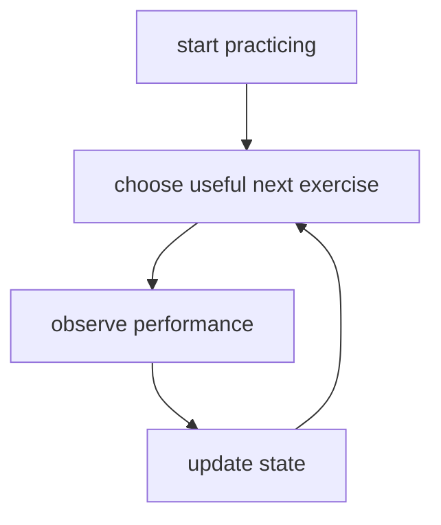
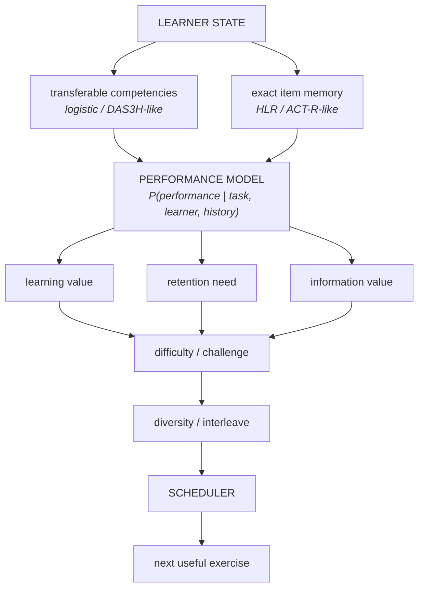
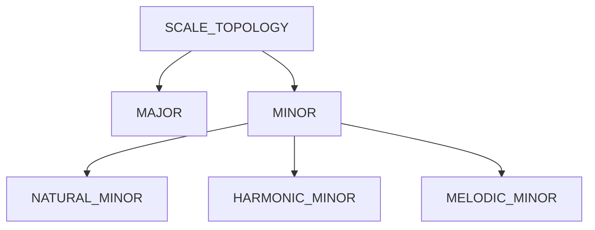
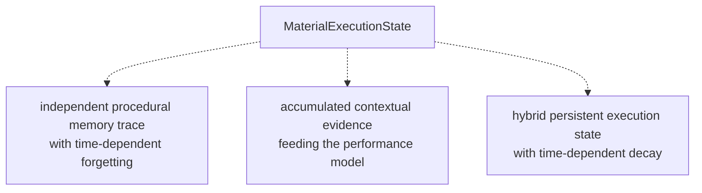
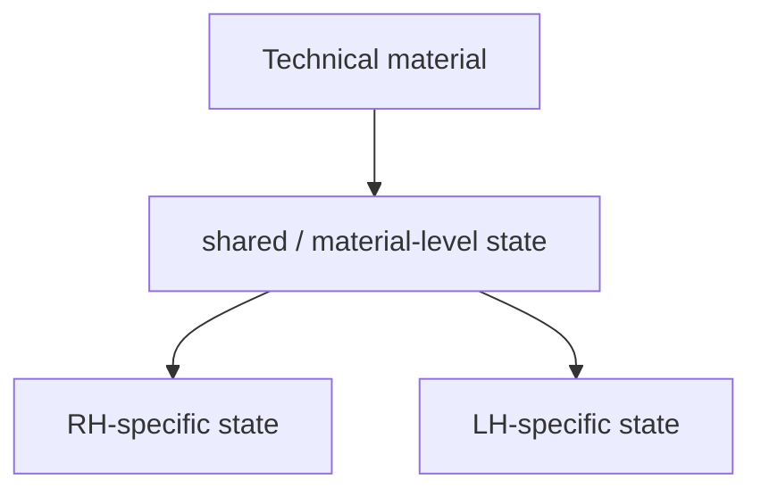
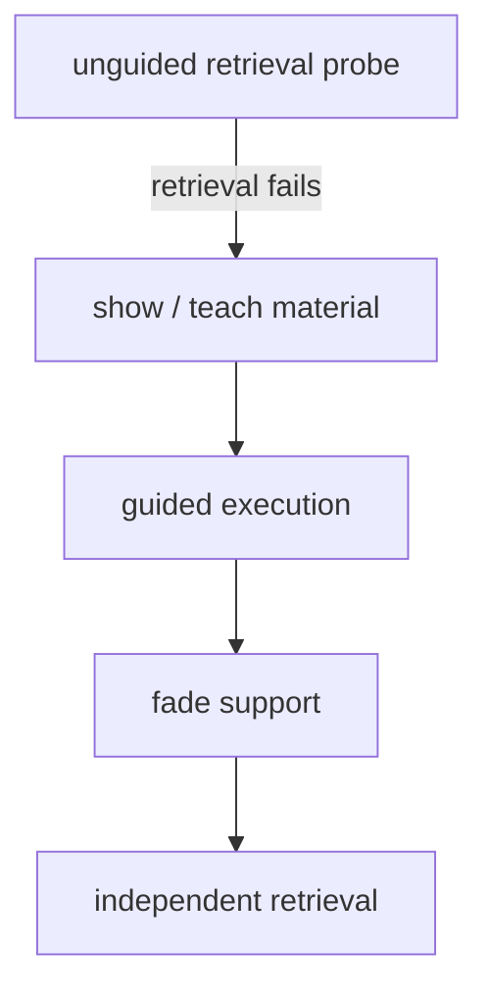
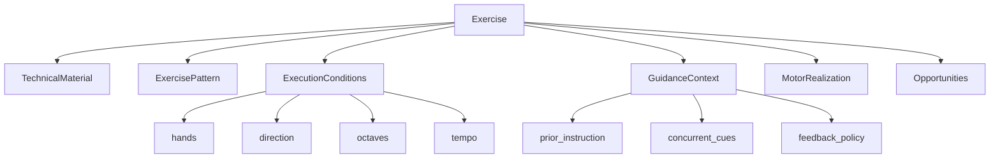
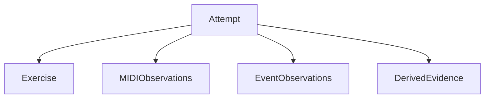
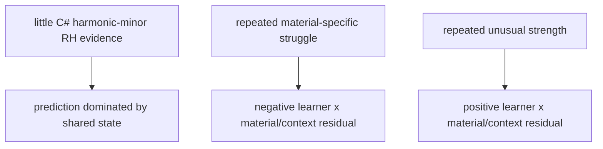
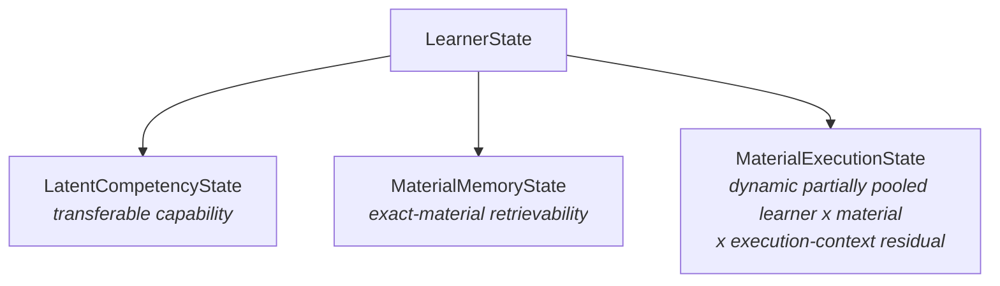

# Learner-model literature

> **Status:** research record, and the evidentiary basis for the learner model.
>
> **Research cutoff:** August 2026.
>
> This is not the shortest description of what KeyRecall does; that is
> [`../../system/learner-model.md`](../../system/learner-model.md). Read this
> for the sources, and for the boundary between what the research supports and
> what is our own synthesis.

Sources are cited by key into [`../../REFERENCES.md`](../../REFERENCES.md),
which carries the full citation and a line on what each one contributed. The
prose here still says what a source established, because a citation key alone is
not a readable argument.

Several superseded state proposals have been removed from this document: the
provisional generalized domain model, the successive "refined definition"
sections, the recommended modeling sequence, and the immediate design questions.
All of those were answered, and the answers are in
[`../../system/`](../../system/). What remains is evidence.

## Purpose

KeyRecall needs a learner model that can estimate transferable competencies,
memory for exact practiced items, uncertainty, performance as difficulty
changes, effects of elapsed time, and the learning value of candidate exercises.

No single established model covers all of these requirements. The recommended
direction is therefore a **hybrid, interpretable learner and scheduler model
assembled from established research traditions**, rather than a novel opaque
"KeyRecall algorithm."

This document deliberately distinguishes research-supported findings from
KeyRecall-specific synthesis decisions that still require simulation and
empirical validation.

## Architectural distinctions

The preceding motor analysis established:

```text
Motor/domain model
    describes what the exercise requires

Learner model
    describes what KeyRecall believes about the pianist

Evidence model
    connects observed performance to learner state
```

The learner model adds another distinction:

```text
TRANSFERABLE COMPETENCY
    persistent capability shared across related tasks

ITEM MEMORY
    time-sensitive state for an exact practiced item

TASK FEATURES
    conditions under which performance is requested

OBSERVATIONS
    what actually happened during the attempt
```

For example:

```text
RH scale execution           transferable competency
harmonic-minor topology      transferable competency
D harmonic minor             exact item
time since D harmonic minor  item-memory feature
phase 5                      task feature
92 BPM                       task feature
wrong C#                     observation
local hesitation             observation
```

This separation is foundational.

## Knowledge tracing

Knowledge-tracing models infer unobserved learner knowledge from sequences of
observable performances. Classical Bayesian Knowledge Tracing (BKT) established
the general architecture of hidden knowledge state updated by evidence, commonly
using learned/unlearned state plus learning, guessing, and slipping parameters.

That architecture is useful to KeyRecall, but vanilla BKT is too coarse. MIDI
performance is not naturally binary and can expose pitch correctness, fingering
deviations, timing consistency, hesitation, tempo, continuity, crossing
execution, turnaround behavior, and hands-together synchronization. A single
exercise can also require several competencies simultaneously.

**KeyRecall implication:** preserve the knowledge-tracing distinction between
observation and latent state, but do not assume binary mastery is the final
mathematical model.

## Performance Factors Analysis and logistic learner models

Pavlik, Cen, and Koedinger's Performance Factors Analysis (PFA) was developed as
an alternative to conventional knowledge tracing and explicitly addresses
limitations around actions requiring multiple skills.

A logistic family gives a useful general form:

```math
P(\text{success}) = \sigma(\text{learner/skill state} + \text{practice evidence} + \ldots)
```

where:

```math
\sigma(x) = \frac{1}{1 + e^{-x}}
```

This is attractive because KeyRecall can eventually model:

```math
P(\text{performance} \mid \text{competencies}, \text{task features}, \text{history})
```

without turning every task feature into a separate latent skill.

**Source:** [Pavlik2009]

## DAS3H: the closest conceptual match

Choffin, Popineau, Bourda, and Vie developed DAS3H specifically for adaptive
distributed practice where items involve **multiple underlying skills** and
those skills undergo learning and forgetting.

This closely resembles KeyRecall. A D harmonic-minor RH exercise can
simultaneously provide evidence about harmonic-minor topology, scalar motor
organization, RH execution, crossing facility, multi-octave continuation,
direction reversal, and rhythmic evenness.

DAS3H builds on additive-factor models and incorporates the temporal
distribution of prior practice on skills associated with an item. Learning and
forgetting curves may differ by skill. The authors report improved prediction
over comparison educational-data-mining models on three real-world datasets.

This supports three KeyRecall decisions:

1.  exercises may involve multiple competencies;
2.  evidence may transfer through shared competencies; and
3.  elapsed time and forgetting belong inside the learner model rather than only
    in an external due-date mechanism.

DAS3H was developed for educational response data, not continuous piano motor
performance. KeyRecall would adapt the approach rather than apply it unchanged.

**Source:** [Choffin2019]

## Exact-item memory: Half-Life Regression

Settles and Meeder introduced Half-Life Regression (HLR), modeling recall
probability as:

```math
P(\text{recall}) = 2^{-\Delta/h}
```

where $\Delta$ is elapsed time and $h$ is estimated memory half-life.

HLR provides precedent for maintaining time-sensitive state for an **exact
item**. Thus D harmonic minor can have its own practice/forgetting history while
the same attempt updates transferable competencies.

This supports:

```text
shared learner state
        +
exact scale-item memory
```

A piano scale is not a vocabulary item and successful execution is not binary
recall. HLR should therefore inform item-memory dynamics rather than serve as
the complete performance model.

**Source:** [Settles2016]

**Public implementation:**\
<https://github.com/duolingo/halflife-regression>

## ACT-R-derived practice optimization

Pavlik and Anderson developed a quantitative memory model and used it to compute
practice schedules. Their optimization balances long-term spacing benefit
against recency, frequency, forgetting/failure risk, and the time cost of
difficult retrieval. As an item becomes more stable, its optimal interval
increases.

This is important to KeyRecall because:

- irregular practice is normal; elapsed time is an input, not a schedule
  violation;
- scheduling can optimize learning value per unit of practice time rather than
  merely determine what is "due"; and
- optimal spacing can change dynamically with the learner.

This supports sessions that require no declared duration:



**Source:** [PavlikAnderson2008]

## Adaptive Response-Time-Based Sequencing (ARTS)

ARTS dynamically sequences learning using accuracy, response time, and trials
since last presentation. As measured learning strength increases, spacing
expands.

Piano practice lacks conventional question-response latency, but MIDI offers
richer analogous signals:

```text
accuracy
tempo
inter-onset timing
local hesitation
pauses
restarts
crossing slowdowns
continuity
```

**KeyRecall implication:** adaptive spacing need not depend on explicit
easy/hard ratings. Objective performance can drive sequencing.

**Source:** [Mettler2013]

## Spacing and distributed practice

Cepeda et al.'s quantitative review examined 839 assessments from 317
experiments. Importantly, the spacing interval producing maximal retention
varies with the desired retention interval.

KeyRecall therefore should not treat a fixed progression such as:

```text
1 day -> 3 days -> 7 days -> 14 days
```

as the fundamental memory model. A dynamic model may produce similar intervals,
but they should emerge from estimated state and scheduling goals.

**Source:** [Cepeda2006]

## Motor learning: Challenge Point Framework

Guadagnoli and Lee's Challenge Point Framework explicitly considers the
interaction between performer skill and task difficulty. The same nominal task
does not create the same learning challenge for performers of different ability.

This supports treating:

```text
tempo
octave count
hands separately/together
direction
rhythmic variation
pattern complexity
```

as **difficulty/context dimensions**, not separate latent skills.

KeyRecall should eventually estimate something closer to:

```math
P(\text{successful execution} \mid \text{learner state}, \text{tempo}, \text{octaves}, \text{hands}, \ldots)
```

This suggests a **performance frontier** rather than a single static mastery
percentage.

The framework supports adapting difficulty to ability, but does not establish
one universal target success percentage that KeyRecall should hard-code.

**Source:** [GuadagnoliLee2004]

## Contextual interference and interleaving

Contextual-interference research provides a basis for varying tasks rather than
indefinitely blocking repetitions of one task.

A 2024 systematic review and meta-analysis found an overall medium effect on
motor-skill transfer favoring random practice, but with substantial
heterogeneity. Effects were stronger in laboratory settings; the applied-setting
effect was smaller and not statistically significant. The review also identified
methodological weaknesses in much of the underlying literature.

Therefore:

```text
interleaving is promising
```

does not imply:

```text
maximize randomness
```

Carter and Grahn (2016) provide particularly relevant piano-specific work
comparing blocked and interleaved practice in advanced musical performance.

**KeyRecall implication:** the scheduler should eventually contain a
diversity/interleaving pressure, but its strength may depend on ability, task
complexity, acquisition stage, uncertainty, retention need, and practice goal.

**Sources:**

Carter, C. E., & Grahn, J. A. (2016). _Optimizing Music Learning: Exploring How
Blocked and Interleaved Practice Schedules Affect Advanced Performance_.
Frontiers in Psychology, 7, 1251.\
<https://doi.org/10.3389/fpsyg.2016.01251>

Czyż, S. H., Wójcik, A. M., & Solarská, P. (2024). _The Effect of Contextual
Interference on Transfer in Motor Learning - A Systematic Review and
Meta-Analysis_. Frontiers in Psychology, 15, 1377122.\
<https://doi.org/10.3389/fpsyg.2024.1377122>

## IRT, MIRT, and adaptive testing

Item Response Theory relates item performance to latent ability and item
characteristics. Multidimensional IRT generalizes ability to a vector.

A common multidimensional logistic form is:

```math
P_i(\boldsymbol{\theta}) = \frac{\exp(\mathbf{a}_i^\prime\boldsymbol{\theta}+d_i)}{1+\exp(\mathbf{a}_i^\prime\boldsymbol{\theta}+d_i)}
```

Computerized Adaptive Testing selects items that are especially informative
about current ability estimates. Multidimensional CAT extends this to multiple
traits, with established selection criteria including Fisher information and
mutual information.

IRT/MIRT is probably not KeyRecall's complete longitudinal model because it is
fundamentally a measurement framework rather than a learning-and-forgetting
model. It is, however, highly relevant to:

```text
initial level setting
diagnostic probing
uncertainty reduction
selection of informative exercises
```

An experienced pianist should not have to grind through beginner material
because KeyRecall lacks history. A short adaptive diagnostic can rapidly select
exercises that reduce uncertainty across multiple competencies.

**Sources:**

Reckase, M. D. (2009). _Multidimensional Item Response Theory_. Springer.\
<https://doi.org/10.1007/978-0-387-89976-3>

van Groen, M. M., Eggen, T. J. H. M., & Veldkamp, B. P. (2016).
_Multidimensional Computerized Adaptive Testing for Classifying Examinees With
Within-Dimensionality_. Applied Psychological Measurement, 40(6).\
<https://doi.org/10.1177/0146621616648931>

## Contextual bandits: later, not foundational

Contextual-bandit methods can eventually choose among candidate exercises from
learner context and observed reward, balancing exploitation and exploration.

They are potentially attractive once substantial real-world data exists, but
should not be the V1 foundation. Starting there would make the system more
data-hungry, less interpretable, more telemetry-dependent, and harder to
validate pedagogically.

A future policy-learning layer could optimize scheduler weights from
privacy-preserving aggregate data while retaining an interpretable model-based
core.

## Proposed KeyRecall synthesis

The following is a **KeyRecall design synthesis**, not a single published model:



Research precedent by requirement:

| KeyRecall requirement          | Research foundation                 |
| ------------------------------ | ----------------------------------- |
| Persistent transferable state  | Knowledge tracing, PFA, logistic KT |
| Multi-skill exercises          | PFA, DAS3H, multidimensional models |
| Forgetting of shared skills    | DAS3H                               |
| Exact-item memory              | HLR, ACT-R-derived memory models    |
| Irregular elapsed time         | HLR, DAS3H, ACT-R scheduling        |
| Adaptive difficulty            | Challenge Point Framework           |
| Objective performance strength | ARTS                                |
| Initial level setting          | IRT/MIRT, CAT                       |
| Information-seeking practice   | CAT/MIRT                            |
| Interleaving                   | Contextual-interference research    |
| Future policy optimization     | Contextual bandits                  |

## Transferable competency vs. exact item state

For:

```text
D harmonic minor RH
```

an attempt can update transferable state such as:

```text
harmonic-minor topology
diatonic scale motor
RH execution
crossing facility
multi-octave continuation
rhythmic evenness
```

while also updating a memory trace for the exact D-harmonic-minor item.

When the pianist later encounters B-flat harmonic minor for the first time,
shared competencies can establish a strong prior without pretending that B-flat
harmonic minor itself has been practiced.

Conversely, D harmonic minor may need reinstatement after a long gap even if
general harmonic-minor competence remains high.

This gives a principled mechanism for both **transfer** and **spaced
retrieval**.

## Scale topology as hierarchical shared knowledge

A provisional hierarchy remains plausible:



The hierarchy and numerical transfer strengths are **KeyRecall hypotheses**, not
conclusions established by the sources above.

Tonic should initially remain a task feature rather than twelve independent
mastery variables:

```yaml
pitch_context:
  tonic: D
  form: harmonic_minor
```

Preserving tonic context in observations lets later data determine whether
persistent key-specific effects justify explicit latent parameters.

## Open procedural-memory questions

The generalized state model above is a **provisional KeyRecall design
hypothesis**, not yet a conclusion from the reviewed memory literature.

The central unresolved question is the status of `MaterialExecutionState`:



The current literature review establishes useful models for item recall and
shared-skill learning/forgetting, but it does not yet establish that
material-specific piano motor execution should use the same retention dynamics
as declarative or vocabulary-like item memory.

A related question is whether `MaterialMemory` itself can cleanly be interpreted
as a declarative/retrieval trace. Producing a scale combines knowledge of the
pitch collection with procedural execution, so the convenient architectural
distinction between "remember D major" and "execute D major RH" should not be
mistaken for a settled cognitive distinction.

The next research pass should therefore examine motor-skill and
procedural-memory retention specifically, including:

- retention and forgetting of acquired motor skills over time;
- differences between declarative and procedural forgetting;
- contextual specificity and transfer of motor learning;
- whether hand-specific practice produces durable effector-specific state;
- transfer between effectors/hands;
- savings or rapid reacquisition after periods without practice;
- effects of spacing on complex motor-skill acquisition and retention; and
- piano-specific evidence where available.

The research goal is to determine whether the three-layer architecture should
remain:

```text
LatentCompetencyState
MaterialMemory
MaterialExecutionState
```

and, if so, whether the latter two require distinct mathematical update and
decay models.

## Procedural motor retention and material-specific execution state

A focused procedural-memory research pass strengthens the provisional
three-layer architecture rather than collapsing it.

### Procedural skill is time-sensitive

Tatel and Ackerman's 2025 meta-analysis of procedural skill retention and decay
synthesized 1,344 effect sizes from 457 reports. Performance loss increased with
periods of nonuse, and decay differed across accuracy, speed, and mixed
performance measures. Task characteristics and intermittent use also moderated
retention.

This provides strong support for allowing `MaterialExecutionState` to weaken
with nonuse.

The aggregate decay estimates from this heterogeneous literature should **not**
be used directly as KeyRecall parameters. Their value here is structural:
material-specific procedural readiness is not merely an immutable accumulation
of historical evidence.

**Source:** [Tatel2025]

### Motor representations can contain shared and effector-specific components

Motor-sequence research provides evidence for both effector-independent and
effector-specific representations. Studies of intermanual transfer and motor
sequence learning have reported transfer of abstract or spatial sequence
information between hands alongside components that remain specific to the
trained effector.

This aligns with, but does not prove a one-to-one neural interpretation of, the
KeyRecall decomposition:



The software architecture should therefore support **partial transfer** rather
than assuming either zero or complete transfer between hands.

Practicing F# harmonic minor RH might produce:

```text
strong update:
    F# harmonic minor material state
    RH-specific execution state

shared update:
    transferable scale motor competencies

partial indirect benefit:
    prior for future F# harmonic minor LH
```

It should not mark the LH realization as though it had itself been practiced.

**Representative sources:**

- Panzer, S., Krueger, M., Muehlbauer, T., Kovacs, A. J., & Shea, C. H. (2009).
  Inter-manual transfer and practice: Coding of simple motor sequences.
  <https://pubmed.ncbi.nlm.nih.gov/19073469/>
- Abrahamse, E. L., Ruitenberg, M. F. L., de Kleine, E., & Verwey, W. B. (2013).
  Control of automated behavior: Insights from the discrete sequence production
  task. Background review of sequence representations:
  <https://pmc.ncbi.nlm.nih.gov/articles/PMC3110831/>
- Wiestler, T., Waters-Metenier, S., & Diedrichsen, J. (2014). Effector-
  independent motor sequence representations exist in extrinsic and intrinsic
  reference frames. <https://pubmed.ncbi.nlm.nih.gov/24695723/>
- Vangheluwe, S., Puttemans, V., Wenderoth, N., Van Baelen, M., & Swinnen, S. P.
  (2006). Inter- and intralimb transfer of a bimanual task: Generalizability of
  limb dissociation. <https://pubmed.ncbi.nlm.nih.gov/16307261/>
- van Mier, H. I., & Petersen, S. E. (2006). Intermanual transfer effects in
  sequential tactuomotor learning. <https://pubmed.ncbi.nlm.nih.gov/16198379/>

### Procedural retention is not equivalent to item recall

Motor-memory research also cautions against treating procedural execution as a
flashcard-like recall process.

Motor learning may demonstrate **savings**: performance can deteriorate during
nonuse while subsequent reacquisition remains faster than original acquisition.
Savings, retention, and long-term motor memory need not be identical constructs.

For KeyRecall this argues against simply assigning an HLR-style recall half-life
to each hand-specific execution.

`MaterialExecutionState` is therefore preferable terminology to
`ExecutionMemory`: it describes the model's estimate of material-specific
procedural readiness without prejudging the exact cognitive mechanism.

**Representative sources:**

- Krakauer, J. W., & Shadmehr, R. (2006). Consolidation of motor memory.
  <https://pmc.ncbi.nlm.nih.gov/articles/PMC2553888/>
- Recent work distinguishing savings from long-term motor memory:
  <https://pmc.ncbi.nlm.nih.gov/articles/PMC10138789/>

### Motor spacing evidence requires a narrower claim

Distributed practice has substantial support in motor learning, including
evidence for improved long-term retention in some complex motor-training
domains. However, motor spacing effects vary with task characteristics and
experimental design and are not as uniform as the declarative-memory spacing
literature.

KeyRecall should therefore **not directly import declarative spaced-repetition
intervals into procedural piano practice**.

A piano-specific study by Wiseheart, D'Souza, and Chae found no spacing benefit
for newly learned 17-note piano sequences and short song phrases under the
within-session spacing conditions they tested. Importantly for KeyRecall, their
retention test occurred only about **five minutes after training**. The study
therefore addresses short-term retention following a single learning session,
not the longitudinal problem KeyRecall is intended to solve: building,
maintaining, and reacquiring a technical motor repertoire across months and
years.

The result is still useful because it demonstrates that a spacing effect should
not be assumed merely because the task involves piano. It does **not** provide
evidence against long-term adaptive spacing of piano technique.

The appropriate research position is:

> Spacing is extremely well established for declarative learning, and
> distributed practice has meaningful support in motor learning, but motor
> effects are task- and timescale-dependent. Limited piano-specific evidence
> does not justify directly importing declarative spacing schedules, nor does
> the available short-retention piano study test KeyRecall's longitudinal use
> case.

**Sources:**

- Wiseheart, M., D'Souza, A. A., & Chae, B. (2017). Lack of spacing effects
  during piano learning. <https://pmc.ncbi.nlm.nih.gov/articles/PMC5553926/>
- Systematic review of distributed practice in surgical motor-skill training:
  <https://pubmed.ncbi.nlm.nih.gov/28843958/>

### Accuracy and speed should remain distinguishable

The procedural-retention literature provides empirical support for preserving
multiple dimensions of performance rather than collapsing MIDI observations into
one score. Accuracy and speed can show different retention characteristics.

KeyRecall should therefore retain separable observations such as:

```text
pitch/sequence accuracy
continuity
timing/evenness
tempo capacity
```

A later performance model may combine these dimensions for prediction or
scheduling, but the underlying evidence should remain available separately.

### Prior expertise can support acquisition of related motor material

Research comparing musicians and nonmusicians on sequential motor tasks has
found benefits of prior musical experience for acquisition and/or consolidation
of related finger-sequence skills.

This supports the broader KeyRecall premise that a novel technical item should
not begin from an isolated zero state. Transferable motor competencies can
provide informative priors for new but structurally related material.

**Representative sources:**

- <https://pubmed.ncbi.nlm.nih.gov/27333186/>
- <https://pubmed.ncbi.nlm.nih.gov/27472398/>

## Guidance, retrieval demand, and evidence interpretation

KeyRecall's learner model must distinguish successful **supported execution**
from successful **independent retrieval**.

If the interface continuously supplies the notes, target keys, or fingering for
a scale, a correct performance can provide strong evidence about motor execution
while providing much weaker evidence that the underlying material is
independently retrievable.

This makes instructional support part of the evidence context rather than merely
a user-interface preference.

### Retrieval practice and independent production

Retrieval-practice research distinguishes attempting to retrieve information
from simply restudying or re-exposing it. KeyRecall should preserve this
distinction when updating `MaterialMemoryState`.

For example, two pitch-perfect performances of F# harmonic minor are not
equivalent evidence if one is performed with the pitch sequence continuously
displayed and the other is independently produced from only the instruction
"Play F# harmonic minor."

Conceptually:

```text
fully prompted performance
    strong execution evidence
    weak independent-retrieval evidence

independent performance
    strong execution evidence
    strong material-retrieval evidence
```

Supported practice may still produce learning; supported success simply should
not be interpreted as equivalent evidence of independent retrievability.

**Representative source:** Karpicke, J. D., & Grimaldi, P. J. (2012).
_Retrieval-Based Learning: A Perspective for Enhancing Meaningful Learning_.

<https://pmc.ncbi.nlm.nih.gov/articles/PMC3983480/>

### Instruction, concurrent cueing, and feedback are distinct

KeyRecall should distinguish three forms of support.

**Instruction** supplies information before an attempt:

```text
F# harmonic minor:
F# G# A B C# D E# F#

RH fingering:
3 4 1 2 3 1 2 3
```

**Concurrent cueing** supplies information while execution is occurring:

```text
highlight next key
display next note
show finger number
```

**Feedback** supplies information after, or in response to, learner behavior:

```text
wrong note
timing uneven here
pause near expected crossing
post-attempt performance summary
```

These interventions have different implications for what an attempt tells us.
Concurrent pitch cues can directly remove some retrieval demand, whereas
post-response feedback need not prevent the learner from first attempting an
independent response.

Motor-learning research on augmented feedback also cautions against assuming one
universal feedback-frequency rule. Guidance can improve acquisition performance,
but the effects of feedback frequency and timing on retention and transfer
depend on task and feedback characteristics.

**Representative sources:**

- Winstein, C. J., & Schmidt, R. A. (1990). Reduced frequency of knowledge of
  results enhances motor skill learning.
  <https://pubmed.ncbi.nlm.nih.gov/7886280/>
- Review discussing augmented-feedback frequency and motor learning:
  <https://pmc.ncbi.nlm.nih.gov/articles/PMC3153799/>
- Review of augmented feedback in motor learning:
  <https://pmc.ncbi.nlm.nih.gov/articles/PMC8681883/>

### Preserve raw guidance configuration

The data model should preserve the actual support supplied during an exercise
rather than storing only a coarse ordinal guidance level.

Conceptually:

```yaml
guidance:
  instruction:
    notes_previewed: false
    fingering_previewed: false

  concurrent_cues:
    note_names: false
    target_keys: false
    finger_numbers: false
    next_note_preview: false

  feedback:
    immediate_wrong_note: true
    post_attempt_summary: true
```

A derived classification such as `FULL`, `PARTIAL`, `MINIMAL`, or `NONE`, or a
continuous `retrieval_demand` value, may later be useful for modeling and
scheduler decisions. The raw configuration should remain available so that the
mapping can be changed or empirically calibrated.

Any numerical mapping from guidance configuration to retrieval demand would be a
**KeyRecall model parameter**, not a coefficient established by the current
literature.

### Prior exposure matters even without concurrent cues

An apparently unguided attempt may still differ substantially depending on what
the learner saw immediately beforehand.

For example:

```text
show F# harmonic-minor notes
wait several seconds
hide notes
ask learner to play
```

requires retrieval during execution, but is not equivalent to independently
producing F# harmonic minor after a long interval without re-exposure.

The attempt should therefore preserve relevant retrieval context:

```yaml
retrieval_context:
  material_shown_before_attempt: true
  seconds_since_material_view: 8
  concurrent_pitch_cues: false
```

The eventual memory model can determine how strongly such an attempt updates
independent retrievability.

### Guidance-sensitive evidence updates

Material-memory evidence should depend on observed performance and retrieval
support:

```math
E_{\text{material memory}} = f(\text{performance}, \text{guidance}, \text{prior exposure})
```

This is a conceptual relationship rather than a finalized equation.

Consider:

```text
Attempt A
    F# harmonic minor
    notes displayed continuously
    100% pitch accuracy

Attempt B
    F# harmonic minor
    no pitch cues
    100% pitch accuracy
```

Attempt A can strongly support conclusions about execution integrity,
continuity, stability, and motor competence while providing relatively weak
evidence of independent material retrieval.

Attempt B provides strong evidence for both material retrieval and execution.

Guidance may also affect motor performance itself, so it belongs in the
performance model as well as the material-memory evidence model.

### Retrieval failure and execution failure should be distinguishable

An unguided learner who cannot begin an E-flat harmonic-minor exercise provides
strong evidence about `MaterialMemoryState` but little direct evidence about
current material-specific execution capability.

KeyRecall could then increase support:



These attempts should not be counted as equivalent repetitions.

Conversely, a pianist may select every pitch correctly but show large pauses,
crossing-local slowdowns, or tempo collapse. Such a performance can provide
positive material-memory evidence while providing weak or negative execution
evidence.

### Guidance fading should be adaptive

KeyRecall should eventually manipulate support independently from motor
difficulty. The scheduler's action is broader than selecting a material:

```text
which material?
which execution context?
what tempo?
how many octaves?
what pattern?
how much support?
```

A plausible adaptive sequence is:

```text
memory uncertainty high
    -> attempt low-guidance retrieval probe

retrieval fails
    -> increase support

supported execution becomes reliable
    -> fade support

independent retrieval succeeds
    -> increase spacing and/or motor challenge
```

This does not imply a fixed `FULL -> PARTIAL -> MINIMAL -> NONE` progression.
The amount and timing of guidance should remain adaptive.

A 2026 piano-training study using adaptive visual guidance reported improved
subsequent unguided pitch/fingering accuracy relative to static guidance. Its
short-duration VR training context is substantially narrower than KeyRecall's
longitudinal use case, so it is best treated as encouraging domain-specific
evidence rather than a basis for a scheduling rule.

**Source:** [AdaptiveVisualGuidance2026]

### GuidanceContext belongs in the exercise model

The conceptual exercise structure therefore becomes:



An `Attempt` preserves that exercise context alongside observations:



The evidence model can then interpret the same observable performance
differently according to the support that produced it.

## Hierarchical item effects and material-specific execution residuals

A targeted review of mixed-effects psychometrics, item-response modeling, and
educational learner models supports a more parsimonious interpretation of
`MaterialExecutionState` than maintaining several independent material-specific
mastery dimensions.

### Crossed learner and item effects are established statistical practice

Repeated-performance data naturally contain multiple sources of variation:
learners differ from one another, materials/tasks differ in general difficulty,
and repeated observations can reveal learner-specific deviations for particular
materials.

Cross-classified mixed-effects and explanatory item-response models provide
established machinery for separating these effects. In KeyRecall terms, a
conceptual performance model can contain:

```text
shared learner competencies
+
general material/task effects
+
learner x material-specific effect
```

A schematic logistic form is:

```math
\mathrm{logit}\, P(Y_{u,m,t}) = \mathbf{x}_{u,m,t}^\top\boldsymbol{\beta} + b_u + c_m + r_{u,m}
```

where $r_{u,m}$ represents a learner-specific deviation for material `m`. This
equation is a KeyRecall synthesis, not an equation taken directly from one cited
learner model.

**Representative sources:**

- Van den Noortgate, W., De Boeck, P., & Meulders, M. Cross-classified
  multilevel logistic models in psychometric response data.
  <https://ppw.kuleuven.be/okp/_pdf/Noortgate2003CMLMI.pdf>
- Rijmen, F., Tuerlinckx, F., De Boeck, P., & Kuppens, P. A nonlinear
  mixed-model framework for item-response models.
- Baayen, R. H., Davidson, D. J., & Bates, D. M. (2008). Mixed-effects modeling
  with crossed random effects for subjects and items.
  <https://www.mpi.nl/publications/item60973/mixed-effects-modeling-crossed-random-effects-subjects-and-items>

### Partial pooling is essential

The useful property of a hierarchical learner-by-material effect is **partial
pooling**.

With little evidence about a learner's execution of a particular material, the
material-specific estimate should remain close to the prediction supplied by
shared competencies, material knowledge, and known task difficulty. Repeated
consistent evidence can then justify a larger personalized deviation.

Conceptually:



This avoids assigning strong independent mastery estimates to sparsely observed
material/context combinations and provides a principled cold-start behavior.

Random-item and explanatory IRT models provide established precedent for this
hierarchical/shrinkage treatment of item effects.

**Representative source:**

<https://link.springer.com/article/10.1007/s11336-008-9092-x>

### Educational learner models also benefit from item-specific effects

Educational-data-mining work provides more direct precedent for combining shared
skill information with item-specific effects.

Knowledge Tracing Machines use factorized logistic models capable of combining
student, item, skill, practice-history, and side-information features. Their
results demonstrate that item-level information can add predictive value beyond
skill-level effects alone.

Logistic Knowledge Tracing research likewise shows that interpretable models
using student-, knowledge-component-, and item-level features can be highly
competitive.

These models do not dictate KeyRecall's implementation, but they support the
principle that transferable competency state need not explain all persistent
material-specific performance variation.

**Representative sources:**

- Vie, J.-J., & Kashima, H. Knowledge Tracing Machines.
  <https://ojs.aaai.org/index.php/AAAI/article/view/3853/3731>
- Logistic Knowledge Tracing research using student-, KC-, and item-level
  features:
  <https://jedm.educationaldatamining.org/index.php/JEDM/article/download/722/177>
- Knowledge Tracing Machines preprint: <https://arxiv.org/abs/1811.03388>

A factorization-machine architecture is more general than KeyRecall requires for
V1. It is better treated as a possible later population-trained model if
sufficient telemetry becomes available.

### MaterialExecutionState should be dynamic, not a static random intercept

A conventional learner-by-item random effect is typically treated as persistent
within the fitted model. KeyRecall's procedural-retention research indicates
that material-specific execution readiness can change with practice and nonuse.

The mixed-effects analogy therefore identifies **what the state represents**
without establishing its temporal dynamics.

The appropriate conceptual extension is:

```math
r_{u,m}(t)
```

rather than a permanently fixed:

```math
r_{u,m}
```

Dynamic and longitudinal IRT models provide precedent for allowing latent
learner state to evolve through time and for modeling repeated observations at
different time points.

**Representative source:**

<https://arxiv.org/abs/1304.4441>

The exact KeyRecall transition/decay process remains a design and empirical
question.

### Execution context belongs in the residual key, but task difficulty does not

The current scale domain provides evidence for meaningful hand-specific
execution and only partial intermanual transfer. It is therefore reasonable for
V1 to distinguish residual state by major execution context:

```text
F# harmonic minor / RH
F# harmonic minor / LH
F# harmonic minor / HT
```

These states should not be interpreted as fully independent. Shared competencies
and `MaterialMemoryState` already provide transfer, and future models may
additionally impose hierarchical or correlated context effects.

In contrast, avoid separate residual identities for:

```text
tempo
octave count
direction
guidance level
keyboard geometry
```

Those are task predictors. The residual asks whether a learner/material/context
combination is persistently unusual **after accounting for those predictors**.

### Preserve rich outcomes without prematurely multiplying latent state

Detailed MIDI-derived outcomes should remain available:

```text
pitch/sequence integrity
continuity
temporal stability
tempo achieved
crossing-local disruption
coordination measures
```

The research does not currently justify maintaining separate persistent
material-specific mastery variables for integrity, fluency/capacity, and
stability.

V1 should instead begin with a parsimonious material-specific residual while
retaining rich outcome data. If longitudinal data later shows persistent
material-specific deviations that differ reliably by outcome dimension,
multidimensional IRT and multivariate mixed-effects approaches provide an
established path for expanding the state.

**Representative source:**

<https://pmc.ncbi.nlm.nih.gov/articles/PMC5978597/>

### MaterialMemoryState remains distinct

The residual model does not replace `MaterialMemoryState`.

The two states answer different questions:

```text
MaterialMemoryState
    How available is this technical material for independent production
    under the current retrieval context?

MaterialExecutionState
    Conditional on shared capability, material availability, and task
    difficulty, is this learner unusually strong or weak at executing
    this material in this execution context?
```

This preserves the three-layer architecture:



### Cold start and extensibility

For a new material/context combination, the residual should begin near the
shared expectation with high uncertainty:

```math
r_{u,m}(t) \approx 0
```

Prediction can therefore fall back naturally to transferable competencies,
material-memory priors, and known task difficulty. No special isolated
"new-scale mastery" estimate is required.

The same architecture extends beyond scales:

```text
arpeggio performance
    shared competencies
    + arpeggio topology/motor competencies
    + arpeggio material memory
    + learner x arpeggio x execution-context residual
    + task features
```

Future exercise patterns can likewise add pattern-related predictors or
competencies without redefining `MaterialExecutionState`.

## Scheduler objective

A useful conceptual utility is:

```math
U(e) = w_L L(e) + w_R R(e) + w_I I(e) + w_G G(e) + w_D D(e) - w_C C(e)
```

where:

- $L(e)$: expected learning gain;
- $R(e)$: retention/review need;
- $I(e)$: information value;
- $G(e)$: relevance to selected goals;
- $D(e)$: useful diversity/interleaving; and
- $C(e)$: excessive difficulty, frustration, or time cost.

This is **not an established canonical formula**. It is a proposed KeyRecall
abstraction whose terms have research foundations:

```text
retention need        spacing / memory models
information value     IRT / adaptive testing
difficulty            Challenge Point / performance models
diversity             contextual interference
learning/time cost    model-based practice optimization
goal relevance        KeyRecall product requirement
```

The scheduler should not require a declared session duration. It should
continually select a useful next exercise, observe performance, update state,
and repeat until the user stops.

## Initial level setting

A research-consistent hybrid approach is:

1.  optionally collect a small amount of self-reported context;
2.  select an exercise with high diagnostic value;
3.  observe rich MIDI performance;
4.  update uncertainty across competencies;
5.  choose the next exercise to distinguish plausible ability levels;
6.  increase difficulty rapidly when evidence supports doing so;
7.  stop explicit assessment once uncertainty is sufficiently low; and
8.  continue refining estimates during normal practice.

This borrows CAT's information-seeking principle without turning KeyRecall into
a standardized test.

## Irregular practice

No special "missed practice" state is required. Elapsed time simply advances.

Depending on the eventual model, time can affect:

```text
exact-item retrievability
shared-skill forgetting features
uncertainty
scheduler priority
recommended challenge
```

A player returning after two days and one returning after two months can be
handled by the same model with different elapsed-time inputs. Early exercises
after a long absence may also have high diagnostic value.

## Telemetry and scientific improvement

The V1 learner model should work **without population telemetry**.

Research-supported priors and conservative assumptions can provide a functional
starting system, while local learner history personalizes it immediately.

Optional privacy-preserving telemetry could later help answer questions such as:

```text
Does phase have a stable independent difficulty effect?
Which keyboard geometries produce persistent crossing difficulty?
How strongly does motor competence transfer between scale forms?
How much should harmonic-minor competence transfer between tonics?
Which MIDI features best predict later retention?
What challenge level produces the best subsequent improvement?
How much interleaving is useful at different ability levels?
```

Population data should calibrate and refine the model rather than be a
prerequisite for building it.

## Research-supported vs. KeyRecall-specific decisions

### Strongly research-supported principles

- distributed practice robustly improves long-term retention in declarative
  learning and has meaningful but task-dependent support in motor learning;
- useful spacing depends on memory state and retention goals;
- elapsed time and forgetting can be modeled quantitatively;
- adaptive scheduling can outperform fixed scheduling;
- learner state can be inferred from repeated performance;
- tasks can involve multiple underlying skills;
- multidimensional adaptive testing can select informative items;
- task difficulty interacts with performer ability in motor learning;
- interleaving/contextual interference can improve retention or transfer under
  some conditions; and
- objective performance measures can drive adaptive sequencing.

### KeyRecall synthesis decisions

- technical-material memory should be distinct from transferable competencies,
  with material-specific execution state retained separately;
- DAS3H-like shared-skill dynamics and HLR/ACT-R-like item memory should be
  investigated together;
- pitch topology should be hierarchical, with scale topology as the V1
  implemented branch and arpeggio topology reserved for later research;
- tonic, phase, and keyboard geometry should initially remain contextual
  features;
- MIDI observations should remain fine-grained even when latent competencies are
  coarse;
- tempo and octave count should parameterize difficulty rather than create new
  skills;
- the scheduler should combine learning, retention, information, goals,
  diversity, and cost;
- explicit session duration should not be required; and
- population telemetry should refine rather than enable the core model.

The second list is a set of design hypotheses subject to simulation and later
empirical revision.

## Working research position

> KeyRecall should use an interpretable, multidimensional learner model that
> combines shared transferable competencies with time-sensitive exact-item
> memory. Rich MIDI observations should update that state through an evidence
> model. Scheduling should dynamically balance retention, expected learning,
> diagnostic information, task difficulty, learner goals, and useful
> interleaving. The initial system should be grounded in established
> learning-science and psychometric models and should not depend on population
> telemetry to function.

The closest existing model family for shared-skill/forgetting is DAS3H and
related logistic knowledge-tracing work. HLR and ACT-R-derived scheduling
provide strong foundations for exact-item memory and time-dependent practice.
IRT/MIRT and adaptive testing provide a mathematical foundation for rapid level
setting and uncertainty reduction. Challenge Point and contextual-interference
research constrain motor difficulty and practice ordering.

These traditions do not prescribe one final KeyRecall equation. They provide a
defensible foundation from which the learner model and scheduler can be
designed, simulated, and refined.
