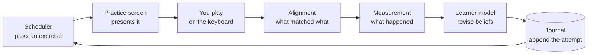
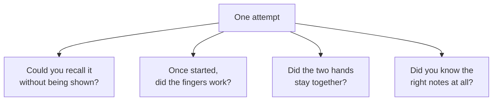

# How KeyRecall works

KeyRecall watches someone practice piano scales on a MIDI keyboard and decides
what they should play next. This is the tour of how it does that, start to
finish. Everything here describes the system as it is today; if the code
disagrees with something on this page, the code is right and the page is a bug.

## The one-sentence version

Every time you finish playing, KeyRecall compares what you played against what
it asked for, updates what it believes about you on several independent
channels, and picks the next exercise that is neither too easy nor too hard.

## The loop

Each box is a package, and each arrow is a one-way boundary. The domain says
what an exercise is and never what an attempt at one was worth. Alignment
decides which note was which and never whether the playing was good. Measurement
says what happened and never what to do about it. The learner model holds
beliefs and never chooses. That separation is the thing most worth preserving
when changing any of it.

## The seven pieces

| Document                                               | Covers                                                                        |
| ------------------------------------------------------ | ----------------------------------------------------------------------------- |
| [`domain.md`](domain.md)                               | What can be played: material, exercises, guidance, fingering, motor structure |
| [`observation.md`](observation.md)                     | What was played: transcript, alignment, measurement, the outcome channels     |
| [`learner-model.md`](learner-model.md)                 | What we believe about the player, and how an attempt revises it               |
| [`scheduler.md`](scheduler.md)                         | How the next exercise is chosen                                               |
| [`practice.md`](practice.md)                           | What the player sees, how an attempt ends, supported acquisition              |
| [`curriculum.md`](curriculum.md)                       | How a large catalog becomes a small practice surface                          |
| [`history.md`](history.md)                             | The journal, checkpoints, replay, and the five data products                  |
| [`validation-boundaries.md`](validation-boundaries.md) | Which constructors throw and which assert                                     |

## Why it is shaped this way

Three ideas do most of the work. The rest of `system/` is the detail underneath
them.

### An exercise is not a skill

"C major, right hand, two octaves, 100 bpm" is an **exercise**: an observable
task you can be asked to do. What it tells us about is a set of **competencies**
that many exercises share, such as knowing the major scale pattern, right-hand
execution, thumb crossings, or keeping two hands together.

Keeping those apart is what lets evidence transfer. Playing G major well is
evidence about the major-scale pattern in general, so D major starts from a
better prior than a blank slate. If the system only tracked exercises, every one
of the 9,216 would have to be learned from nothing.

### One attempt is several separate observations

A single performance answers several questions that are easy to collapse into
one score and should not be:

Failing to remember a scale and fumbling a scale you remember perfectly well are
different problems with different fixes, and a single "70%" cannot tell them
apart. So the model predicts each separately and learns from each separately.

The sharpest case is what happens when the notes are on screen the whole time.
That attempt says plenty about your fingers and **nothing at all** about your
memory, so it contributes exactly zero memory evidence rather than a weak
success. Getting this wrong in the other direction, treating "not tested" as a
mild failure, would make repeated supported practice look like steady
forgetting.

### Nothing is stored except what happened

The journal of attempts is the only authority. What KeyRecall believes about you
is not saved; it is recomputed by replaying that journal. A checkpoint is only a
cache of that replay and is thrown away whenever it cannot be trusted.

That costs some startup time and buys two things. Beliefs can never quietly
drift away from the evidence that produced them, because there is no stored
belief to drift. And a change to how the model learns is honest about its own
blast radius: it changes what the entire history means, which is why
`LearnerParams.modelVersion` has to move with it.

## The support ladder

A scale you do not know yet is shown on the staff while you play it. Once you
can play it, the notes are previewed and then hidden. Once that is comfortable,
you are asked for it from memory. Those are the three **guidance rungs**, and
moving down one is a normal response to a bad attempt rather than a penalty.

The ladder governs pitch support only. Every exercise gets a count-in at every
rung, and the metronome is a separate choice the player makes rather than a
reward that gets unlocked.

## The numbers

Every constant lives in `LearnerParams` and `SchedulerConfig`, is versioned, and
is provisional. They are starting points chosen from the literature and from
synthetic characterization, calibrated against recorded playing where that was
possible. They are not yet calibrated against a real learner population, and
nothing in the design depends on any of them being exactly right.

The architecture and the transition ordering are settled for initial production.
[`../roadmap.md`](../roadmap.md) records what would have to be true to reopen
them.
