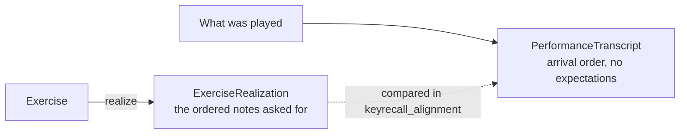

# The domain

What can be played, and how it can be played. This is `keyrecall_domain`, which
answers structural questions only: it holds no beliefs about any learner, reads
no state, and makes no pedagogical judgments.

## An exercise is a bundle of independent choices

An `Exercise` is not a row in a catalog. It is a small set of orthogonal
decisions, and keeping them orthogonal is what stops the space from fragmenting:

```text
TechnicalMaterial      what is played: F-sharp harmonic minor, say
ExercisePattern        the ordering applied to it: LINEAR today
ExecutionConditions    hand, direction, hand motion, octaves, tempo
GuidanceContext        what cues are shown, before or during
MotorRealization       canonical fingering and the motor structure it implies
Opportunities          where crossings, continuations, and reversals occur
```

**Material identity excludes hand, tempo, octaves, direction, hand motion, and
guidance.** That is the single most load-bearing decision in the domain. It is
why one F-sharp harmonic minor scale has exactly one memory state, while its
right-hand, left-hand, and hands-together performances can each carry a
different execution state. If hand were part of material identity, remembering
the scale would have to be learned three times.

Two axes are easy to confuse, and conflating them would be a real loss:

```text
ExerciseDirection   how one line is traversed in time      up | upDown
HandMotion          how two hands move relative to each other   parallel | contrary
                    contrary is valid only when hands are together
```

Both hands traverse the same `upDown` exercise whether they move together or
apart. Folding contrary motion into direction would confuse the shape of one
line with the relationship between two.

## What is in the catalog

All twelve keys in four forms: major, natural minor, harmonic minor, and
fixed-form melodic minor. That is `allScales`, 48 materials, and it is the
learner-facing catalog.

`allRootPositionArpeggios` is the supported arpeggio corpus, 24
provenance-backed major and minor root-position arpeggios. `proofArpeggios` is a
deliberately tiny three-material fixture that exists to prove a second material
family can use the generic machinery; it is not a curriculum. See
[`../decisions/curriculum-and-progression.md`](../decisions/curriculum-and-progression.md).

A **material family** (`SCALE` or `ARPEGGIO`) is a declared key, not an enum the
scheduler branches on. It decides a material's candidate generation, its
acquisition floor, its entry tempo, and which execution and topology
competencies it loads. Nothing outside the domain is allowed to interpret it.

`InstrumentProfile` gates the whole catalog on what the connected instrument can
physically play, before the learner model is consulted at all.

## Guidance is a three-rung ladder

```text
continuouslyCued     pitch cues visible throughout; retrieval never tested
notesPreviewedOnly   shown before, then hidden; a real, lower-demand test
unguided             no cues; the strongest independent retrieval test
```

Exactly those three values exist, and the constructor is private so no fourth
can be built. Notes previewed _and_ cues left visible would describe the same
condition as `continuouslyCued` while comparing and hashing differently, and
guidance is part of exercise identity, cache keys, recovery matching, and
persisted records.

Guidance changes how much independent production an attempt demands. It never
changes how hard the physical task is, and it never changes the Q-matrix: a cued
harmonic-minor exercise still contains harmonic-minor topology.

`retrievalDemand` is the number the model consumes, and it is a heuristic
mapping rather than a research-established coefficient.

## The Q-matrix

`Exercise.structuralQ` maps an exercise onto the competencies it creates an
opportunity to observe:

```math
Q_{e,k}\in\{0,1\}
```

`Q[e,k] = 1` means exercise `e` creates an opportunity to observe competency
`k`. It makes no claim about how strong that evidence is; that is predictor
loading and attempt evidence weight, both of which live in the learner model.

An opportunity is structural. It says a scalar crossing occurs at this point in
this exercise. It does not claim the expected fingering was actually used, which
nothing here can observe.

## Realization, and its two sides



`realize` turns an exercise into the notes it asks for, spelled by scale degree,
so a staff and a keyboard diagram read one answer rather than two.
`PerformanceTranscript` is the other side: what was played, in arrival order,
with no relation to what was expected.

Nothing in the domain knows how one relates to the other. That is
[`observation.md`](observation.md), and the direction is deliberate: the domain
says what an exercise is, and never what an attempt at one was worth.

## Fingering

`CanonicalFingering` records are family-neutral and carry material and hand
identity, the `entry / cycle / terminal` structure, explicit descent symmetry,
and compact provenance. They cover all 48 scales and all 24 supported arpeggios
in both hands, and they refuse to guess at an unsupported material.

Fingering is domain structure, not presentation metadata. It determines the
motor opportunities an exercise exposes, which is why it sits here rather than
in the UI.

The research behind which fingerings are canonical, including the sources and
the cases that took real work to settle, is in
[`../research/foundations/fingering.md`](../research/foundations/fingering.md).

## Motor structure

`Exercise.linear` derives motor opportunities from the same hand paths and
canonical fingerings that realize the exercise, so the two can never disagree.
What the packages carry is deliberately narrow: `MotorOpportunitySite` for where
an event occurs, and `ExerciseRealization` for the notes it resolves to.

The richer vocabulary of motor families, phases, crossings, and rotation
equivalence is analysis vocabulary rather than implemented state. It lives in
[`../research/foundations/motor-structure.md`](../research/foundations/motor-structure.md)
and `analysis/scale-motor/motor-realizations.yaml`. Whether any of it earns a
competency is an open question, and the residual census exists to answer it.

## Tempo

The tempo ladder is Maelzel's metronome progression, 40 to 208: two apart to 60,
three to 72, four to 120, six to 144, eight to 208.

Nothing treats these numbers as pedagogically privileged. They are a
quantization grid a musician already reads, with steps that grow as the tempo
does, which is the right shape for a quantity where a fixed count of beats per
minute does not mean a fixed amount at both ends.

It is used as an **adjacency relation rather than a candidate set**: the
question is always whether the next rung up is useful work yet, which needs two
neighbors and not a catalog. At either end the step clamps, so a learner at the
top is asked for that rung again rather than for nothing.

## Recorded exercises are not regenerated

`Exercise.recorded` rebuilds an exercise exactly as it was presented, including
its stored motor opportunities. Replaying an old decision through the current
generator would silently rewrite historical evidence, so recorded exercises
retain what they were given. It is not how new exercises are built.
