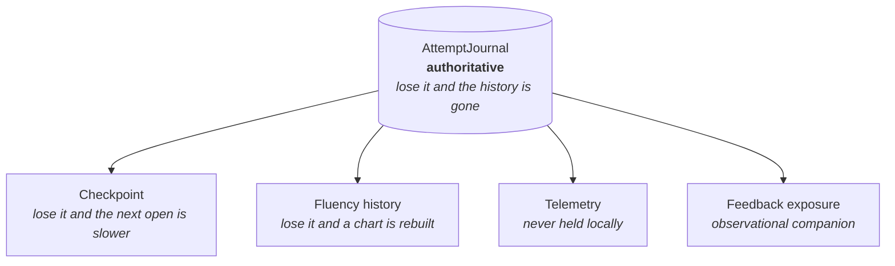

# History and replay

KeyRecall keeps several things about a player, and they are easy to confuse
because they overlap in content. They differ in the only way that matters:
**what happens when you lose one.**



## The profile owns the history

A shared instrument means a shared install, so an install has no single learner.
It has one independent history per `Profile`: its own journal, its own state,
its own session.

A profile id is opaque and stable, never derived from a display name. Names
change and repeat, so a history keyed on one would be lost by a rename and
merged by a coincidence.

Every persisted artifact is scoped by it, and `AttemptRecord` carries the
profile id on the record itself rather than only on the journal, so a record
stays self-describing once exported. A history's owner is checked **before its
content is read**: a whole file copied into another profile's directory is
internally consistent at every record, so no amount of replay can establish
whose it is.

`LearnerState` deliberately knows nothing about profiles. It stays the pure
learner-model object, which is what keeps app-account concepts out of
`keyrecall_learner`.

## Profile lifetime

A profile id says whose history a write belongs to. It does not say the history
is still wanted, and that gap is what erasing and deleting have to close: both
end a profile's recorded practice while work started before them is still in
flight, and an id alone would let that work put back what was just destroyed.

So every profile carries a durable `ProfileLifetime`: its id, and an incarnation
that is replaced rather than cleared. A sitting binds to the one standing when
it opened and writes through that view, and storage refuses anything naming an
incarnation that has been retired. The check happens inside the same serialized
operation as the write, so nothing can be retired between authorizing a write
and performing it. It survives the process, so an interrupted deletion resumes
against the incarnation it retired.

The invariants:

- a profile genesis has exactly one durable lifetime at a time;
- only the standing lifetime may create durable practice state;
- once erasure or deletion retires a lifetime, no work carrying it persists;
- deletion is resumable after an interruption at every durable step;
- repository operations mutate only their explicit target;
- startup recovery may destroy only an artifact it positively identified;
- once creation has committed a genesis, retries operate on that identity;
- a confirmation reflects committed state, never an attempted mutation.

`ProfileLifecycle` is the one place those sequences live. Below it the
repository owns genesis and selection, and the store owns practice.

### Creating is two durable facts

The profile exists, and it is the active profile. They are separate writes, and
the repository primitive commits only the first: `create` writes a genesis and
never a selection, not even for the first profile on an install. Sequencing the
two is the lifecycle's job, which is what lets it report which of them landed.

A create whose selection failed comes back carrying the identity it committed,
and finishing it selects that profile: running the create again would make a
second person with a history of their own. An install left in that state
resolves itself besides, because choosing among the people who exist is what
`selectedOrOldest` already does.

### Deleting is a resumable state machine

Intent first, then history, then genesis, then the intent itself:

1. record the deletion intent, which takes the profile off the roster;
2. retire the lifetime and erase everything the store holds;
3. remove the profile's record of itself, handing the selection on;
4. drop the intent.

History goes before genesis because the genesis is what names it, and every step
is idempotent. Startup finishes any recorded intent before anything asks who is
active, so an interruption leaves a job to complete rather than storage nothing
can attribute.

### Erasing keeps who the profile is

Erasing means "forget what you have learned about my playing", not "replace who
this profile says I was". The display name, the color, and the **placement tier
all survive**, because placement is the prior the whole history was computed
against rather than something the history taught. Starting from a different tier
is a different learner: today that means deleting the profile and creating
another.

### Recovery targets the artifact that failed

Reading each artifact classifies its own failure, and a recovery may only change
what the failure named:

| Failed artifact                | What recovery does                                                          |
| ------------------------------ | --------------------------------------------------------------------------- |
| Selection metadata             | Forgets the selection; the oldest profile is chosen                         |
| A profile's genesis            | Nothing destructive; there is nothing safe to rebuild                       |
| A deletion intent              | Nothing automatic; the file naming who was going is the one nobody can read |
| A journal that will not replay | Erases that profile's history, by id                                        |
| Anything unclassified          | Retries, and offers no erasure at all                                       |

Inferring the target from whatever the app happened to be holding is how an
intact history gets erased to repair a file somewhere else.

Repair reaches storage directly rather than through a reconciled install.
Startup reconciliation reads the same metadata a repair would be fixing, so a
repair that waited for a clean start would wait for the thing it exists to fix:
an interrupted deletion cannot finish without reading the selection, and a
corrupt selection would then block the repair that makes it readable. The repair
runs, then reconciliation is asked again.

The rule underneath all of this:

> Recovery and authorization are read-only until the artifact granting the
> authority has been validated.

Which is also why authorizing a write reads the incarnation rather than
resolving one. Issuing a lifetime where none is recorded is how a session opens;
doing it while checking whether a held lifetime may write would grant the
authority being checked for, and recreate the storage a deletion had just
removed.

## The five data products

### 1. Attempt journal, authoritative

Append-only, lossless, retained indefinitely. Learner state is whatever
replaying it in order produces. It holds what replay needs and what a later
model must be able to reinterpret, and nothing it can safely recompute.

Its genesis is small and immutable: the profile, its creation instant, and the
placement tier. Placement belongs there because every posterior in the journal
is a function of it, and a history that does not record the prior it was
computed against cannot reproduce itself.

Nothing may be aggregated, summarized, or dropped.

### 2. Feedback exposure, observational companion

Append-only and retained locally, but **not learner evidence**. It records what
the post-attempt review actually showed: the feedback level, whether personal
progress appeared, and every named progress event in the displayed statement.

It is scoped to a profile, idempotent on attempt id, and cannot be recorded
unless the journal already contains that attempt. Losing one does not change
replay, but it destroys the record needed to estimate how feedback affected
later observations.

Feedback exposure never changes evidence weight. Any effect on later attempts is
something to be learned from preserved histories, not assumed by the update
model.

### 3. Checkpoint, disposable acceleration

A snapshot of learner state at a journal position, verified against the journal
before it is trusted and discarded when it does not match. Losing one costs
replay time and nothing else. It is not historical evidence and must never be
read as such.

### 4. Fluency history, a rebuildable projection

Does not exist yet, and is where time-series thinking belongs. A chart over
years of practice should not scan the whole journal per frame, so it wants
derived storage: per-session and per-day summaries, posteriors over time, tempo
and quality distributions, downsampled with age.

All of that is safe **because the projection is disposable**. Delete it, rebuild
it. That property is what keeps the aggregation honest, and it buys something
else: when a later model changes what fluency means, the projection is
regenerated rather than discovered to have destructively summarized the only
evidence there was.

### 5. Telemetry, a projection at an export boundary

Opt-in, minimized, versioned, and **not a journal upload**. A field belongs in
it because a research question needs it, never because the journal happens to
carry it.

> Local persistence is optimized for faithful reconstruction. Telemetry is
> optimized for answering specified questions with the minimum necessary data.

Those goals should produce different schemas, and the fact that they do is the
design working.

Privacy risk changes at every boundary, and the technique appropriate to one is
wrong at the others:

```text
the learner's device        exact journal, in the app sandbox
        | explicit, opt-in, minimized projection
central collection          pseudonymous events
        | aggregation, differential privacy
research dataset            statistics, or synthetic data for sharing
```

The literature on synthetic learning-analytics data and differential privacy is
about the lower two boundaries. It is not an argument for degrading one person's
own history on their own device. Minimization still applies locally, which is
why the transcript and edit script are discarded rather than kept in case they
prove useful, but **semantic downsampling for privacy happens at the export
boundary, not by damaging the canonical local evidence.**

## What a checkpoint has to prove

`validateCheckpointAgainstJournal` is the whole of what accepting one requires,
in one place, because the parts are only meaningful together:

| Checked                                       | What accepting it without the check costs                      |
| --------------------------------------------- | -------------------------------------------------------------- |
| Profile                                       | One person's state seeded from another's history               |
| Model version, in every mode                  | A hybrid estimate                                              |
| Sequence is inside the journal                | A stand-in for attempts that are gone                          |
| The covered attempt's id and time             | A position nobody verified                                     |
| Its own content hash                          | A snapshot that has drifted from what it claims                |
| The digest of the history it skips            | An altered earlier attempt, replayed over rather than replayed |
| Agreement with the covered `state_after_hash` | State the history never produced, reported as faithful         |

The digest is the one that makes skipping safe. A per-record hash says the state
at that position was reached; it says nothing about whether the records before
it still say what they said. So a checkpoint carries a chained digest of the
history it stands in for:

```text
h(genesis)  = H(header, hash of the state replay starts from)
h(n)        = H(h(n-1), content hash of attempt n)
```

That binds the checkpoint to the exact records it skips and to the prior they
were replayed from, without replaying the model over any of them. Changing an
earlier outcome makes the digest disagree and costs a full replay.

A checkpoint from another model version is unusable in _every_ mode,
counterfactual included. It already contains one model's reading of everything
before it, so seeding a different model from it would produce a hybrid: earlier
history estimated one way, later history another. That answers no question
anyone asked.

**Rejecting a checkpoint is not rejecting a journal.** An unusable checkpoint
costs a full replay and nothing else. A malformed record, an ownership
violation, or an unrecoverable file is the other thing entirely, and fails the
load.

## Replay

| Mode             | Question it answers                                                                                      |
| ---------------- | -------------------------------------------------------------------------------------------------------- |
| `exact`          | Is the recorded past still reachable? Model versions must match, and every recomputed value is compared. |
| `counterfactual` | What would a different estimator have concluded from the same observations?                              |

The counterfactual boundary matters: an alternative estimator may be applied
only to the exercise that was **actually presented**. The journal holds no
outcome for an action never taken, so a scheduler replay showing a different
choice says nothing about what that choice would have achieved. It is not policy
evaluation.

### What `isFaithful` proves, and what it does not

From the beginning, it proves that the recorded observations rebuild the
recorded state under this model: every prediction, weight, and state hash was
recomputed and agreed.

From a checkpoint, it proves that of the attempts after it, and proves of the
ones before it only that they carry the same canonical content the checkpoint
was taken from. Their predictions and weights are not recomputed, because they
are not replayed. That is the trade a checkpoint is: the digest establishes the
history is unchanged, not that it was ever verified. Discard every checkpoint to
get the stronger claim back, which costs only time.

It does **not** prove the scheduler would select the same exercise again. Exact
learner replay is not exact scheduler replay: regenerating a historical
selection needs the candidate set the slot considered and a decision trace hash
over it, and the journal records neither. Nothing should read `isFaithful` as a
stronger invariant than the journal can support.

## Four things stored that replay could recompute

The presented exercise, the prediction, the evidence weights, and the memory
attribution. They are the **audit trace**. Replay recomputes each and compares,
which is how a change that would silently reinterpret history gets caught
instead of absorbed. Reapplying the stored numbers would reproduce any past
mistake perfectly and prove nothing.

Full state snapshots are not duplicated per attempt. Each record carries the
hash of the state its decision was made from and the state its update produced.

## Rules the boundary enforces

**`retrieval_succeeded` is `true`, `false`, or `null`**, and `null` means
retrieval was never tested. It must never be read, queried, or analyzed as
failure.

**Time runs forward.** `occurredAt` is the model timeline and never goes
backward. Every memory transition is driven by elapsed time and propagating
backward is illegal in the model, so a journal recording a backward step would
be impossible to replay. A device clock really can be corrected backward
mid-session; that is resolved at the observation boundary, before the attempt is
recorded.

**Records are contiguous and ids do not collide.** `journalSequence` counts
attempts in append order, contiguously, so a lost line is detectable rather than
silently absorbed. Idempotency is not first-write-wins: an id returning with
identical content is a retry and a no-op, while an id returning with _different_
content is a collision and throws. In an authoritative log, silently keeping one
of two conflicting records is worse than refusing both.

**Canonical state advances only on a committed attempt.** Time propagation is
mathematically path-independent but not path-independent in floating point, and
a state hash is exact. Replay propagates from one recorded attempt to the next,
so the writer must do the same, and every look-ahead runs against a scratch
copy. See [`practice.md`](practice.md).

**Persisted data is untrusted input.** Either it produces one unambiguous domain
object or it throws a located `JournalFormatException`. That promise belongs to
every public reader of persisted data, not to the journal loader alone. See
[`validation-boundaries.md`](validation-boundaries.md).

**Schema versions move independently, and a reader that meets one it does not
understand fails rather than guessing.** This is the historical source of truth,
and a misread record rewrites the past.

## Storage is deliberately absent

The journal holds records in memory and encodes to JSON lines, one record per
line, so an adapter can append without rewriting what came before and a person
can read a journal with ordinary tools. Keeping the contract above any storage
engine is what stops the engine from deciding the schema.
