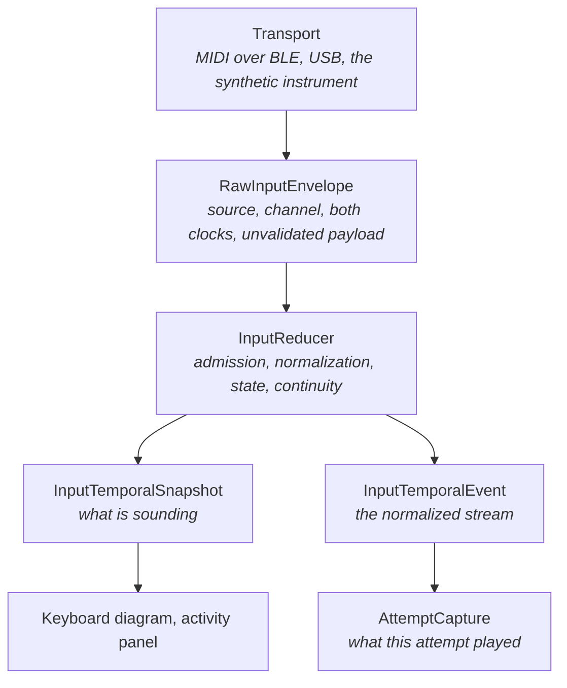

# The input boundary

How playing becomes events KeyRecall is willing to measure, and what happens
when it stops being able to prove they are one performance.



## One interpretation, or two that disagree

Normalization, sounding state, source admission, and temporal continuity are one
decision made in one place. They were four, in four listeners racing the same
raw stream, and they diverged: a release of a key nobody pressed became a
sustained note in one representation and nothing at all in the other, so
resubscribing published a reset claiming a pitch was sounding that had never
been struck.

`InputReducer` is a plain class with no subscriptions. Every source hands it raw
envelopes and forwards what it returns; nothing else is allowed to read raw
input. The synthetic instrument goes through the same reducer as a real one,
which is what makes it a stand-in rather than a second implementation that
happens to agree today.

## The governing rule

> Once KeyRecall can no longer prove that the captured event stream faithfully
> represents one continuous observation from the adopted instrument, the attempt
> is ineligible for ordinary measurement.

An `InputTemporalFaultEvent` says that has happened and why:

| Fault                 | What was observed                                   |
| --------------------- | --------------------------------------------------- |
| `sourceFailure`       | the source stream reported an error                 |
| `sourceClosed`        | the source ended while still supposed to run        |
| `malformedInput`      | a payload no instrument can produce                 |
| `timestampRegression` | time ran backward within one observation            |
| `observationGap`      | observation was suspended, so continuity is unknown |

**An attempt gets one terminal disposition.** Once the boundary has said the
observation broke, nothing may reinterpret the same attempt as an ordinary one,
and an attempt reads only the capture its own recording produced. Both halves
were needed: the screen for the next exercise is built while the last attempt's
capture is still in the provider, so it read that interruption as its own and
ended before a note was played, and the commit then re-derived the disposition
from a capture that had since been discarded and recorded an attempt nobody
made.

**A fault is terminal for the interval it ends.** The reducer stops admitting
input, and nothing reopens the observation until a caller explicitly begins a
new one. An instrument that resumes behaving perfectly does not repair an
attempt whose integrity is already in doubt. A capture interrupted this way
keeps what it had and can never become measurable again.

A reset is the softer boundary: a connection change, an all-notes-off, or a new
consumer needing the whole snapshot. It also interrupts an attempt, because the
notes on either side are not one observation, but it is not a failure and the
stream continues.

**Attaching a consumer is not recovery.** Asking where the observation stands
never opens one. A consumer that subscribes says nothing about whether a failed
transport came back, and an observation that resumed because something started
watching would be exactly the claim the terminal-fault rule exists to refuse; a
consumer attaching while the observation is closed is handed the fault instead.
What does open one is an event that actually establishes an epoch: the app
starting, a connection transition, adopting an instrument, returning to the
foreground, or a failed subscription being replaced. That last one is why a
transient transport error does not deafen the app until the next reconnect: the
observation ends, and a new subscription opens a new one.

## Nothing is repaired into plausibility

A backward timestamp is evidence that the observation is unreliable, not data to
sort or clamp. Neither is a note number of 200 or a velocity of `-1`. This
boundary used to clamp both into range, which turned transport corruption into
credible playing, and used to drop the out-of-order note, which turned an input
fault into a missing note the learner appeared not to have played.

Continuity is checked over the whole normalized stream, releases and pedal
events included, rather than only between adjacent transcript notes: an
impossible sequence around a release is as much a fault as one between two
strikes.

## Provenance, and what is admitted

The transport merges every live source into one stream, so a message that has
lost its device cannot be attributed to an instrument. Device, transport,
channel, and the transport's own timestamp survive as far as the admission
filter.

While nothing is adopted, every source is admitted: there is no instrument to
tell them apart from. Once an instrument is adopted, every other source is
turned away and counted. That is a rejection, not a fault, because another
keyboard in the room is not evidence that this one's stream broke. It is also
what keeps a stale link from injecting notes, releasing notes it does not hold,
moving the pedal, or ending an attempt with an all-notes-off.

A reconnect is a new observation even when the device id did not change, so
identity carries a session as well. The transport reports which device sent a
message but never which link delivered it, so the session token is minted here,
once per transport subscription, and closed over by that subscription's
listener. A message from a superseded session is turned away by the same filter
that turns away another instrument.

Below that sits a plainer rule: a subscription's callbacks stop counting the
moment it is replaced. Cancelling a stream is not, on every platform, a promise
that its terminal callbacks will never fire, and a superseded subscription
reporting an error or a close would otherwise end the observation its
replacement had just opened and open yet another. That guard also covers the
window before anything is adopted, when every source is admitted by policy and
identity has nothing to reject with.

### Channels are owned separately and measured together

Every channel of the adopted instrument is one keyboard. A stage piano splitting
hands across two channels is one player playing, and nothing KeyRecall measures
is per-channel.

That is a policy about the product stream, and it is not a reason to forget
which channel is holding what. Notes and the pedal are owned per channel,
because that is where an instrument owns them:

```text
pressed / sustained / pedal, per channel
                  |
                  v
   one aggregate keyboard, and the events that explain it
```

So a release on one hand's channel cannot damp the same pitch the other hand is
still holding, and one channel's pedal cannot catch another channel's note. What
the aggregate collapses is only what a set of sounding pitches cannot represent:
a pitch two channels hold is one pitch sounding.

The emitted events are derived from the difference between the aggregate before
and after, and then checked by replaying them against it. Where the normalized
vocabulary cannot express a transition, the result is a reset carrying the whole
snapshot rather than a stream that no longer describes the state. Mixed pedal
positions across channels are the case that needs it. That is what makes
"replaying the stream reproduces the snapshot" structural rather than an
argument about cases.

## Two clocks, and only one of them is trusted

`arrivalTimestampMs` is the shared monotonic input clock, read when the message
was processed. It orders the stream, and that is all it does.

`transportTimestamp` is the transport's own stamp, kept and never yet
interpreted. Substituting it would not be an improvement on its own: BLE stamps
wrap, and clock domains differ between transports.

**Monotonic arrival order is not trustworthy performance timing.** A delayed
batch can turn separated strikes into near-simultaneous arrivals, or a delivery
stall into apparent hesitation, without violating anything the arrival clock
promises. Timing evidence read from arrival times is therefore only as good as
the transport was behaving, and nothing here can currently say whether it was.
Deriving performance timing from the transport clock, with unwrapping,
conversion, and a rule for when the derived timing may be believed at all, is
not done; see [`../roadmap.md`](../roadmap.md).

## Suspension is a boundary

Backgrounding stops the app observing, not necessarily the transport delivering.
Whether the OS buffered, dropped, delayed, or reordered MIDI while the app was
suspended is unknowable, so the observation ends at the boundary and a new one
begins on resume. The link is deliberately left up: whether to stay connected is
a separate decision from whether KeyRecall can claim to be watching.

## What holds

These are the properties the boundary is built to make impossible to violate,
and they are tested as properties rather than through the layers that rely on
them:

- an integrity fault after any valid prefix never increases the number of
  accepted musical events;
- once interrupted, a capture never becomes measurable again, and nothing
  downstream reclassifies the attempt it ended;
- a capture belongs to the recording that produced it, and to no other attempt;
- state reconstructed by replaying the normalized events equals the reducer's
  live snapshot;
- a release of a key nobody pressed cannot create a sounding note;
- a release on one channel cannot end a pitch another channel is holding;
- events from a source that is not the adopted instrument cannot alter
  normalized state;
- every event in one observation is in nondecreasing time;
- a lifecycle suspension ends the current observation;
- a consumer attaching partway through is handed the whole snapshot, not
  whatever arrives next, and never reopens a closed observation by asking;
- a superseded transport subscription can neither play into the observation that
  replaced it nor end it.
