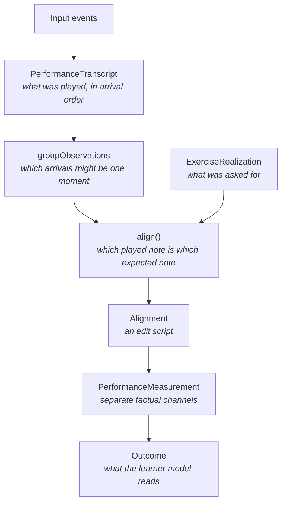

# Observing a performance

How the notes someone actually played become the evidence the learner model
consumes. Three packages, in a strict order, each refusing to do the next one's
job.



## Why alignment is a boundary and not a detail

Deciding that an observed F sharp _is_ the sixth note of the scale, rather than
a wrong third note, is the same decision as saying the attempt was going well.

Any display that places an observation into an expected position, advances
expected progress, or omits an observation that does not fit has already made
that comparison and is showing its result. So alignment is the single place a
correctness judgment is allowed to be made, and its output is the single thing
both the evaluative displays and the learner model read. The neutral echo the
practice screen draws while you play does not go anywhere near it.

## Grouping proposes, alignment decides

Grouping is its own stage so the aligner is never asked to discover simultaneity
and musical correspondence at once. It is the only place a timing tolerance
lives, and it knows nothing about keys, octaves, hands, or scale degrees. It can
say only that two arrivals are plausibly one event and plausibly two.

**Everything grouping says is a proposal, not a fact alignment must obey.**
Proposals enter as costs, never as constraints. That is not a hedge: the
out-of-phase take in the calibration data has observations 23 ms apart that
belong to different moments, so even a very small gap cannot be authoritative.
The recorded playing behind that is in
[`analysis/onset-grouping/`](../../analysis/onset-grouping/README.md).

## The edit script

`align` answers one question: which played note corresponds to which expected
one, and what is left over on either side. The result describes relationships
rather than scores, and it is moment-first, with note edits riding inside:

```text
MomentCorrespondence  realization moment i  <-  observed run j..k
  Match                 expected note, hand  <-  observed note
  Substitution          expected note, hand  <-  observed note, different pitch
  Deletion              expected note, hand      nothing played
  Insertion                                      observed note, nothing expected
MomentDeletion        realization moment i      nothing arrived for it
MomentInsertion                                 observed run, nothing expected
```

Every operation names the realization position, the observations it consumed, or
both, so a display can walk either sequence and know what happened at each
point.

Hand identity rides on the expected note of an edit. An observation says which
key and when, never which hand, because nothing in the input stream knows.

**The search is global.** A single extra note early in a scale has one cheap
explanation, an insertion, and one expensive one, a substitution at every
remaining position. Deciding locally picks the expensive one and never recovers.
Resynchronizing after a skip, an extra, or a correction falls out of choosing
the whole explanation at once rather than being a special case.

Two different readings must stay answerable from the same result: whether the
attempt was first-pass clean, and whether it was eventually completed. An
attempt that reached the end after three corrections must not be readable as a
clean one.

`AlignmentReading` answers those beside the correspondence rather than inside
it. It counts repair-shaped patterns rather than naming intentions: an extra
note followed by the right one is what a correction looks like, and also what a
hesitation or a bounced finger looks like.

Why the costs are what they are, and what a single grouping threshold would have
cost, is in
[`../decisions/evidence-and-measurement.md`](../decisions/evidence-and-measurement.md).

## Measurement reads a settled correspondence

Once alignment has decided which note is which, the timestamps of the matched
notes are properties of the performance rather than further evidence about
correspondence. Measurement is then free to read them, and changing how the same
notes sat in time cannot move a pitch-derived channel.

The guarantee is precisely that: timing does not reach a _settled_
correspondence. It is not that ambiguous correspondence is immune to timing,
because grouping already let timing express a bounded preference between two
otherwise equally good readings. Two-hand material is where that shows.

## The channels, and why they stay apart

An octave slip separates four things that are easy to conflate:

```text
topologyAccuracy    unaffected     the scale degree was right
materialRetrieval   unaffected     the material did appear
retrieval           unaffected     factual scale memory is about the degrees
pitchIntegrity      reduced        the sounded pitch was wrong
```

There is no register competency, and inventing one because the measurement
system can see register would be letting the sensors write the ontology.

`retrieval` is categorical and strict: any wrong degree, any missing note, any
extra note that is not a repeat, and it failed. A threshold would make two
nearly identical performances move the memory clock in opposite directions, and
the continuous channels already carry how well it went. A repaired attempt is
therefore complete, high in `materialRetrieval`, and a retrieval failure, which
is exactly the supported-practice reading the model wants.

A repeat is exempt, because replaying the note just played is producing the
right material twice rather than producing the wrong material. That
classification is structural, not attributed: whether it was a double trigger, a
bounced finger, or a deliberate reiteration is not observable here.

### Timing

Two scores that must not collapse into one:

- **temporal stability** reacts to spread across the traversal;
- **continuity** reacts to a single interruption.

Both use robust statistics so those stay independent, and the thresholds come
from real playing rather than round numbers; see
[`analysis/timing-calibration/`](../../analysis/timing-calibration/README.md).
They are provisional engineering calibration rather than a pedagogical boundary.

Being robust against one anomalous wait needs enough waits for one of them to be
the anomaly. `TimingEvidence` decides that once, for everything that reads
timing: below five waits the interpolated quartiles include the extremes they
exist to ignore, so the performance establishes no baseline and both scores are
absent. Three notes at 0, 500, and 60000 ms would otherwise read as badly broken
and totally unsteady at the same time, from a single wait measured against
itself.

## Absent is not zero

Measurement says what the observation model read, never whether the attempt was
any good. Fifty wrong notes measure fine, and every exercise the system
generates can be read, so nothing a learner plays goes unmeasured. Otherwise the
worst performances would go missing exactly where the evidence is strongest.

What can be absent is a **channel**. Coordination needs a moment where both
hands corresponded to something that arrived; where no moment did, it is absent
rather than zero, because an attempt nobody could read for togetherness has not
been read as ragged. Continuity and temporal stability are absent the same way
when the playing supplied too few waits.

Achieved tempo is the deliberate exception: its raw field reports an unobserved
pace as zero, because a ratio has no null to report. `measuredTempoRatio` is
that sentinel's one interpretation, and every reader asking what pace was
observed goes through it, so a performance too short to time enters no tempo
statistic rather than entering it as a stop.

**An absent channel is absent all the way through.** `Outcome` carries the null,
the evidence weights leave the channel out, the update path leaves its state
untouched, and the record omits it rather than writing a zero. A channel nothing
observed cannot accumulate into evidence that the learner was bad at it.
