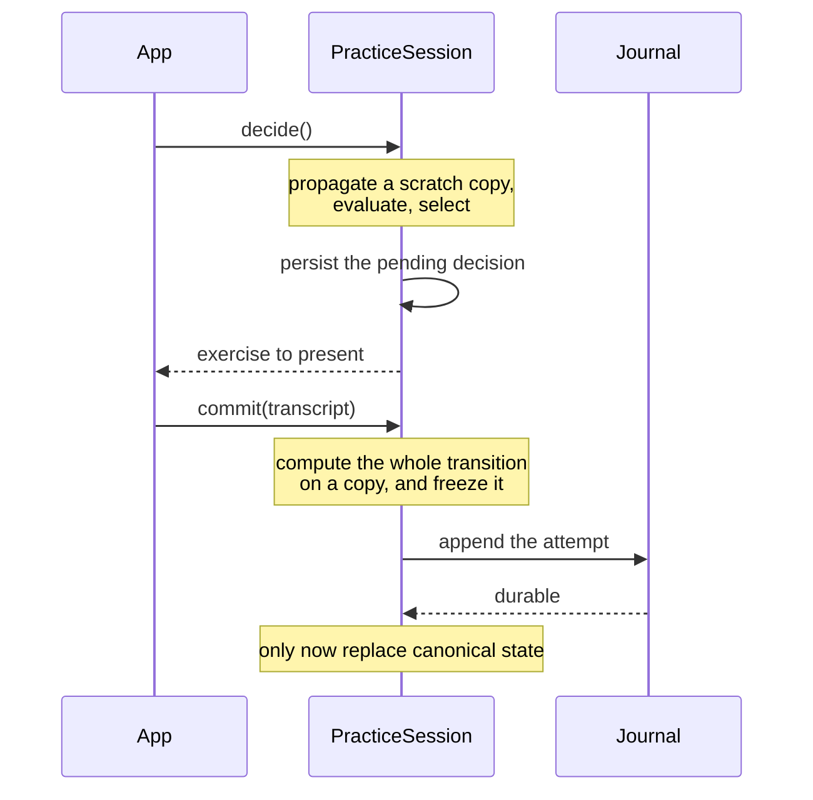

# The practice loop

What a player sees, how an attempt ends, and how the attempt becomes durable
history without anything being invented along the way.

## The attempt transaction

The single narrow invariant in `keyrecall_practice`:

> **Canonical learner state does not advance until the attempt is durably
> present in authoritative history, and advances at most once for it.**



Other things legitimately move earlier. Scheduler bookkeeping, the durable
pending slot, and probe service all happen before the attempt is history, and
are meant to.

The ordering exists to prevent three specific failures:

- **A crash after presenting** leaves a decision with no outcome. On the next
  open it surfaces as `pending` and the caller resolves it explicitly rather
  than having one invented: present it again, or abandon it. The attempt id was
  durable before the exercise was shown, so a resumed attempt lands in history
  under the id it was given.
- **A crash during commit** is safe in either order it can fail, because the
  attempt id is chosen at decide time and is the journal's idempotency key.
- **A storage failure that does not kill the process** is the one that needs
  more than crash safety. The transition is computed on a copy and canonical
  state is replaced only once the append succeeds, so an append that wrote
  nothing leaves the session exactly where it started.

Retrying is safe because the attempt is **frozen** when the close begins, not
recomputed. The app reads its clock again on every call and may hand over a
fresh transcript, so a rebuilt record would offer the same attempt id carrying
different content, which an authoritative log refuses.

## Who owns asynchronous work

The transaction contract above is about one session. This one is about which
session an asynchronous result belongs to, and it exists because every part of
the app can be locally correct while the app still applies a valid result to the
wrong owner: the journal validates a transaction, the worker evaluates a
request, the capture records notes, and the profile repository switches
profiles, and none of them can see that the sitting moved under the result.

> **An asynchronous continuation may finish work for its original owner, but it
> may publish state or start further work only if that owner is still current.**

A `PracticeSessionIdentity` names one live instantiation of a profile's practice
session, and reopening the same profile produces a new generation. A
`PracticeAttemptOwner` names an attempt and the session that issued it.

The five rules the app layer holds to:

1. **A selected profile does not identify an asynchronous operation's owner.**
   An operation carries the identity it began under, and never resolves the
   owner again after an await.
2. **A generation uniquely identifies one live sitting.** Two sittings for one
   profile are two owners, whatever the storage underneath them says.
3. **An attempt belongs permanently to the session generation that issued it.**
   Completion names its target: `finish`, `decline`, and `finishAcquisition`
   take the owner the presentation was issued with, so evidence that arrives
   after the ground moved lands nowhere rather than on whoever is selected.
4. **Superseded work may satisfy a durability obligation it already started, but
   may not publish into or schedule for the replacement.** An append in flight
   owes history an answer; the continuation that would have shown its result
   does not get to run. A sitting that was replaced or torn down while it was
   opening stops before deciding, because deciding persists a pending slot over
   whatever is presenting one now. Being replaced and being torn down are two
   ways of no longer being the sitting rather than one: a build with nothing
   after it is not superseded, and is just as gone.
5. **A recoverable commit failure retains and retries the frozen close.**
   Reopening is a different recovery, and one that abandons the performance the
   learner already supplied.

Recovery is single-flight with everything else the loop writes. A recovery
already running is what a retry exists to finish, not something to start again:
reopening while a frozen close is mid-write is how the sitting on screen ends up
behind durable history.

Two resources are owned rather than shared:

- **A scheduler host belongs to the sitting that opened it**, for that sitting's
  lifetime. Binding replaces the scope a host holds, so a shared host answers
  both sittings against whichever scope bound last. Worker requests carry ids
  and are answered by id; a worker that dies, however it dies, fails every
  request outstanding on it rather than leaving them pending. Each binding names
  itself before it yields, so one superseded or disposed while its isolate was
  spawning stops that isolate instead of installing it.
- **A recording belongs to the attempt that started it.** Leaving the screen
  closes that recording by name, so an attempt that is gone stops collecting
  notes and cannot close a recording a later attempt has already opened.

Failures are classified by what they leave standing, because that is what says
how to recover:

| Failure      | What is still valid                  | Recovery                                    |
| ------------ | ------------------------------------ | ------------------------------------------- |
| `history`    | possibly no usable sitting           | reopen, or erase                            |
| `commit`     | the frozen close, on its own session | write that same attempt                     |
| `scheduling` | everything recorded, and the sitting | ask again, rebinding if the worker was lost |

Erasing is offered for the first only. Beside an attempt that is still savable
it destroys the practice it was meant to rescue.

`scheduling` covers the whole of the decide-to-durability path, and not every
failure in it is the host's. Where the worker was lost, recovery re-establishes
where the sitting decides before asking again, because what died took its
binding and nothing authoritative. Every other failure there, such as the
pending slot not reaching storage, retries from the same still-authoritative
sitting without rebinding: the host never said it was at fault, and diagnosing
one nobody observed is its own kind of wrong answer. Neither reopens a sitting
whose state never left this isolate.

Plan reads are ordered behind plan writes for the same profile, above the
notifier that performs them. A plan notifier is replaced whenever the selection
changes, so its own queue cannot order a write against the read its replacement
performs: once a mutation for a profile is accepted, a later load of that
profile sees it or something later.

## During an attempt

`PerformanceFeedback` describes what the learner sees of their own playing while
they play: nothing, a neutral echo, or an evaluative display. Prospective pitch
cues, motor cues, and tempo support stay separate channels because they change
different demands.

One screen presents one exercise. Guidance changes what is placed on the staff
and keyboard rather than swapping in a different screen.

The **neutral echo** lights the keys currently held on the keyboard diagram. The
staff is static until the traversal starts, then lights the note each hand has
reached, for as long as that key is held.

The **staff locator is low-bandwidth contingent feedback** on a channel of its
own, `LocatorFeedback`. It depends on what was played matching what was
expected, so it is not neutral, and an attempt that ran under it is not an
attempt under no feedback; see
[evidence and measurement](../decisions/evidence-and-measurement.md). It is
still not a reading of the performance, and the two are deliberately different
things:

- Each hand travels its own line, so one hand's mistake leaves the other's
  highlight alone.
- A hand takes an arrival that is the note it expects, or failing that one that
  uniquely matches either of the next two notes, so a skipped note costs a note
  rather than the rest of the run.
- Both hands are offered every arrival, since the input stream does not say
  which hand played it, and an exact match takes it before an octave match.
- Register agreement is an entry condition rather than something the locator
  recovers into. A hand whose first note falls in another octave stays dark for
  the whole traversal, because a cue appearing mid-run reads as an event and
  takes attention, where a cue that was never there reads as one this
  performance does not get.

The tolerances never light anything. A notehead lights only while the key it is
written for is down, so the staff never stands for a note that was not played.
Measurement is unaffected: it reads the same arrivals strictly and keeps every
departure the locator travels through.

Policy opens the locator only where a cue staff is on screen while the attempt
runs, which is the continuously cued rung. A withdrawn cue takes it with it, and
an unguided rung never had a staff for it to travel over.

### What the record says it ran under

Presentation is recorded with the attempt rather than derived from it. What a
rung and an exercise imply depends on app policy, on whether the catalog could
finger the material, and on what the renderers draw, so a later policy change
would otherwise make the same recorded exercise mean a different exposure.

Three things are kept apart:

```text
resolved    what policy decided this attempt was to contain
delivered   what the app actually supplied on each fallible channel
exposed     which surfaces the learner had an opportunity to perceive
```

The first two are on the attempt record, with the presentation policy version
that resolved them. The third is the feedback exposure stream and the moment an
outstanding attempt is acknowledged as presented.

Only audio can half happen, so it is the only delivery reported today: a
count-in that never sounded, or one whose engine opened late and dropped the
beats it missed, is recorded as the shortfall it was rather than as the count-in
policy asked for. The shortfall never rewrites the intent, because scaffolding
that was withheld and scaffolding that was promised and missing are different
facts about an attempt.

Practice policy is the only thing that turns a rung and an exercise into
channels. A surface that read the rung again would be a second policy nothing
records, and a pitch cue whose restriction no surface implements is refused
rather than drawn in full.

Every channel recorded as supplied is supplied to a screen reader too, from the
same resolved conditions: the cue and the echo are painted, and neither engraved
noteheads nor marked keys describe themselves. The words withdraw exactly when
the cue does, and they name a finger only where the motor channel is open.

## How an attempt ends

```text
Attempt termination
├── learner initiated
│   ├── Done / abandon
│   └── declined: "I don't remember", before playing
├── observation based, non-evaluative
│   ├── prolonged silence
│   └── excessive elapsed duration
└── evaluative
    ├── repeated errors
    ├── loss of alignment
    └── predicted inability to complete
```

The first two categories are compatible with a neutral echo: silence and elapsed
time are facts about the observation stream and say nothing about whether a note
was right. The third is not. Counting errors or predicting that the learner
cannot finish are judgments, and ending the attempt on one delivers that
judgment through the loudest channel there is.

**Declining is evidence, not an escape hatch.** "I don't remember" is a
retrieval failure the learner is in a position to report, and it maps onto a
state the model already has: an outcome that never started, with a failed
retrieval, carrying memory evidence at the rung's weight and no execution
evidence at all. Before it existed, the only way to say it was to play something
wrong, which manufactures execution evidence for a performance that never
happened.

Two boundaries hold it in place. It is offered only at a rung that tests
retrieval, since there is nothing to fail to retrieve when the material is on
screen. And only before anything has been played: once notes attributable to the
attempt have arrived, what happened is a question for measurement. It is
deliberately not a skip.

**Prompt rather than seize.** Silence and duration surface an offer, not a
confiscated instrument. A long pause is ambiguous on its face, and continuing to
accept input while asking "still working?" resolves none of that wrongly. A much
larger absolute limit closes an abandoned attempt, and that closure is a fact
about the app rather than about the performance.

**The termination reason sits beside the outcome, never inside it**, so that

```text
inactivityTimeout -> completed: false -> the learner failed
```

is not available as an accidental inference. There is deliberately no
`learnerCompleted` reason: completion is measurement's to establish, and Done
means only that the learner ended it.

## After an attempt

The review has three outputs:

```text
attempt diagnosis   what happened
attempt summary     what the major measurements looked like
progress evidence   what this attempt established over time, if anything
```

`AttemptDiagnosis` selects one useful true interpretation. It names the
principal fault rather than listing every departure.

The summary reports **Notes**, **Flow**, **Pulse**, **Coordination** (for a
measured hands-together attempt), and **Tempo**. These are observations of one
performance, not learner-state deltas and not mastery scores. The whole summary
is one tap target onto a sheet that explains only the dimensions visible for
this attempt, in plain musical language, and says plainly that they describe the
attempt rather than the player.

Details locates the attempt's evidence along its traversal while the transient
reading is still available, then discards it with the review rather than
persisting it. Note departures are named with the realization's musical spelling
and a traversal landmark; raw realization positions stay display coordinates and
are never learner-facing.

**Progress evidence** comes from named events with explicit truth conditions:
first clean completion, first independent completion, and repeated reliability
once the last three comparable attempts were clean. Comparable means the same
material, pattern, and execution conditions including tempo; guidance may vary.
An event is emitted only when its condition first becomes true, so most reviews
carry no progress statement. Coinciding events combine into one sentence rather
than stacking notices.

What the review actually showed is recorded in the feedback exposure stream; see
[`history.md`](history.md).

## Supported acquisition

The guidance ladder changes how much support accompanies an exercise that is
still an ordinary realization of its material. **Below-floor acquisition can
relax the task itself**, so what it observes is evidence about the relaxed task
and nothing else.

The sentence the design rests on:

> Supported acquisition of a specific part of the normal task, with success
> earning a normal-task probe.

An `AcquisitionTask` names a parent `Exercise` and relaxes the portion played,
the timing demand, or who advances the sequence. It is not an `Exercise` and is
not convertible to one, so no ordinary admission, ranking, or learner-model path
can consume it. Its attempts produce an `AcquisitionObservation` rather than an
`Outcome`: no retrieval credit, no tempo reading, no ordinary evidence of any
kind.

**The boundary is the type.** A criterion success, meaning a clean first pass
with established continuity, makes the unchanged parent eligible for a probe,
and only that probe establishes ordinary readiness. Nothing an acquisition
attempt measured ever reaches the learner model directly.

A `TransitionCensus` accumulates stalls across attempts at one task, so a
repeatedly troublesome transition can be told apart from generally uneven
playing.

The rationale, and what is deliberately not built, is in
[`../decisions/acquisition-and-guidance.md`](../decisions/acquisition-and-guidance.md).
