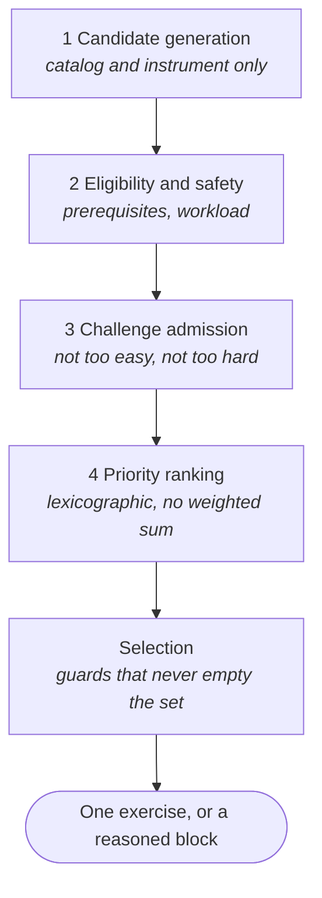

# The scheduler

Given what the system currently believes about a player, which valid exercise
should they play next.

The scheduler is a staged policy, not a scoring function. Each stage answers one
question, may read only what its information boundary permits, and every
candidate comes back with a `CandidateTrace` explaining what happened to it. It
lives in `packages/keyrecall_scheduler` and holds no beliefs of its own: it is
handed learner state and asks the learner model questions about candidates.

An **attempt slot** is a scheduler decision opportunity. A **selection** exists
only when that decision produces an exercise to present; a slot that admits
nothing has no selection and no presented attempt. Session caps, replay,
diagnostics, and telemetry all have to keep those apart.



## 1. Candidate generation

The generator combines valid material, hand, octave, direction, tempo, and
guidance options. It reads the domain catalog and `InstrumentProfile`, but no
learner or session state.

An impossible exercise should never become a candidate. This stage handles
physical and product validity, not pedagogy.

## 2. Eligibility and safety

The `REQUIRES` relationship creates an ordered eligibility tier from competency
state. In the current implementation, hands-together work is fully eligible when
both RH and LH execution means meet the configured threshold; otherwise it is
provisionally eligible.

This is a soft pedagogical gate. A provisional candidate remains reachable, but
cannot outrank a fully eligible candidate.

The stage answers two questions that are worth keeping apart. Whether a material
is appropriate yet is a question about the material and the learner's
competencies. Whether it may be attempted _at this rung_ yet is a question about
guidance, and the one rule of that kind reads whether the material has any
history in this profile at all: material nothing is known about may be
introduced, but not tested from memory the first time it appears. That is a
statement about what has been established here, not a claim that the learner
does not know the scale.

A third rule asks a question of its own: whether the learner's vocabulary of
scale forms should grow yet. Harmonic and melodic minor are not harder keys,
they are new ideas about what minor means, and meeting one while ordinary scales
are still unsettled enlarges the vocabulary faster than the base under it. They
wait on a breadth of major and natural-minor material the learner has actually
retrieved, spread over more than one band, and the wait is lifted for someone
already fluent in the hand the exercise asks for, since the rule exists so a
beginner's vocabulary does not outrun their base rather than to make an
experienced player re-earn what they arrived with. Per hand, by the same reading
the bands use: a fluent right hand is not evidence about the left.

So eligibility reads competency state and factual observation history: whether a
material has an entry at all, and whether it has ever been retrieved. It does
not read what the model believes about that history. Durability, uncertainty and
retrievability are estimates, and estimates belong to prediction, which runs
later.

The safety policy is a separate hard gate based only on session/workload state.
It implements a configurable session-attempt cap, left unset in production: a
sitting ends when the player stops. The cap exists as a guard against a runaway
decision loop and as a knob for tests and simulation, not as a statement about
how long somebody practices. It does not diagnose fatigue or injury from MIDI
behavior.

## 3. Challenge admission

Ordinary candidates must land in a "not too easy, not too hard" band on the
overall probability computed in [`learner-model.md`](learner-model.md) §3.4:

```math
p_{\mathrm{min}}\le\widehat p_{\mathrm{overall}}(e)\le p_{\mathrm{max}}
```

The current provisional band is 0.60 to 0.90. This is a configurable engineering
choice inspired by Challenge Point reasoning, not a research-established
universal optimum.

Eight named mechanisms can admit a candidate outside the ordinary band:

```text
new material        a scale this hand has not played, only above a lower
                    introduction floor, and only from the highest eligibility
                    tier with anything left to introduce
consolidation       a scale met and not yet produced from memory, offered again
                    at the previewed rung when nothing appropriate is left to
                    introduce
execution progress  one adjacent execution step on material already produced
                    from memory: the next tempo rung, one octave wider, or the
                    same work with both hands
guidance probe      one rung less support once that rung has been established,
                    at the tempo already managed there
bootstrap probe     a retrieval test where no rung is established, after interval
observation probe   a retrieval test after a run of attempts that observed none
recovery            exact failed exercise with one step more guidance
tempo probe         the same exercise at the tempo it was actually played at
```

Ranking asks two questions in one key. The first five terms choose the material;
the last two choose how to realize it, and are reached only when the first five
come out even, which for two realizations of one scale they always do.
`RealizationRank` orders a candidate against the frontier - advancing, holding,
unmeasured, surpassed - and the realization fit separates unmeasured ones, which
are otherwise identical to each other however far apart their tempi are.

Three of those partition what is known about a material, so they never contend:
material a hand has not played is introduced, played and unretrieved material is
consolidated, and played and retrieved material progresses. Introduction reads
the hand rather than the material because knowing the notes of a scale travels
with the learner and a fingering does not; hands-together is not an
introduction, but a step progression offers off two frontiers that already
exist. Execution progression is consulted last of all, so a candidate that is
also a probe keeps the probe's reason: a probe is answering a specific question
and progression is ordinary work.

Consolidation exists because the ordinary band is inert for a beginner and every
other path to seen material was shut: no rung established so the guidance probe
could not climb, the bootstrap probe days away, and the observation probe
counting supported attempts that a previewed introduction resets. Introducing
was the only move the scheduler had, so after the appropriate material ran out
it introduced the inappropriate.

Execution progression advances exactly one axis. Information gain prefers
whatever is least explored, so a candidate that goes wider _and_ faster at once
is the most attractive thing on offer and the least appropriate: two steps taken
as one, after which nobody knows which of them was the problem. It also requires
that the material has been produced from memory rather than merely shown, since
playing a scale well while looking at it demonstrates the conditions and not the
scale.

The observation probe answers a loop the ordinary band creates on its own.
Support raises predicted success, so as memory weakens continuous cueing is what
lands inside the band, and continuous cueing observes no retrieval. Nothing then
arrives to say whether the support is still needed, and the preference persists
on evidence that can never be collected: the scheduler optimizes the challenge
so well that it stops gathering what it would take to stop. After a run of
attempts in which retrieval went unobserved, one retrieval-observing question is
admitted whatever its predicted success.

Counted across the sitting rather than per material. Simulation showed cueing
spreading itself over distinct materials, so no material was cued twice running
and a per-material count never reached two however long the drought lasted. What
starves is the scheduler's knowledge of whether support is still needed, and
that starves whether or not the same scale keeps coming back. It is also checked
ahead of the introduction floor, since a drought is a drought whether the
candidate that ends it is new or familiar.

Recovery is reactive and exclusive: after a factual retrieval failure, only the
same material and motor task with one additional guidance step survives that
decision. Tempo, direction, octave span, and hand configuration do not silently
collapse.

The tempo probe is its mirror, and is not exclusive. An attempt that was
completed cleanly, evenly, unbroken, from memory, and comfortably faster than
requested is evidence about the task rather than about the performance: it was
beneath the learner. The probe offers that same task at the fastest offered
tempo they were already reaching. Only the tempo moves, for the reason recovery
moves only guidance.

It was exclusive once, and that made it routine: play a scale at sixty, play it
again immediately at a hundred and twenty, nearly every time anything was met.
It was the only way to learn a learner's pace, because an execution frontier
records the tempo that was _asked for_ and a probe was the only way to ask. Pace
is recorded now, beside the frontier and separate from it, so unseen material
arrives near the speed somebody actually plays and there is much less for the
probe to discover. As an ordinary exception it can win a slot when it is the
most useful thing on offer and lose one to a scale nobody has played - including
to the repetition guard, which is right: somebody who has played this scale five
times running is not served by a sixth, however fast.

It is a probe rather than the tempo axis itself. Ordinary tempo movement is
execution progression's, one rung of the metronome ladder at a time; this is the
deliberate jump to a speed already demonstrated in the playing, which is a
different question.

### A probe holds every axis but its own

The guidance, bootstrap, and observation probes all ask one question about
support, and all three hold the execution conditions the learner is already at:
the frontier tempo for that material, hand, and span, or the resolved family
entry tempo where that span has never been managed and no transferable pace is
available.

This is a rule about probes, not about tempo. A probe that moved two axes would
ask two questions and answer neither, since nothing in the outcome says which
one the learner responded to. A probe on any other axis has to implement the
same rule in its own direction.

Holding is active rather than incidental. Nothing constructs a probe: they are
predicates over generated candidates, and the ranking key reads none of the
execution conditions, so an axis nobody constrains is not left alone - it is
decided by the order of a constant. Guidance probes landed at sixty for that
reason, however fast the learner was working.

Every one of those conditions is required, because speed alone is ambiguous:
rushing and finding it trivial look identical on the tempo axis and differ on
every other one. Retrieval must have been tested and succeeded, since playing
quickly while reading the notes off the screen says nothing about the exercise.

This is the selection half of a division the attribution rule makes necessary.
Execution evidence is credited no higher than the tempo that was asked for, and
at the lower demonstrated tempo when the learner played slower (see
[`learner-model.md`](learner-model.md) §4). So a learner cannot be credited with
a difficulty nobody posed, and the only way to earn evidence at a faster tempo
is to be asked for it. This is what does the asking.

Note which rungs can trigger it. Previewed notes supply the material and still
leave retrieval tested, so a first encounter with unseen material can produce a
tempo probe as soon as it is played from the preview. Only continuous cueing,
where retrieval is never observed, cannot.

The guidance probe is the mirror of recovery: the same task at exactly one rung
less support than the one retrieval last succeeded under, where recovery is the
same task at one rung more. That makes the ladder traversable in both directions
and gives it a top, since material established unguided has no less supportive
rung to be probed toward. Climbing from cued to previewed is the bootstrap
probe's job, since a cued attempt never observes retrieval and so can establish
nothing.

It named one fixed rung until simulating three learners showed why that fails.
The reasoning had been that a successful probe re-anchors the clock and ordinary
admission takes it from there; in practice ordinary admission never got a slot,
every selected candidate across all three profiles carried a bypass, and no
profile ever played anything from memory unaided. Knowing the rung retrieval
succeeded under is what the ladder is climbed by, so material memory records it
alongside the retrieval clocks.

The two probes use different factual clocks, and the difference is the point:

```text
guidance probe     time since the current rung was established
bootstrap probe    time since the last factual retrieval attempt
```

Removing support and proving retention are different questions and were briefly
the same clock. Every successful retrieval moved that clock forward, including
successes at the rung already established, so a learner who never missed a note
had the next step toward independence pushed further away each time they
practised: the harder they worked, the longer the preview stayed. Material
memory therefore records when a rung was established as well as which one, and
that clock moves when the rung changes rather than whenever it is repeated. A
factual failure unsettles the rung entirely, since a rung the learner just
failed at is not one they are succeeding at.

That leaves the case with no established rung, which the bootstrap probe owns:
material never retrieved at all, and material whose rung a failure unsettled.
Recovery answers a failure by adding support and can walk a material down to
full cueing, where retrieval is never observed and nothing could re-establish
anything, so without this a learner could settle there permanently. Its clock is
the longer one, because returning to something that just went wrong is a
question about retention in a way that stepping up from a working rung is not.

## 4. Priority ranking

Surviving candidates are ordered
[lexicographically](https://en.wikipedia.org/wiki/Lexicographic_order), exactly
like alphabetizing a dictionary: compare the first field, and only move to the
next field when the first is tied. There is no hidden weighted sum anywhere in
this, and `RankKey.compareTo` is the whole of it:

```text
1  eligibility tier          a provisional candidate never outranks a full one
2  coordination transition   the first hands-together chance, just earned
3  contrary coordination     spend that first chance on mirrored motion
4  retention        R(e)     how urgent it is to test this before it fades
5  information      I(e)     how much uncertainty this attempt would resolve
6  diversity        V(e)     negative count of this material recently
7  goals            G(e)     learner-goal relevance
8  realization rank          advancing, holding, unmeasured, or surpassed
9  realization fit           how near an unmeasured realization is to entry
```

The first three terms are the only ordinal ones, and each is there because
ordering below its position would make it inert.

**Retention** is the term that usually decides:

```math
R(e)=
(1-\widehat p_{\mathrm{retrieval},m})\,o_{\mathrm{retrieval}}(e)
```

High when a material is at risk _and_ this candidate can actually test
retrieval. A continuously cued candidate has zero retrieval opportunity, so it
cannot win by exploiting a memory deficit it is structurally unable to resolve.

**Information** is the weighted uncertainty this candidate's competency, memory,
and execution evidence opportunities would expose. **Diversity** is the negative
count of the material in the recent-history window. **Goals** is zero for
anything no focus emphasized.

The last two terms never decide which material to practice, only which
realization of it. Two candidates on the same scale always tie on terms 4
through 7, so realization rank and fit are what choose the tempo and span it is
asked at.

### The coordination transition

Terms 2 and 3 exist because the hands-together transition is a pedagogical
moment that ordinary ranking could not express.

**It must precede retention and information**, or it never decides anything:
those are the terms that separate a waiting hands-together candidate from the
winner. It therefore overrides genuine retention urgency, which it is allowed to
do because it cannot persist. The first hands-together attempt on the material
ends it, so the cost is one slot per scale, once.

**It must follow the tier**, so it cannot pull a provisionally eligible
candidate past a fully eligible one.

Term 3 is a claim about which introduction is better, not about which exercise
is easier. Prediction scores parallel and contrary motion identically, because
nothing measured supports a quantitative difference between them. Common piano
pedagogy introduces hands-together work through contrary motion: the hands
mirror, the same fingers align, and the thumb crossings happen together, where
parallel motion pairs non-homologous fingers. Without this term the choice is
still made, by the order `HandMotion.values` happens to list, and contrary
motion won none of 710 measured transition slots for exactly that reason. It is
false whenever the transition is, so outside that moment the two motions are
ordinary realizations of the same material and this does not order them.

See
[`../decisions/curriculum-and-progression.md`](../decisions/curriculum-and-progression.md).

## 5. Selection

Three rules run after ranking has ordered the survivors and before the best is
taken. None of them can empty a selectable set.

**The diagnostic fairness guard.** Exploration legitimately dominates a capable
learner's early sittings: new material establishes breadth and tempo probes find
speed, and both are worth the slots. What it may not do is dominate
indefinitely. Simulation had an advanced learner lose fifteen consecutive free
contests across two sittings with an independence probe ranked and waiting every
time, so once enough selection opportunities have passed that way, the
highest-ranked independence probe is taken.

It counts opportunities rather than offers: a slot that recovery or a tempo
probe narrowed to one candidate was never a contest, so nothing lost it. It is
silent when no such probe is ranked. And it is a selection rule rather than a
rank term, because the probe is already admitted and already ranked; it is
losing the contest rather than missing from it, and strictly lexicographic
ranking cannot express an urgency that grows.

**The repetition guard** prevents the same material from winning more than the
configured consecutive-attempt cap while another admitted material exists. It
counts materials, not kinds of work, so rotating between materials satisfies it
while the technical strand stays unchanged.

**Two family filters** read declared realization families instead, and answer
different questions about the same slot. Realization-family pacing asks how much
of the recent window one family holds, and relieves concentration when much of
that work is unproductive. Family dose control asks what a family's recent
attempts produced, independent of how much of the sitting it holds, and lowers
how often a persistently unproductive one is offered. Both are live; see
[`../decisions/pacing-and-tempo.md`](../decisions/pacing-and-tempo.md).

An optional introduction cap withholds first exposures while a scope already
holds its budget of unretrieved material. It is configurable, and null in the
shipped configuration.

## 6. What each stage may know

The information boundary is the architectural commitment here. Violating it is a
design defect rather than a tuning question, and a source-level test keeps
family-specific policy out of the scheduler package entirely.

| Stage        | Reads                                                   | Decides                    |
| ------------ | ------------------------------------------------------- | -------------------------- |
| Generation   | domain and instrument validity                          | whether an exercise exists |
| Prerequisite | transferable competencies                               | full or provisional tier   |
| Safety       | session and workload state                              | suppress or allow          |
| Challenge    | candidate `p_overall` and named-exception clocks        | admit or reject            |
| Priority     | tier, actionable retention, uncertainty, history, goals | ordering                   |
| Selection    | ordered candidates and repetition history               | one next exercise          |

Candidate generation takes no learner or session parameter at all, and that
absence is the enforcement rather than a convention.

Retained consolidation is absent from this table by design. With activation and
current durability held fixed, consolidation alone cannot change prediction,
admission, or ranking.

## Where a decision is computed

A session binds the resolved scope, the learner, and the policy constants, then
asks for one slot's decision. The host answers with the winning candidate or a
reason there was none, plus the effect to apply to the sitting. Production
computes on a worker isolate so the isolate that draws stays free; tests decide
in process. What one decision costs, and how that grows with the catalog, is in
[`../decisions/pacing-and-tempo.md`](../decisions/pacing-and-tempo.md).
