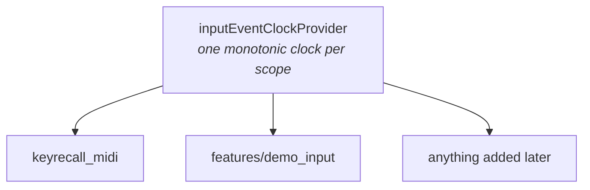

# keyrecall_input_sources

The shared runtime every input source builds on.

**Used by:** `keyrecall_midi`, the app's synthetic instrument. **Does not:**
decide which source is active. That is an application decision.

**System documentation:**
[`docs/system/practice.md`](../../docs/system/practice.md)

## Why it is its own package

Something has to sit below every source, and no source can be it. A synthetic
instrument has no business depending on the MIDI package to find out what time
it is, and the reverse is no better. The dependency this package removes is the
one between siblings.

It holds only what every source needs. Which source is active, and how one is
chosen, is an application decision and lives in the app.

## What it provides

`inputEventClockProvider` is the monotonic clock every normalized event is
timestamped against.

## The guarantees

- **One clock per scope.** Every source in a `ProviderScope` reads the same
  clock, so their events can be ordered against each other and switching sources
  does not look like time jumping.
- **Separate scopes keep separate clocks.** A test can run an isolated timeline
  without touching another's.
- **The clock is stopped when its scope is disposed.**

A shared timeline is not a shared performance. Each source opens with an
`InputTemporalResetEvent`, and that reset is a hard boundary: what came before
it cannot be measured against what comes after, however comparable the
timestamps look. See `docs/system/practice.md` for what the practice loop does
with one.
