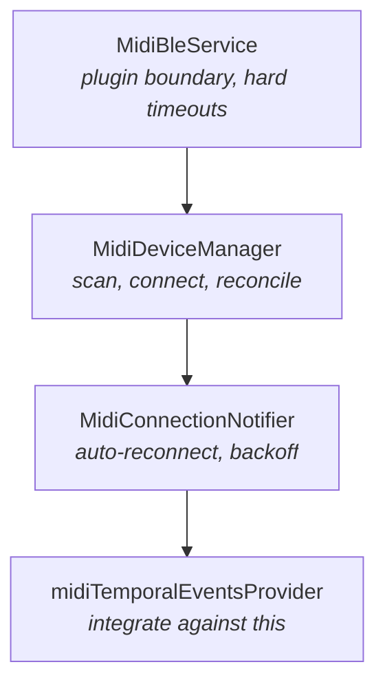

# keyrecall_midi

Bluetooth MIDI transport, vendored from WhatChord. See
[VENDORED.md](VENDORED.md) before changing anything here.

**Used by:** the app. **Does not:** export the raw note stream. Reading that as
a performance would mistake a held chord for a scale.

**System documentation:**
[`docs/system/practice.md`](../../docs/system/practice.md)

## Three layers

| Layer                    | Owns                                                                            |
| ------------------------ | ------------------------------------------------------------------------------- |
| `MidiBleService`         | The plugin boundary, with hard timeouts on calls that can hang. No policy.      |
| `MidiDeviceManager`      | Scanning, the device snapshot, connect and disconnect, platform reconciliation. |
| `MidiConnectionNotifier` | Auto-reconnect, backoff, cancellation, and the single-flight reconnect guard.   |

## What to integrate against

`midiTemporalEventsProvider`, the normalized `InputTemporalEvent` stream defined
by `keyrecall_input`. Everything else in this package exists to keep that stream
working when an instrument is switched off, carried out of range, or the app is
backgrounded for an hour.

Timestamps come from `inputEventClockProvider` in `keyrecall_input_sources`, so
MIDI events are ordered against every other source on one timeline.

The raw `midiNoteEventsProvider` is deliberately not exported. It reports
note-on and note-off as they arrive, so it does not read velocity-zero note-on
as a release, does not resolve repeats, and substitutes note 0 for a message
without one. Reading it as a performance would mistake a held chord for a scale.

## Reconnection

A connection can end without the platform saying so. What this package does
about it, and why, is the accumulated knowledge VENDORED.md exists to protect:

- Calls that can hang are bounded, because some devices never return.
- The device graph is reconciled on resume, because iOS drops Bluetooth links
  while backgrounded without emitting timely events.
- A reconnect target is remapped by name and transport, because a platform can
  expose the same physical instrument under a changed id across sessions.
- Reconnect runs are single-flight, because overlapping ones left stale retry
  state on screen.

Every change of connection phase emits a reset into the temporal stream, as does
an all-notes-off. An attempt in progress is interrupted rather than measured
across one.
