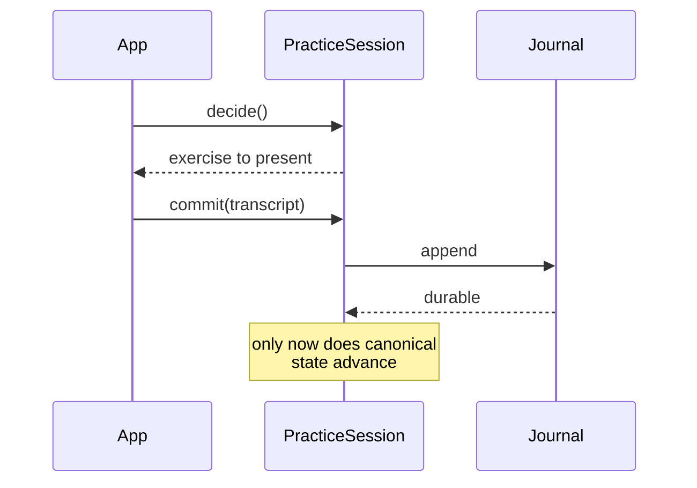

# keyrecall_practice

The attempt transaction, and the durable store it writes through.



**Used by:** the Flutter app, `keyrecall_simulation`.

**Does not:** advance canonical learner state before the attempt is durably in
history, or advance it twice for one attempt.

**Related documentation:**
[`docs/system/practice.md`](../../docs/system/practice.md)

## The transaction

```text
decide()   propagate a scratch copy, evaluate candidates, select,
           persist the decision, then present
commit()   compute the whole transition on a copy and freeze it,
           append the attempt durably,
           then replace canonical state and clear the decision
```

The invariant is narrow and exact: **canonical learner state does not advance
until the attempt is durably present in authoritative history, and advances at
most once for it.** Other things legitimately move earlier. Scheduler
bookkeeping, the durable pending slot, and probe service all happen before the
attempt is history, and are meant to.

The ordering exists to prevent three specific failures.

**A crash after presenting** leaves a decision with no outcome. On the next
`open` it surfaces as `pending`, and the caller resolves it explicitly rather
than having one invented: present it again and close it from what is played, or
`abandonPending()` where it cannot be presented. The attempt id was durable
before the exercise was shown, so a resumed attempt lands in history under the
id it was given. An abandoned one moves no state and leaves no evidence, so
history does not claim it happened.

**A crash during commit** is safe in either order it can fail. The attempt id is
chosen at decide time and is the journal's idempotency key, so on restart the
journal either already contains the attempt, in which case the stale decision is
cleared, or it does not, in which case the attempt is still pending. The update
is never applied twice because learner state is not stored: it is replayed from
the journal, and the journal holds each attempt exactly once.

**A storage failure that does not kill the process** is the third case, and it
needs more than crash safety. A close computes the whole transition on a copy
and replaces canonical state only once the append has succeeded, so an append
that wrote nothing leaves the session exactly where it started with the decision
still pending. Applying the update first would leave state ahead of the journal,
and the retry would fold the same outcome in again from an already-advanced
state.

Retrying is safe because the attempt is frozen when the close begins, not
recomputed. The app reads its clock again on every call and may hand over a
fresh transcript, so a rebuilt record would offer the same attempt id carrying
different content, which an authoritative log refuses. A retry finishes the
transaction that was started.

An append whose answer was lost is settled by reading durable history back.
There are three answers and no others: this exact attempt is there and the
append committed, nothing with that id is there and the same record may be
written again, or that id holds different content, which is a collision rather
than something to resolve by picking one. The same reconciliation covers the
acquisition log, which additionally remembers that its durability is unknown
when the settling read fails too, and reloads before building another event.

Cleanup is part of the transaction, not an afterthought. If clearing the pending
slot fails, the evidence is still durable and the close still reports a failure,
so the transaction stays open: closing again finishes the cleanup and returns
the same result, and deciding again is refused until it does.

Abandoning is gated on knowing. An append that threw may still have landed, so
"not written" and "nobody can say" are tracked apart: a prepared close may only
be abandoned once storage has established that its attempt is absent from
history, and where that is unknown abandoning reads history to settle it and
fails if it cannot. Treating uncertainty as absence is what leaves one attempt
in the file and none in the sitting, with every later commit aimed at a sequence
storage has already filled.

Stated exactly: **once a close is prepared, its complete observable result is
immutable, canonical learner state advances at most once for it, and it cannot
be abandoned unless storage has established that it is absent from authoritative
history.**

A pending decision is deliberately **not** part of the journal. An attempt with
no outcome produced no evidence and moved no state, and putting it in the replay
stream would invite exactly the manufactured outcome this prevents.

It is disposable recovery state, and disposable state must not be able to
manufacture authoritative history, because completing one appends it. So every
claim it makes that can be checked is checked on recovery: the profile it
belongs to, the journal position it targets, its time against the profile and
against the journal tail, its index within its session, the state hash it says
it was decided from, and the prediction it recorded, both recomputed from
history propagated to its own instant. Anything the journal contradicts is
refused.

A slot from another learner-model version is abandoned instead. It is not
damaged; it was decided under one model's reading of this history, and
completing it would apply today's model's update to yesterday's decision. One
unfinished exercise is the whole cost of deciding again.

## Usage

```dart
final session = await PracticeSession.open(
  store: FilePracticeStore.at('/path/to/practice'),
  profile: profile,
  materials: v1ScaleCatalog,
);

// A pending decision is one the last run showed and never closed. Present it
// again rather than deciding past it: closing it writes the attempt under the
// id it already has.
final exercise = switch (session.pending) {
  final PendingDecision pending => pending.exercise,
  null => switch (
    await session.decideOutcome(at: DateTime.now().toUtc()),
  ) {
    final PresentedAttempt presented => presented.exercise,
    PracticeBlocked(:final reason) => throw StateError(
      'practice blocked: ${reason.name}',
    ),
    PracticeCaughtUp() => null,
    // Something the session owns changed while the decision was being
    // computed, so the answer is about inputs that have moved. Deciding again
    // produces a current one.
    PracticeSuperseded() => null,
    PracticeInvalidScope(:final failures) => throw ArgumentError(
      'invalid practice scope: $failures',
    ),
  },
};

// ... present exercise, collect what happened ...

await session.closeFromPerformance(transcript);
await session.saveCheckpoint(); // optional; only ever saves replay time
```

A session decides through a `SchedulerHost`, which chooses where the decision is
computed and nothing else. Passing none decides on the calling isolate, which is
what a test and a simulation want. The app passes an `IsolateScheduler`, because
a mature full-catalog decision blocks its isolate for a fifth of a second on a
mid-range phone. Either way the session binds the scope, the learner, and the
policy constants, applies the returned sitting effect, and writes the pending
decision itself.

Placement state is anchored at `Profile.createdAt`, so every attempt must fall
at or after it, and the caller supplies the instant a new journal is stamped
with. A wall clock the caller does not control would give replay a different
origin on every run. `JournalHeader.createdAt` is storage provenance only;
nothing derives a model timestamp from it.

The session attempt cap counts scheduler **decision opportunities**, not only
presented attempts, so a blocked result still consumes one. Caught-up and
invalid-scope results return before scheduling and consume none. None creates a
pending decision: only an exercise that was durably selected and shown can later
become an attempt.

## Storage

`PracticeStore` is the port. Three kinds of thing live behind it with different
durability requirements:

|                  | Shape                         | If lost                                   |
| ---------------- | ----------------------------- | ----------------------------------------- |
| Attempts         | Append-only, authoritative    | History is gone                           |
| Pending decision | One slot, replaced or removed | An interrupted attempt cannot be resolved |
| Checkpoint       | One slot, replaced            | Only replay time                          |

`FilePracticeStore` is the reference implementation:

```text
<root>/<profileId>/journal.jsonl     append-only, authoritative
<root>/<profileId>/pending.json      one slot
<root>/<profileId>/checkpoint.json   one slot
```

Attempts are appended and flushed. The single-slot files are written to a
temporary name and renamed over the target, so a reader sees the old content or
the new one and never a half-written file.

Erasing writes a marker before removing any practice file. If deletion is
interrupted, the next access finishes it before exposing storage, so a journal,
pending decision, and checkpoint from opposite sides of an erase cannot mix.

A crash mid-append can leave a final record without its newline. That attempt
was never committed, so the torn tail is dropped on read and truncated before
the next append. A malformed record _anywhere else_ is real corruption of
history and fails loudly, because quietly skipping it would lose evidence.

Where history stops is decided in the bytes. The file is truncated at the offset
of its last committed newline and its valid prefix is never rewritten, so a
second interruption during recovery cannot destroy what the first one left
intact, and a tail torn midway through a multi-byte character does not stop the
file from being read at all.

Loading also checks who a history belongs to. A file copied into another
profile's directory agrees with itself at every record, so the header's profile
is compared to the profile that asked, here and again when a session opens.

A database can replace this without the transaction noticing, as long as it
keeps those guarantees.

## Documentation

[`docs/system/history.md`](../../docs/system/history.md) section 5 is the
canonical attempt transaction this implements.
